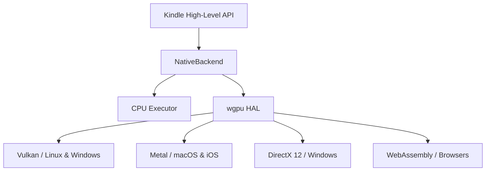

# Kindle Native GPU Computing & Operations Completeness Roadmap

This document outlines the architectural design and execution roadmap for extending `kindle-native` from a CPU-only backend to a hardware-accelerated GPU backend.

---

## 1. Core Hardware Abstraction Layer (HAL)

To maintain a pure-Rust developer experience without requiring external C/C++ toolchains (such as CUDA Toolkit or Xcode Command Line Tools), the native GPU backend will be built on top of **`wgpu`** (WebGPU for Rust).
Also following extensions should support the cuda toolkit and interoperate with nvidia graphic cards. also cpu based tensor operations should be extremely optimized using simd and more



### Key Advantages of `wgpu`:
* **Zero Host Toolchain Requirements**: End-users do not need to install local CUDA compiler drivers (`nvcc`) or configure compiler paths.
* **Unified Shader Language**: Write compute kernels once in **WGSL** (WebGPU Shading Language), which is compiled and translated automatically at runtime to SPIR-V, MSL, or HLSL.
* **WebAssembly Target**: Enables the exact same training and inference pipelines to run inside web browsers via WebAssembly.

---

## 2. Dynamic Shader Compilation & Pipeline Dispatch

Compute operations will be implemented as parametric WGSL templates. When an operation is invoked, the dispatch pipeline will manage compiling, caching, and executing the shader.

### Pipeline Life Cycle:
1. **Shader Caching**: Compiled `wgpu::ComputePipeline` instances are cached using a hash of the shader source and specialization constants (e.g., block sizes, tensor strides).
2. **Bind Group Creation**: Layouts are dynamically generated mapping input/output buffers to layout bindings.
3. **Execution Dispatch**:
   * Compute pass is encoded into a `wgpu::CommandEncoder`.
   * Grid dimensions are dynamically calculated using workgroup sizes (typically `8x8` or `16x16` for 2D spatial layouts).
   * Commands are submitted to the `wgpu::Queue` asynchronously.

---

## 3. Storage Buffer Memory Management

To avoid high latency overhead between host memory (CPU) and device memory (GPU), the buffer architecture will adhere to a strict staging discipline.

```
Host (CPU) Memory  <=== (Staging Buffer Map) ===>  Device (GPU) Storage Buffer
```

### Buffer Lifetimes & Placement:
* **`wgpu::Buffer` Allocation**: Tensors are allocated as GPU-resident storage buffers using `wgpu::BufferUsages::STORAGE | wgpu::BufferUsages::COPY_SRC | wgpu::BufferUsages::COPY_DST`.
* **Asynchronous Writes**: Moving data from CPU to GPU uses `queue.write_buffer` to stream contiguous bytes directly into target allocations.
* **Asynchronous Reads**: To retrieve tensor results (e.g., loss values), a temporary staging buffer is created with `wgpu::BufferUsages::MAP_READ | wgpu::BufferUsages::COPY_DST`. Commands copy data from the storage buffer to the staging buffer, and mapping is resolved asynchronously via `buffer.map_async()`.

---

## 4. Operations Completeness & Static-Dimension Parity

Currently, operations like 2D Convolution and Pooling are implemented via CPU gathers (`im2col` + batched matmul). The GPU backend will implement direct hardware-parallelized kernels for these layouts, ensuring static-dimension type parity.

### 1. 2D Convolution (`Conv2DShape`)
* **Shared Memory Tiling**: Load input tiles into Local Shared Memory (LDS) to reuse overlapping window weights and minimize global memory bandwidth.
* **Channels-Last (NHWC) Support**: Implement an optimized kernel pathway for NHWC formatting to leverage coalesced global memory access patterns.

### 2. Max/Average Pooling (`Pool2dShape`)
* **Overlap-Safe Reductions**: Map each target pixel coordinate to a single GPU workgroup thread, calculating bounding offsets dynamically and executing parallel reductions across the window.

### 3. Concatenation & Strided Views
* **Unified Scatter Kernels**: Rather than copying memory multiple times, strided views will resolve coordinate locations inside the shader itself, copying slices directly into target destination buffers in parallel.
