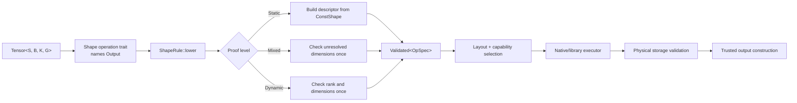
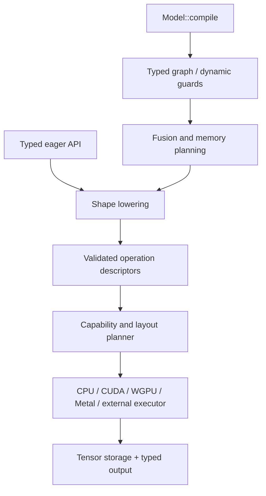

# Incin Architecture, Shape Lowering, Performance, and Developer UX RFC

**Status:** Proposed
**Project version:** `0.0.0`
**Target toolchain:** Stable Rust by default; nightly experiments remain opt-in
**Audience:** Core maintainers, backend authors, external-backend authors, and
performance engineers

## Executive summary

Incin already expresses a useful distinction that many tensor systems lose:
the shape is part of `Tensor<S, B, K, G>`, and operations such as matrix
multiplication, broadcasting, and flattening use traits to compute their output
shape. The largest architectural gap is that these proofs stop at the tensor
API. Backend methods receive storage plus ordinary runtime dimensions, repeat
semantic checks, and cannot directly exploit the facts established by `S`.

This RFC preserves the public `Shape`, `Dim`, typenum, named-dimension, and
const-axis model. It adds a proof-carrying lowering layer between the typed
frontend and native execution. That layer resolves an operation once into a
validated descriptor containing output dimensions, layout facts, iteration
geometry, and proof provenance. Backends may trust the logical descriptor.
Safe construction, import, and plan binding validate physical storage and
runtime hardware facts once; native launch code then trusts sealed metadata
except where an external or mutable resource invalidates that trust.

The proposed end state has two modes over one executor:

- **Eager execution** retains direct tensor methods and immediate errors.
- **Compiled execution** lowers a typed model into validated operations,
  performs fusion and memory planning, and specializes a bounded set of native
  paths.


Compiled execution also becomes the foundation for distributed execution. A
model may be placed over a typed logical device mesh using data, tensor,
pipeline, or hybrid parallelism. Type-level shape and placement rules prove
divisibility and collective compatibility when dimensions are static; runtime
binding separately proves that the requested physical GPUs, memory, transport,
and topology actually exist.
The default installation remains stable-Rust, pure-Rust CPU. WGPU, native Metal, CUDA,
external backends, BLAS, and vendor libraries remain explicit Cargo features.
The repository should stay at version `0.0.0` until the stabilization gates in
this document are met.

### Terminology

This document uses the following labels deliberately:

- **Confirmed defect:** behavior that can panic, produce an invalid result, or
  violate an advertised invariant.
- **Architectural limitation:** behavior that is valid but restricts
  extensibility, diagnostics, or optimization.
- **Performance opportunity:** a change whose principal benefit is speed,
  memory use, compile time, or binary size.
- **Proposal:** a design that is not yet implemented.
- **Design ruling:** a decision recorded to *prevent* a change, where the
  current design is already correct and a plausible alternative was rejected.

Every subsection of §1.1 carries one of these labels, and every §2/§3 item is a
**Proposal** or a **Performance opportunity** unless labelled otherwise. A
subsection labelled **Confirmed defect** must cite the file and line that
exhibits it, so the claim can be re-verified against the tree rather than
trusted.

“External backend” means a backend implemented using a third-party tensor
runtime, such as Candle. “Vendor library” means an optional optimized native
library, such as BLAS, cuBLASLt, or cuDNN. Neither category is “legacy.”

---

## 1. Architectural Fixes & Technical Debt

### 1.1 Current bottlenecks and flaws

#### 1.1.1 Shape proofs terminate before native execution

**Architectural limitation.**

The frontend encodes an operation's logical constraints in traits such as
`Flatten<START, END>`, broadcast rules, matrix-multiplication rules, and
`ShapeEq`. The result is wrapped in a typed `Tensor<OutputShape, ...>`.
Nevertheless, backend calls primarily receive:

- backend storage,
- runtime axis or parameter values,
- runtime shape and stride vectors,
- dtype and device metadata.

The backend does not receive a sealed proof that the frontend has checked the
operation. It therefore must either repeat validation or assume that callers
used a safe tensor path. The result is duplicated work and a fragile trust
boundary: the type system knows more than the native layer can express.

This is especially important for operations whose useful launch parameters are
direct consequences of shape proofs:

- matrix multiplication: `M`, `N`, `K`, batch broadcast masks and batch strides;
- reduction: collapsed `outer`, `reduced`, and `inner` regions;
- broadcasting: result dimensions and zero-stride input dimensions;
- convolution: output height/width and checked receptive-field geometry;
- flatten/reshape: output dimensions, element count, and contiguity requirements.

#### 1.1.2 Static, mixed, and dynamic shapes have different guarantees

**Architectural limitation.**

A binary static/dynamic classification is insufficient:

1. A `ConstShape` can prove all dimensions and element count at compile time.
2. A tuple containing named or runtime dimensions has type-level structure but
   still needs selected runtime checks.
3. `Dyn` needs full runtime rank and dimension validation.

Named dimensions are useful for identity constraints, but two values carrying
the same named dimension type can still arrive with inconsistent runtime
sizes. Type identity proves which dimensions must agree; it does not prove
that untrusted runtime data supplied the same value. The runtime equality check
must therefore occur exactly once at the safe boundary.

#### 1.1.3 Dynamic shape arithmetic is not uniformly fallible

**Confirmed defect.**

Some dynamic output-shape paths use assertion, `unwrap`, or unchecked
arithmetic. Convolution and pooling are the sharpest case:

```text
out = floor((input + 2 * padding - dilation * (kernel - 1) - 1) / stride) + 1
```

Every addition and multiplication can overflow, the subtraction can underflow,
and `stride == 0` is invalid. Verified instances, all reachable from safe APIs:

| Site | Defect |
|---|---|
| `shapes/spatial.rs:112-113` | The formula above written in raw unchecked arithmetic. Underflows when the receptive field exceeds the padded input; divides by zero when `stride == 0`. |
| `shapes/spatial.rs:100-102` | Static `Pool2dShape` returns `(input.0, input.1, Default::default(), Default::default())` — the spatial dimensions are silently **zeroed** for any runtime-carrying dim type (a `usize` axis or a `dim!` name). |
| `shapes/spatial.rs:154`, `:221` | `COut::from_size(out_channels).unwrap()` on the convolution channel dimension. |
| `tensor/ops/manipulation.rs`, `tensor/ops/reduce.rs` | Roughly 30 `from_dyn(...).unwrap()` sites after reshape, flatten, transpose, and reduction shape computation. |

One nearby site is *not* a live defect and should not be "fixed" by mistake:
`checked_broadcast_dim` (`shapes/broadcast.rs:22-28`) asserts, but its own
documentation records that every public path validates through the backend
first. It is deliberate defense-in-depth, and it is the real guard against two
identically-typed `dim!` names carrying different runtime sizes. Converting it
to a `Result` is correct; deleting the check is not.

An empty shape must never stand in for an error: rank zero is a valid scalar
shape and cannot also be an error sentinel. (The current code returns `Option`
or `Result` rather than an empty vector here, so this is a constraint on the
new code, not an existing defect.)

Shape resolution for any unproven value must return `Result`.

#### 1.1.4 Operation coverage is constrained by inconsistent rank generators

**Confirmed defect.**

Tuple shapes and structural operations are generated only over bounded rank
ranges, and those ranges disagree. Roughly ten independent generators each
declare their own cap: `Shape` (`shapes/shape.rs:325-332`), `AppendDim`,
`ReplaceLastDim`, `EndsWith`, `HasChannels1D/2D`, `BroadcastShape`,
`ConcatShape`, `StackShape`, and the spatial rules.

The clearest instance: `Shape` is implemented for tuple ranks **1–8**, but
`ElementCount` (`shapes/reshape.rs:12-50`) is implemented only for ranks
**0–4**. Because `ReshapeShape` is blanket-implemented over `ElementCount`,
a static reshape between two rank-5 shapes has **no element-count proof at
all** — the shape is representable, the operation is logically valid, and the
trait simply does not exist.

The rank cap itself is acceptable on stable Rust. The flaw is having multiple
implicit caps. One source of truth must generate and test every supported
tuple-rank operation.

#### 1.1.5 `Flatten` const parameters are correct

**Design ruling.**

`Flatten<const START: usize, const END: usize>` should not replace its const
parameters with typenum values.

- The entries of `S` are dimension types and remain typenum, named, or dynamic
  dimensions.
- `START` and `END` identify positions in a tuple. Const generics are the
  idiomatic representation of axis indices.
- The output dimension remains type-level: the selected dimensions are folded
  into `ProdDim<...>`, so later layers can continue applying shape traits.

For example, conceptually:

```rust
type Input = (U2, U3, U4, U5);
type Output = <Input as Flatten<1, 2>>::Output;
// Output is structurally equivalent to (U2, ProdDim<U3, U4>, U5).
```

The issues to fix are range diagnostics, generated-rank coverage, checked
runtime products for mixed shapes, and contiguity/materialization policy—not
the use of const axis indices.

#### 1.1.6 The backend interface conflates storage, capabilities, and execution

**Architectural limitation.** `Backend`
(`crates/incin-core/src/tensor/backend.rs:79`) is a 97 KB supertrait composed
from nine operation families totalling roughly 254 methods.

The current backend surface is a large supertrait composed from many operation
families. Default methods return `UnsupportedBackendOperation`, so support is
often discovered only after attempting an operation. This creates four forms
of friction:

- backend authors face a very large API even when implementing a focused
  backend;
- generic code cannot ask whether an operation is native, composed, or absent;
- runtime dispatch contains repeated enum/configuration matching;
- documentation cannot be generated from a single capability source of truth.

The existing static backend types can avoid runtime backend dispatch, but
dynamic dispatch storage still needs enum matching. That distinction is
reasonable; the problem is that operation support and the semantic validation
contract remain implicit in both paths.

#### 1.1.7 Tensor construction has an oversized unsafe trust surface

**Architectural limitation.** `Tensor::from_parts_unchecked`
(`crates/incin-core/src/tensor/base.rs:78`) is `pub(crate)` and has roughly 45
call sites; the checked path `try_from_storage` (`:119`) exists but is not the
one internal operations take.

Safe storage import validates shape, dtype, and device. Internal operations
often use unchecked construction after calling a backend and separately
computing the typed output shape. This is defensible only when every caller
maintains all invariants. Today, that guarantee is convention rather than a
single enforceable construction path.

Unchecked construction should be crate-private, narrowly named, documented with
its obligations, and callable only after:

1. a validated operation descriptor has been produced, or
2. a storage-only transformation has proved that metadata remains unchanged.

#### 1.1.8 Autograd is duplicated and does not receive `G`

**Architectural limitation.** Three independent thread-local tapes exist
(`cpu/tape.rs`, `cuda/tape.rs`, `wgpu/tape.rs`) with an identical `TapeEntry`
schema and substantially duplicated traversal.

CPU, CUDA, and WGPU each maintain backend-specific tape and gradient-map
infrastructure. The backend operation does not see the tensor's `Grad`/`NoGrad`
marker, so an implementation may record work that can never participate in
backpropagation. Thread-local tapes also make ownership, nesting, async use,
cross-thread execution, and lifetime behavior difficult to state precisely.

The differentiation rules are logically backend-neutral. Gradient kernels are
backend-specific, but node ownership, dependency counting, saved-value policy,
and traversal should not be duplicated.

#### 1.1.9 Layout metadata is repetitive and inconsistent

**Architectural limitation and performance opportunity.** All three storages
carry the same `Vec<usize>` shape/stride pair — `cpu/storage.rs:198`,
`cuda/storage.rs:47`, `wgpu/storage.rs:95` — with no shared layout module and,
in WGPU's case, no offset field.

CPU and CUDA storage track shape, strides, and offset. WGPU has a more
contiguous-oriented contract. Common layout analysis already normalizes and
coalesces runtime dimensions, but native selection does not receive a
shape-proof-derived descriptor.

Repeated heap-allocated `Vec<usize>` values are unnecessary for the common
rank range. Metadata also needs to distinguish:

- logically contiguous versus physically contiguous;
- zero-stride broadcast dimensions;
- negative strides, if ever supported;
- storage offset and byte bounds;
- guaranteed versus observed alignment;
- materialized versus view storage.

#### 1.1.10 Error reporting describes failure, not remediation

**Architectural limitation.** The current shape error is a single stringly
typed variant, `Error::ShapeMismatch { op, expected, got, msg }`
(`crates/incin-core/src/err.rs:56-67`), which cannot be matched on
structurally or rendered with a remediation.

`UnsupportedBackendOperation` communicates the operation and backend but not
why a candidate was rejected, whether another implementation exists, or which
Cargo feature enables it. Shape errors likewise need to separate logical
expectation from physical-storage corruption.

### 1.2 Proposed solutions

#### 1.2.1 Add proof-carrying operation lowering

Introduce a crate-private constructor for `Validated<O>` and public,
inspectable descriptors. The exact module placement may evolve, but the
contract should be:

```rust
#[derive(Clone, Copy, Debug, Eq, PartialEq)]
pub enum ProofLevel {
    /// Rank and every semantic dimension constraint came from type-level data.
    Static,
    /// Structure is typed, but named or dynamic dimensions were checked once.
    Mixed,
    /// Rank and all semantic dimensions were checked at runtime.
    Dynamic,
}

pub struct Validated<O> {
    descriptor: O,
    proof: ProofLevel,
}

impl<O> Validated<O> {
    pub fn descriptor(&self) -> &O;
    pub fn proof_level(&self) -> ProofLevel;

    // No public unchecked constructor.
    pub(crate) fn new(descriptor: O, proof: ProofLevel) -> Self;
}

pub trait ShapeRule<Inputs>: Sized {
    /// The output shape. This is not a new claim: it is required to be the
    /// *same* `Output` the existing frontend trait already names for this
    /// operation, so the two cannot drift. See the binding rule below.
    type Output: Shape;
    type Args;
    type Descriptor;

    fn lower(
        inputs: &Inputs,
        args: Self::Args,
    ) -> Result<Validated<Self::Descriptor>, ShapeError>;
}
```

`ShapeRule` is a companion lowering contract, not a replacement for the
existing public shape traits. Existing traits remain responsible for expressing
whether an operation is legal and naming `Output`. Lowering converts that proof
plus runtime fields into data native execution can consume.

`Output` is load-bearing rather than decorative: each `ShapeRule`
implementation is required to restate the `Output` its corresponding frontend
trait already computes, which makes any divergence between the two a
compile-time error instead of a silent mismatch discovered in a kernel. The
existing traits and their owning modules are:

| Operation | Frontend trait that names `Output` | Module |
|---|---|---|
| broadcast | `BroadcastShape<Rhs>` | `incin-core/src/shapes/broadcast.rs` |
| matrix multiplication | `MatMulShape<Rhs>` | `incin-core/src/tensor/matmul.rs` |
| reshape | `ReshapeShape<Target>` / `ElementCount` | `incin-core/src/shapes/reshape.rs` |
| flatten | `Flatten<START, END>` | `incin-core/src/shapes/shape_ops.rs` |
| reduction | `ReduceDim` / `ReduceKeepDim` | `incin-core/src/shapes/shape_ops.rs` |
| convolution / pooling | `SpatialConv1d`, `Pool2dShape`, `SpatialOut` | `incin-core/src/shapes/spatial.rs` |
| concat / stack | `ConcatShape`, `StackShape` | `incin-core/src/shapes/{concat,stack}.rs` |

Worked example, binding the broadcast rule to the trait that already exists:

```rust
pub struct BroadcastRule;

impl<L, R> ShapeRule<(L, R)> for BroadcastRule
where
    L: BroadcastShape<R>,
    R: Shape,
{
    // Not a second opinion about the output shape — the same one.
    type Output = <L as BroadcastShape<R>>::Output;
    type Args = ();
    type Descriptor = BroadcastSpec;

    fn lower(
        inputs: &(L::Field, R::Field),
        _args: (),
    ) -> Result<Validated<BroadcastSpec>, ShapeError> {
        // `try_output_shape` is the fallible form introduced by SHP-004;
        // for a `ConstShape` pair it folds to a constant.
        let dims = L::try_output_shape(&inputs.0, &inputs.1)?;
        Ok(Validated::new(
            BroadcastSpec::from_dims(dims)?,
            ProofLevel::of::<L, R>(),
        ))
    }
}
```

Representative descriptors:

```rust
pub struct MatMulSpec {
    pub lhs_rank: u8,
    pub rhs_rank: u8,
    pub output: ShapeBuf,
    pub batch: ShapeBuf,
    pub m: usize,
    pub n: usize,
    pub k: usize,
    pub lhs_batch_strides: StrideBuf,
    pub rhs_batch_strides: StrideBuf,
    pub output_batch_strides: StrideBuf,
    pub transpose_lhs: bool,
    pub transpose_rhs: bool,
}

pub struct BroadcastSpec {
    pub output: ShapeBuf,
    pub lhs_strides: StrideBuf,
    pub rhs_strides: StrideBuf,
    pub lhs_broadcast_mask: AxisMask,
    pub rhs_broadcast_mask: AxisMask,
}

pub struct ReductionSpec {
    pub output: ShapeBuf,
    pub axes: AxisMask,
    pub outer: usize,
    pub reduced: usize,
    pub inner: usize,
    pub keep_dims: bool,
}

pub struct Conv2dSpec {
    pub output: ShapeBuf,
    pub n: usize,
    pub c_in: usize,
    pub c_out: usize,
    pub h_in: usize,
    pub w_in: usize,
    pub h_out: usize,
    pub w_out: usize,
    pub kernel: [usize; 2],
    pub stride: [usize; 2],
    pub padding: [usize; 2],
    pub dilation: [usize; 2],
    pub groups: usize,
}
```

Use inline metadata for the supported common rank:

```rust
pub struct ShapeBuf {
    // Conceptually SmallVec<[usize; INLINE_RANK]> or an equivalent no_std type.
    dims: InlineOrHeap<usize>,
}

pub struct TensorMeta {
    pub shape: ShapeBuf,
    pub strides: StrideBuf,
    pub offset_elements: usize,
    pub dtype: DType,
    pub device: DeviceId,
    pub layout: LayoutClass,
    pub alignment: Alignment,
}
```

`ShapeBuf` must have checked `numel()` and checked byte-length helpers. It must
not cache values that can become inconsistent with its dimensions.

#### 1.2.2 Establish a strict validation boundary

Validation is divided into type, lowering, resource-binding, and native-launch
layers. “Static device” means a compile-time logical selector, not compile-time
hardware discovery. In the current API, `CudaN<U0>` proves “the CUDA backend at
ordinal 0 was selected”; it does not prove that a CUDA device 0 exists on the
machine that eventually runs the binary.

| Check | Fully static path | Mixed path | Dynamic path | Safe boundary | Native executor |
|---|---|---|---|---|---|
| Rank compatibility | compile time | compile time | once at lowering | sealed descriptor | trust descriptor |
| Static dimension equality | compile time | compile time | once at lowering | sealed descriptor | trust descriptor |
| Named/runtime equality | N/A | once at lowering | once at lowering | sealed descriptor | trust descriptor |
| Output arithmetic/overflow | const or checked lowering | checked lowering | checked lowering | sealed descriptor | trust descriptor |
| Backend family selected | compile time | compile time when `B` is concrete | runtime dispatch | plan binding | trust bound executor |
| Logical device ordinal selected | compile time for `ConstDevice` such as `CudaN<U0>` | runtime for `Cuda`/`Wgpu` | runtime | plan binding | trust bound executor |
| Static dtype/backend legality | compile time through `SupportsDType<K>` and `Execute<O>` bounds | compile time for static `K`; runtime for `Dyn` | runtime | lowering or plan binding | trust validated request |
| Operation interface available | compile time through `Execute<O>` for a concrete backend | compile time when backend is concrete | capability-plan lookup | plan binding | trust validated request |
| Physical device/adapter exists | cannot be compile-time proven | cannot be compile-time proven | cannot be compile-time proven | runtime bind/init | trust live device handle; revalidate after loss |
| Actual device supports dtype/op | cannot be fully compile-time proven | cannot be fully compile-time proven | cannot be compile-time proven | runtime capability query | trust fingerprinted plan; guard changes |
| Inputs share required device | compile time if exact device markers match | runtime when ordinal is stored | runtime | operation lowering/binding | trust validated request |
| Storage shape/dtype/device matches metadata | runtime for imported or backend-created storage | runtime | runtime | construction/import | trust sealed storage; validate unsafe/external imports |
| Byte bounds and offset | derived statically only for fully owned static storage | checked | checked | construction/view creation | trust sealed view; recheck raw external memory |
| Pointer alignment | alignment requirement may be static; actual address is not | runtime | runtime | allocation/import and path selection | use only the proved alignment class |
| Driver/runtime/library compatibility | cannot be compile-time proven | cannot be compile-time proven | cannot be compile-time proven | runtime bind/init | guard cached plans and report loss |

Cargo features and target `cfg`s can prove at compile time that support code is
present. Trait bounds can prove that the selected backend family advertises a
dtype and operation. Neither proves facts about the future runtime host. A
build script that probes the build machine would be incorrect for deployment,
cross-compilation, containers, schedulers, and this repository’s deliberate
compile-only CUDA CI path.

**The "Static dtype/backend legality" row above describes the target contract,
not current behavior.** `SupportsDType<K>`
(`crates/incin-core/src/tensor/backend.rs:61-66`) exists, but its single method
has a blanket default body that forwards to `K::to_incin` and never rejects
anything — so today it proves nothing at compile time, and every unsupported
dtype is discovered at runtime. The proposed `Execute<O>` split makes static
dtype/operation rejection a trait-resolution failure instead. `SHP-001`
inventories every case that still falls back to runtime capability rejection;
`EXE-005` and `EXE-006` close them.

Debug builds may offer a `paranoid-validation` feature that recomputes logical
facts inside an executor. It is a testing aid, not the normal contract.

#### 1.2.3 Make all unresolved shape arithmetic explicit and fallible

Add structured errors:

```rust
#[non_exhaustive]
pub enum ShapeError {
    RankMismatch {
        operation: OperationKind,
        expected: RankExpectation,
        actual: usize,
    },
    DimensionMismatch {
        operation: OperationKind,
        axis: Axis,
        lhs: usize,
        rhs: usize,
        constraint: DimensionConstraint,
    },
    InvalidAxisRange {
        operation: OperationKind,
        start: usize,
        end: usize,
        rank: usize,
    },
    InvalidParameter {
        operation: OperationKind,
        parameter: &'static str,
        value: usize,
    },
    ArithmeticOverflow {
        operation: OperationKind,
        expression: &'static str,
    },
    EmptyOutput {
        operation: OperationKind,
        axis: Axis,
    },
}
```

Static-invalid operations remain compile errors. Mixed and dynamic failures
return `Result`; they must never panic or fabricate a scalar/empty shape.
Kernel and pooling formulae use `checked_add`, `checked_mul`, and `checked_sub`
in a named sequence so diagnostics identify the failing term.

#### 1.2.4 Split backend storage, execution, and capabilities

Replace the single broad obligation with composable interfaces:

```rust
pub trait StorageBackend<P: Placement = Local> {
    /// Storage remains generic over dtype, as it already is today
    /// (`Tensor` holds `<B as StorageBackend<P>>::Storage<K>`), while the
    /// backend implementation is selected for one placement. `P` defaults to
    /// `Local` so all existing single-device code is unaffected.
    /// §2.11 refines the placement half of this contract; it does not redefine
    /// the trait.
    type Storage<K: DType>;
    type Device;

    fn metadata<K: DType>(
        storage: &Self::Storage<K>,
    ) -> &TensorMeta;
}

pub struct ExecutionRequest<'a, O, B: StorageBackend> {
    pub operation: &'a Validated<O>,
    pub inputs: &'a [TensorHandle<'a>],
    pub context: &'a ExecutionContext<B>,
}

pub trait Execute<O>: StorageBackend + Sized {
    type Output;

    fn execute(
        &self,
        request: ExecutionRequest<'_, O, Self>,
    ) -> Result<Self::Output, BackendError>;
}
```

Rust does not permit defaults on generic parameters of associated types, so
the earlier `type Storage<K, P = Local>` spelling cannot compile on stable
Rust. D-020 moves `P = Local` to the trait while preserving both axes of the
contract: storage is still selected by dtype and placement, and distributed
code writes `<B as StorageBackend<P>>::Storage<K>`. The local shorthand remains
`<B as StorageBackend>::Storage<K>`. This is an encoding correction, not a
reduction of the placement model.

`TensorMeta` (§1.2.1) is the single name for physical tensor metadata
throughout this document; there is no second `PhysicalTensorMeta` type.

Operation-family blanket helpers may reduce boilerplate, but lack of an
`Execute<O>` implementation should be a compile-time fact for concrete
backends whenever practical. Runtime-selected backends use a capability query:

```rust
pub struct CapabilityQuery {
    pub operation: OperationKind,
    pub dtype: DType,
    pub layout: LayoutClass,
    pub rank: usize,
    pub training: bool,
    pub math_mode: MathMode,
}

pub enum SupportLevel {
    Native,
    Composed,
    Fallback,
    Unsupported(UnsupportedReason),
}

pub trait Capabilities {
    fn support(&self, query: &CapabilityQuery) -> SupportLevel;
}
```

`Composed` means the backend implements an operation through other device
operations without leaving the backend. `Fallback` means an explicitly enabled
policy can move or materialize data, and must never occur silently.

#### 1.2.5 Replace backend-local tape ownership with an execution context

```rust
pub enum GradMode {
    Disabled,
    Enabled,
}

pub struct ExecutionPolicy {
    pub math_mode: MathMode,
    pub determinism: Determinism,
    pub fallback: FallbackPolicy,
    pub allocator: AllocatorPolicy,
    pub grad_mode: GradMode,
    // autotune arrives with TUN-003.
}

pub struct ExecutionContext<B> {
    pub backend: B,
    pub policy: ExecutionPolicy,
    // Internal graph/tape and telemetry handles.
}
```

The typed marker `G` remains valuable: it constrains which tensor APIs are
available and selects `GradMode` at lowering. The context makes the decision
visible below the frontend. `NoGrad` must produce no autograd node and save no
backward-only tensor.

The core owns a backend-neutral graph containing operation kind, dependencies,
saved-value handles, and backward recipe. Each backend supplies kernels for
the backward recipe. The eager convenience API may use a scoped default
context, but explicit contexts are the canonical, thread-safe interface.

### 1.3 Integration with compile-time checks

The complete operation flow becomes:



For static shapes, `ShapeRule::lower` should inline to constant descriptor
construction where possible. For mixed shapes, the type controls which checks
are emitted. For dynamic shapes, the same descriptor format prevents runtime
validation from leaking into each backend.

This design preserves a crucial invariant:

> Type-level shape proofs establish logical tensor semantics. Runtime storage
> validation establishes memory safety. Neither substitutes for the other.

---

## 2. New Features & UX Improvements

### 2.1 Explicit eager and compiled execution

Eager execution remains the default learning and debugging experience:

```rust
let y = x.matmul(&weights)?.relu()?;
```

An explicit-context form exposes policy without global configuration:

```rust
let context = ExecutionContext::new(Cpu::default())
    .with_grad_mode(GradMode::Enabled)
    .with_determinism(Determinism::Required);

let y = x.matmul_in(&context, &weights)?;
```

`ExecutionContext::new` always takes a **backend** value, never a device.
Selecting a device is a separate, fallible step that yields the backend the
context then owns; every `Device::*` constructor returns `Result<Device>`
because no device's existence can be proven before the program runs.

Compiled execution is additive:

```rust
let compiled = model.compile::<InputShape>(
    &context,
    CompileOptions {
        fusion: FusionPolicy::Safe,
        dynamic_shapes: DynamicShapePolicy::Bucketed,
        autotune: AutotunePolicy::Heuristic,
    },
)?;

let output = compiled.run(input)?;
```

Both modes lower into the same `Validated<OpSpec>` executor:



Compiled models must not require every dimension to be static. A graph can
contain:

- exact static dimensions;
- symbolic/named dimensions with equality guards;
- bounded dynamic dimensions with specialization buckets;
- fully dynamic dimensions that use generic kernels.

Guard failure triggers a safe recompile or generic path according to
`DynamicShapePolicy`; it never runs a stale specialization.

### 2.2 Capability inspection and diagnostics

Developers should be able to inspect support before deploying:

```rust
let support = context.capabilities().support(&CapabilityQuery {
    operation: OperationKind::Conv2d,
    dtype: DType::F16,
    layout: LayoutClass::Contiguous,
    rank: 4,
    training: true,
    math_mode: MathMode::Precise,
});
```

Errors should be actionable:

```text
conv2d(F16, NCHW) is unsupported on wgpu for training

reason: F16 shader capability is unavailable on adapter "..."
available paths:
  - enable feature `cuda` and select a CUDA device
  - use F32 on WGPU
  - enable explicit CPU fallback with FallbackPolicy::AllowTransfer
```

Use `#[track_caller]` at public fallible entry points so errors can identify the
user operation without adding caller tracking to every hot internal function.

### 2.3 `cargo incin doctor`

**Proposal.** This is an extension, not a greenfield tool. The
`cargo-incin` binary already exists at
`crates/incin/src/bin/cargo-incin.rs` with a working subcommand dispatcher
(`inspect`, `translate`, `new`, `watch`, plus pass-through to any Cargo
command with humanized shape diagnostics). `doctor`, `plan`, and `tune` are
added to that dispatcher; no second binary is introduced.

Provide a diagnostic command that reports:

- crate and Rust versions;
- enabled Cargo features;
- CPU ISA availability and selected kernel tier;
- discoverable CUDA devices, driver/runtime compatibility, and compiled
  architectures;
- WGPU adapters and required shader features;
- native Metal devices, feature sets, storage modes, and MPS availability;
- enabled external backends and their versions;
- cache paths and writeability;
- capability probes for representative operations;
- warnings when a feature is compiled but its runtime is unavailable.

The command is read-only unless invoked with an explicit cache-cleaning or
benchmark flag. Its output has stable human-readable text and optional JSON for
CI/support reports.

### 2.4 Device selection

The default device remains CPU. Automatic acceleration must be explicit:

```rust
let device = Device::best_available(DevicePreference {
    allow: &[BackendKind::Cuda, BackendKind::Wgpu, BackendKind::Cpu],
    required_dtype: Some(DType::F16),
    minimum_memory_bytes: Some(4 << 30),
})?;
```

Selection returns a report describing rejected candidates. Libraries must not
silently choose a different device based on machine state; reproducible
applications either name a device or explicitly request selection.

### 2.5 Feature and backend taxonomy

The bare top-level dependency enables stable Rust, `std`, and CPU only:

```toml
[dependencies]
incin = "0.0.0"
```

This is already true: `default = ["std", "cpu"]` in both `crates/incin` and
`crates/incin-backends`.

#### Current features

Transcribed from the four manifests. These exist today.

| Feature | Crate | Enables |
|---|---|---|
| `std` | all four | Standard library, serialization, model I/O |
| `cpu` | `incin`, `incin-backends` | Pure-Rust CPU backend. The only default backend. Implies `std` |
| `cpu-blas` | `incin`, `incin-backends` | Blocked GEMM for large `f32` CPU matmuls. Implies `cpu` |
| `cuda` | `incin`, `incin-core`, `incin-backends` | Native CUDA through `cudarc` |
| `wgpu` | `incin`, `incin-core`, `incin-backends` | Cross-platform GPU through `wgpu` |
| `candle` | `incin`, `incin-backends` | External Candle backend at `incin::external::candle` |
| `autotune` | `incin`, `incin-backends` | CUDA launch autotuning. Implies `cuda` |
| `telemetry` | `incin`, `incin-backends` | Backend execution and autograd event hooks |
| `nightly` | `incin`, `incin-core`, `incin-macros` | Nightly-only experiments. Empty on stable by design |

#### Target features

Added or renamed by the tasks named below. A row leaves this table for the
current-features table above when its task lands it.

| Feature | Task | Status | Notes |
|---|---|---|---|
| `external-candle` | GOV-006 | rename of `candle` | `candle` is retained as a deprecated alias for one release |
| `cuda-vendor` | PRF-004 | new | Gates cuBLASLt/cuDNN call sites. `cudarc` is already built with the `cublas` and `cudnn` features, but **no call site exists today** — this is greenfield, not a toggle |
| `metal` | MTL-001 | new | Native Metal on Apple targets |
| `metal-mps` | MTL-003 | new | MPS/MPSGraph structured primitives. Implies `metal` |
| `distributed-reference` | DST-005 | new | Deterministic CPU reference collectives, for conformance tests |
| `distributed-nccl` | DST-006 | new | CUDA NCCL transport |
| `paranoid-validation` | EXE-002 | new | Debug-only: recomputes logical facts inside executors. A testing aid, never the normal contract |

The rename table is the migration contract: `candle` → `external-candle`, with
`candle = ["external-candle"]` kept until `REL-002`. Third-party runtimes live
under an `external-*` namespace. A backend is called "legacy" only if it is
deprecated and scheduled for removal — being external is not being legacy.

Feature documentation must state:

- what the feature enables;
- new direct or transitive dependencies;
- required system libraries, drivers, or hardware;
- supported targets;
- whether it changes numerical behavior;
- compatible and incompatible feature combinations;
- how it is tested in CI.

##### `cpu-blas`

Answering those seven points for the one optional acceleration feature that
exists so far.

It routes `f32` CPU matmuls whose `M * K * N` product reaches roughly 64 cubed
to a blocked, register-tiled GEMM, and leaves everything else on the kernels in
`crates/incin-backends/src/cpu/ops/matmul.rs`. It adds one direct dependency,
`matrixmultiply`, which is pure Rust and pulls in nothing further at the
default feature set this crate uses. It requires no system library, driver, or
hardware, and it supports every target the CPU backend does, because a target
without a vector unit still gets the same blocked kernel compiled from the same
Rust. It implies `std` and `cpu`, and composes with every other feature; it
changes nothing about the GPU backends.

It does change numerical behavior. A blocked kernel accumulates a dot product
in a different order than a row-streaming one, so results move at the level of
floating-point rounding. Nothing in the repository asserts bit-identical
`f32` matmul output across feature sets, and the tests that cover this path
compare against the always-correct scalar kernel within a relative tolerance
rather than exactly.

CI runs it. The CPU job builds `incin-backends` alone twice, once on
`std,cpu` and once on `std,cpu,cpu-blas`, so the kernel-agreement tests run
against both the default kernels and the blocked one on every push. That is
two named steps rather than a generated matrix; the generated matrix is
`CI-001`'s work.

### 2.6 Runtime model import without weakening type guarantees

Runtime formats such as ONNX naturally produce dynamic tensors:

```rust
let dynamic: Tensor<Dyn, B, F32, NoGrad> = session.run(inputs)?;
let typed: Tensor<(Batch, U3, U224, U224), B, F32, NoGrad> =
    dynamic.try_into_shape()?;
```

`try_into_shape::<S>()` validates rank and every unresolved dimension, then
creates the same sealed proof used by ordinary lowering. Imported metadata must
never be cast directly into a static shape. Loader limits include maximum
tensor bytes, maximum rank, maximum graph nodes, checked offsets, duplicate-name
policy, and external-data path containment.

### 2.7 Mixed precision and quantization

Introduce policy rather than per-operation flags:

```rust
pub struct PrecisionPolicy {
    pub parameter: DType,
    pub compute: DType,
    pub accumulator: DType,
    pub output: DType,
    pub loss_scaling: LossScaling,
}
```

The existing dtype policy remains the source for legal compute/accumulator
combinations. Shape descriptors contribute reduction length and GEMM geometry,
which affect accumulator requirements and tensor-core eligibility.

Quantization should progress from storage-only Q8 support to:

- explicit scale/zero-point metadata;
- per-tensor and per-channel schemes;
- quantized linear and convolution layers;
- calibration observers;
- fake-quantization nodes for QAT;
- native CPU and GPU kernels;
- serialization of quantization parameters;
- capability reporting for inference versus training.

### 2.8 Portable fused operations

Fused attention, normalization, activation, and optimizer kernels should be
portable operation descriptors, not CUDA-only public methods. A backend may
execute them as:

1. a native fused kernel;
2. a vendor primitive;
3. a composed on-device graph;
4. an explicit fallback permitted by policy.

The descriptor records semantic details such as masking, causal mode, scale,
dropout, training state, and shape-derived tile geometry. This lets autograd
attach one logical backward recipe regardless of backend implementation.

### 2.9 External-backend SDK

Publish a small backend-authoring surface containing:

- storage metadata and import/export contracts;
- operation descriptor definitions;
- capability registration;
- conformance tests;
- numerical tolerance profiles;
- autograd parity tests;
- rules for synchronization, ownership, and device errors.

An external backend implements only the operation descriptors it supports.
Missing support is visible through the capability registry rather than hundreds
of default trait methods.

### 2.10 Documentation generated from executable truth

A single capability manifest should generate:

- the user-facing backend matrix;
- per-feature reference documentation;
- conformance test cases;
- `cargo incin doctor` operation probes.

Do not maintain independent handwritten support tables that can drift from
code. Every public example is compiled in the minimum documented feature set.

`PROPOSALS.md` is the sole architecture, release-readiness, and execution-ledger
source of truth. `README.md` remains the user entry point, `CHANGELOG.md` records
landed changes, `CONTRIBUTING.md` defines contribution workflow, and
`docs/API_DESIGN.md` retains the public-API visibility policy. Focused editor and
`docs/growth/` specifications may remain while their implementations actively
reference them; they must link back to this RFC and must not carry a competing
release status or architecture roadmap. Superseded planning snapshots are
removed instead of being kept as contradictory AI context.

"Sole source of truth" means exactly one *copy*, not one *canonical copy among
several*. A second, divergent statement of a policy is the same failure mode as
a competing roadmap: `.agents/API_DESIGN.md` currently restates
`docs/API_DESIGN.md` in different words with different rules. Agent-facing
directories may point at a policy document; they may not paraphrase one.
`GOV-007` reduces that file to a pointer.

---
### 2.11 Distributed and multi-GPU execution

#### Proof boundary and initial scope

Distributed execution has two different proof domains:

- **Logical proof:** model dimensions, shard counts, placements, collective
  semantics, and global/local output shapes.
- **Physical proof:** installed devices, rank mapping, available memory, peer
  access, link topology, transport versions, and communicator health.

Static shapes and a typed logical mesh can prove the first category at compile
time. A static device marker such as `CudaN<U0>` can additionally encode a
requested backend family and ordinal. `DeviceMesh::bind` and compiled-plan
guards must still prove the second category at runtime. The API must call this
*compile-time logical device selection and validation*, never compile-time
hardware existence validation.

The initial production scope is synchronous, homogeneous NCCL execution across
exactly two CUDA ranks that may live in separate processes on separate
network-reachable hosts. A deterministic CPU reference transport is required
for conformance tests. Single-process execution remains a useful fixture, but
cannot discharge a network claim. Elastic training, transparent heterogeneous
tensor parallelism, and automatic recovery are later layers.

#### Parallelism choices

| Strategy | Placement and communication | Benefit | Cost or shortcoming |
|---|---|---|---|
| Data parallel | Replicate model, shard batch, all-reduce gradients | Simple throughput scaling | Model and optimizer still consume memory on every GPU |
| Tensor parallel | Shard layer axes; all-reduce/all-gather/reduce-scatter activations | A layer can exceed one GPU | Frequent topology-sensitive collectives and divisibility constraints |
| Pipeline parallel | Assign stages; send activations and gradients | Reduces per-GPU layer memory | Pipeline bubbles, scheduling complexity, activation memory |
| FSDP/ZeRO | Shard parameters, gradients, and optimizer state | Large persistent-memory reduction | All-gather transients and prefetch complexity |
| Expert parallel | Distribute experts; all-to-all tokens | Natural MoE scaling | Load imbalance and network sensitivity |
| Hybrid | Product mesh such as DP × TP × PP | Combines capacity and throughput | Largest planning and tuning search space |

For the first production topology, valid examples are `DP=2`, `TP=2`, or
`PP=2` over two network-accessible CUDA ranks. A rectangular `2 × 2` mesh has
world size four and is not valid for that device set; it must not be partially
populated implicitly. Two-way tensor parallelism additionally requires
relevant hidden, vocabulary, or attention-head dimensions to divide by two
unless padding is explicit.

#### Typed logical mesh and physical binding

Keep topology counts separate from device identities:

```rust
pub struct Data<N: Unsigned>(PhantomData<N>);
pub struct TensorParallel<N: Unsigned>(PhantomData<N>);
pub struct Pipeline<N: Unsigned>(PhantomData<N>);

pub struct MeshSpec<DP, TP, PP>(PhantomData<(DP, TP, PP)>);

pub type ThreeWayTensorMesh =
    MeshSpec<Data<U1>, TensorParallel<U3>, Pipeline<U1>>;

pub struct DeviceMesh<M> {
    id: MeshId,
    devices: Vec<DeviceId>,
    groups: CollectiveGroups,
    topology: TopologyFingerprint,
    _logical: PhantomData<M>,
}

let mesh = DeviceMesh::<ThreeWayTensorMesh>::bind([
    Device::cuda(0)?,
    Device::cuda(1)?,
    Device::cuda(2)?,
])?;
```

Typenum mesh degrees reuse the tensor shape engine's `Mul`, `Div`, and `Rem`
proofs directly. An ergonomic `mesh![dp = 1, tp = 3, pp = 1]` macro can hide the
types. Const generics remain appropriate for positions such as pipeline-stage
indices. Generated `ValidMesh` implementations validate nonzero axes and
checked `DP × TP × PP` multiplication on stable Rust.

Binding validates device count and uniqueness, backend/dtype capabilities,
required collective groups, peer access, hard topology requirements, estimated
peak memory, and agreement on rank/process/communicator identity. A topology
fingerprint includes stable device identity, architecture, relevant link
classes, transport/library versions, and process layout. Device ordinal alone
is not a valid persistent identity.

#### Placement-bearing tensors

Distribution needs placement metadata, but it does not require a second public
tensor abstraction. A separate `DTensor` would duplicate constructors,
operations, documentation, traits, and error behavior, and would force users to
learn where `Tensor` ends and `DTensor` begins.

Use one `Tensor` with a defaulted placement parameter. Existing source remains
unchanged because `Local` is the default. Placement is inferred in explicit
distributed code and remains internal to automatically compiled graphs:

```rust
/// The compile-time placement typestates. `Placement` is a trait: it is only
/// ever a bound on the `P` type parameter. Its runtime counterpart — the value
/// stored inside descriptors and reported by diagnostics — is the
/// `PlacementKind` enum below. The two are deliberately distinct names.
pub trait Placement {
    /// The runtime projection of this typestate, used in descriptors.
    fn kind() -> PlacementKind;
}

pub struct Local;
pub struct Replicated<Mesh>(PhantomData<Mesh>);
pub struct Sharded<Mesh, Axis>(PhantomData<(Mesh, Axis)>);
pub struct Partial<Mesh, Reduction>(PhantomData<(Mesh, Reduction)>);
pub struct PipelineStage<Mesh, const INDEX: usize>(PhantomData<Mesh>);

#[non_exhaustive]
pub enum PlacementKind {
    Local,
    Replicated,
    Sharded { axis: usize },
    Partial { reduction: ReduceOp },
    PipelineStage { index: usize },
}

/// `StorageBackend` is defined once, in §1.2.4. This is the placement half of
/// that same contract, shown here for readability — it is not a second trait.
/// `<B as StorageBackend<P>>::Storage<K>` varies by placement: `Local` owns one
/// storage, while a distributed placement owns or references a validated shard set.
pub struct Tensor<S, B, K, G, P = Local>
where
    S: Shape,
    B: StorageBackend<P>,
    K: DType,
    G: RequiresGrad,
    P: Placement,
{
    storage: <B as StorageBackend<P>>::Storage<K>,
    global_shape: S::Field,
    physical: TensorMeta,
    _marker: PhantomData<(S, K, G, P)>,
}
```

`PlacementKind` is the runtime projection of the logical typestate and therefore
contains only facts the type carries. A physical `MeshId` does not exist until
`DeviceMesh::bind`; distributed execution pairs the validated placement with
that separately bound mesh rather than fabricating an id inside the static
`Placement::kind()` method.

The field list above is illustrative of the *added* placement dimension. The
concrete struct in `crates/incin-core/src/tensor/base.rs` additionally carries
the dtype, device, and grad marker fields it has today; adding `P = Local` as a
fifth defaulted parameter is source-compatible with every existing use.

Normal code continues to write `Tensor<S, B, K, G>`. Expert code may name
`Tensor<S, B, K, G, Sharded<MyMesh, Hidden>>`, but inference and `placement!`
should normally avoid spelling it. The method vocabulary—`matmul`, `relu`,
`reshape`, `backward`, serialization, and inspection—remains one API.

Automatic compiled execution accepts ordinary local inputs, scatters or
reshards at the compiled boundary, keeps intermediate placement in its IR, and
gathers user-visible outputs by default. Experts can request
`run_placed::<P>()` to retain distributed output. Selecting this through a type
parameter keeps Rust return types unambiguous.

`Storage<P>` varies by placement: `Local` owns one storage, while a distributed
placement owns or references a validated shard set. This avoids an enum branch
in local hot paths while retaining one tensor abstraction.

`Partial<Sum>` is a real state. A row-parallel linear layer produces partial
local sums; an all-reduce turns them into `Replicated`. An API requiring a
complete tensor cannot consume `Partial<_>`.

```rust
pub trait DistributedRule<Inputs> {
    type GlobalOutput: Shape;
    type OutputPlacement: Placement;
    type Descriptor: OperationSpec;

    fn lower_distributed(
        inputs: &Inputs,
    ) -> Result<ValidatedDistributed<Self::Descriptor>, DistributedError>;
}

/// Sealed on exactly the same terms as `Validated<O>` (§1.2.1): private
/// fields, a crate-private constructor, and public read-only accessors. A
/// native executor or transport must not be able to fabricate one.
pub struct ValidatedDistributed<O> {
    operation: O,
    global_shape: ShapeBuf,
    local_shapes: Vec<ShapeBuf>,
    input_placements: PlacementBuf,
    output_placement: PlacementKind,
    transition: PlacementTransition,
}

impl<O> ValidatedDistributed<O> {
    pub fn operation(&self) -> &O;
    pub fn global_shape(&self) -> &ShapeBuf;
    pub fn local_shapes(&self) -> &[ShapeBuf];
    pub fn input_placements(&self) -> &PlacementBuf;
    pub fn output_placement(&self) -> PlacementKind;
    pub fn transition(&self) -> PlacementTransition;

    // No public constructor, checked or unchecked.
    pub(crate) fn new(/* validated fields */) -> Self;
}
```

Placement rules include:

- elementwise operations require compatible placements or one replicated
  operand that can broadcast locally;
- reduction over a sharded axis produces `Partial<ReduceOp>` until its
  collective completes;
- column-parallel linear produces a sharded output without an immediate
  reduction;
- row-parallel linear consumes matching contraction shards and produces a
  partial sum;
- transpose remaps the sharded axis;
- reshape/flatten preserves sharding only when shard intervals remain a
  contiguous partition, otherwise it inserts explicit resharding or fails;
- slicing, concatenation, gather, and embedding explicitly declare placement
  preservation or redistribution.

#### Compile-time and runtime validation

With static shapes, generated typenum `Rem`, `Div`, and equality constraints
can prove:

- divisibility of each sharded dimension;
- attention-head divisibility by tensor-parallel degree;
- integral local GEMM/convolution dimensions;
- producer/consumer placement compatibility;
- valid transitions between `Partial`, `Sharded`, and `Replicated`;
- pipeline-stage identity at compile time and index/cardinality at runtime;
- collective input/output placement semantics.

Named and dynamic dimensions use the same rules as checked runtime guards. For
non-divisible values, behavior is explicit:

```rust
pub enum ShardRemainderPolicy {
    Reject,
    PadAndMask,
    Ragged,
}
```

`Reject` is the initial default. `PadAndMask` is legal only when neutral padding
is defined. `Ragged` requires variable-count collectives and kernels and is a
later capability.

Compile time cannot establish GPU availability, free memory, connectivity,
driver/NCCL compatibility, network health, competing workloads, or performance.
These remain runtime guards and planning inputs.

#### Communication interface and correctness

```rust
pub trait CollectiveBackend {
    type Buffer;
    type Event;

    fn all_reduce(
        &self,
        group: GroupId,
        input: &Self::Buffer,
        output: &mut Self::Buffer,
        op: ReduceOp,
        stream: StreamId,
    ) -> Result<Self::Event, DistributedError>;

    fn all_gather(/* validated metadata */)
        -> Result<Self::Event, DistributedError>;
    fn reduce_scatter(/* validated metadata */)
        -> Result<Self::Event, DistributedError>;
    fn all_to_all(/* validated metadata */)
        -> Result<Self::Event, DistributedError>;
    fn send(/* validated metadata */) -> Result<Self::Event, DistributedError>;
    fn recv(/* validated metadata */) -> Result<Self::Event, DistributedError>;
}
```

The first CUDA transport is behind `distributed-nccl`; a portable
`distributed-reference` feature supports tests. Distributed support itself is
optional and does not change the CPU-only default installation.

Each collective descriptor contains group, checked element/byte count, dtype,
reduction, source/destination placement, sequence token, and stream dependency.
Ranks never infer message counts independently. Before launch, all ranks compare
a compact plan hash and collective count, turning divergent graphs into an
early error rather than a later deadlock.

Collective adjoints are explicit: all-gather pairs with reduce-scatter,
all-to-all with its inverse permutation, and pipeline send with receive.
All-reduce backward preserves the specified scaling semantics. Saved tensors
carry mesh and placement identity; cross-mesh gradient accumulation is rejected.

FSDP adds parameter lifecycle states—sharded, gathered, in-use, and
releasable—to the memory planner. Prefetch respects graph dependencies and a
hard memory-headroom policy.

#### Scheduling, failure behavior, and planning UX

Pipeline execution should implement GPipe first, then 1F1B. A schedule
descriptor records microbatch count, stage mapping, warmup/steady/cooldown
steps, and activation-checkpoint policy. Collectives have a total sequence order
within each group while independent compute and communication streams overlap
through explicit events.

The initial failure model is fail-stop: rank or communicator failure aborts the
step and invalidates the distributed context. Automatic replay is unsafe until
optimizer state, RNG, dataloader position, and checkpoint writes have
transaction semantics.

```rust
let plan = model.parallelize(
    &mesh,
    ParallelOptions {
        strategy: ParallelStrategy::Auto {
            allowed: StrategySet::DATA
                | StrategySet::TENSOR
                | StrategySet::PIPELINE,
        },
        memory_limit: MemoryLimit::PerDeviceFraction(0.85),
        remainder: ShardRemainderPolicy::Reject,
        schedule: PipelineSchedule::OneForwardOneBackward,
        objective: PlanObjective::MinimizeStepTime,
    },
)?;
```

Manual annotations override automatic placement and pass through the same
validator. A planning report lists shards, collectives, per-rank memory,
communication volume, topology assumptions, and rejected alternatives.

#### Shortcomings and opportunities

- Strong placement types can create difficult diagnostics; aliases, graph
  visualizations, and errors phrased in global/local shapes are required.
- Static divisibility does not imply load balance or speed.
- Tensor parallelism over PCIe may be slower than one GPU; the planner must be
  topology-aware and willing to warn or reject.
- Pipeline parallelism introduces bubbles; more microbatches reduce bubbles but
  can increase latency and activation memory.
- FSDP lowers persistent memory but can raise transient all-gather peaks.
- Homogeneous tensor parallelism should precede heterogeneous support. Later,
  heterogeneous devices can host weighted pipeline stages.
- Deterministic collectives may be slower or unavailable and must be filtered
  by policy rather than silently relaxed.
- Multi-node performance varies with congestion and placement, invalidating
  local-only cache assumptions.
- Later opportunities include expert and sequence parallelism, activation
  offload, topology-aware checkpoints, elastic data parallelism, and plan
  recomputation after recoverable failure.


### 2.12 Researcher-first UX and macro design

#### UX principles

Distributed execution, proof lowering, and autotuning must not force a
researcher to understand placement algebra before running an experiment. The
public surface follows progressive disclosure:

1. **Automatic:** select two network-reachable CUDA ranks and let Incin produce
   and explain a safe plan.
2. **Configured:** choose data/tensor/pipeline policy and memory constraints,
   while placement and collectives remain compiler-generated.
3. **Explicit:** use typed meshes, placements, collectives, and schedules when
   implementing or studying parallelism algorithms.

The automatic path and expert path lower into the same validated plan. “Easy”
must not mean silent CPU transfer, hidden padding, relaxed determinism, or
unbounded autotuning. Every automatic decision is inspectable and reproducible.

The minimal two-rank network workflow should remain ordinary Rust. The launcher
supplies one local CUDA device and the same rendezvous identity to each process:

```rust
let context = DistributedContext::from_env()?;
let run = Trainer::new(model, optimizer)
    .devices(context.cuda_devices(2)?)
    .parallel(ParallelStrategy::Auto)
    .build()?;

run.fit(dataset)?;
```

The returned build report states the selected strategy, mesh, inserted
collectives, per-device memory estimate, tuning policy, and fallback decisions.
Calling `.explain()` or `cargo incin plan` renders the same report without
starting training.

#### Macro policy

Macros are appropriate when they replace type-level boilerplate, derive a
repetitive implementation, or improve compiler spans. They are inappropriate
for hardware discovery, runtime error suppression, hidden global state, or
semantics that cannot also be expressed through an ordinary Rust API.

Every public macro must:

- expand to public or deliberately documented typed APIs;
- share semantic validation with non-macro code;
- preserve useful spans with `syn::Error::new_spanned`;
- provide compile-pass, compile-fail, hygiene, rename, and rustfmt tests;
- document its expansion conceptually and support `cargo expand` debugging;
- avoid filesystem/network access except existing explicit import macros;
- have a versioned grammar and reject unknown keys;
- never inspect available GPUs during procedural expansion.

Prefer a small orthogonal vocabulary over one macro per operation.

#### Macro purpose and validation matrix

| Macro | What the developer writes | Conceptual expansion | Problem it solves | Validation boundary |
|---|---|---|---|---|
| `s!` | `s![Batch, 128]` | Tuple of typenum/named `Dim` types | Removes unreadable typenum shape trees | Syntax and static dimensions at compile time; named/dynamic values at runtime |
| `idx!` | `idx![.., 1..4, -1]` | Typed slice/index descriptor | Replaces heterogeneous index type construction and improves range errors | Literal/range grammar at compile time; dynamic bounds against storage at runtime |
| `mesh!` | `mesh![dp=1,tp=3,pp=1]` | `MeshSpec<Data<U1>, TensorParallel<U3>, Pipeline<U1>>` | Hides topology type arithmetic and prevents invalid logical world layouts | Axis names, nonzero counts, and world-size product at compile time; actual GPUs/topology at bind time |
| `placement!` | `placement![shard(axis=Hidden, over=tp)]` | `Sharded<Mesh, Hidden>` or another placement type | Makes shard/replicate/partial typestates readable and avoids long generic signatures | Placement grammar at expansion; operation compatibility through traits; physical shards at runtime |
| `axes!` | `axes![Batch, Sequence]` | Typed axis-selection/permutation descriptor | Eliminates raw `U0`/const-index bookkeeping and survives axis reordering | Names, duplicates, and static membership at compile time; ambiguous/dynamic resolution through checked guards |
| `einsum!` | `einsum!("b h q d, b h k d -> b h q k", q, k)` | Broadcast, transpose, multiply, and reduction descriptor graph | Expresses tensor algebra directly and avoids fragile manual reshape/permute chains | Equation grammar and static dimension relations at compile time; dynamic equality and backend capability at runtime |
| `#[parallel]` | `#[parallel(mesh=mesh![tp=3])]` | `ParallelTemplate` implementation for a module | Declares global strategy once instead of threading placement configuration through every layer | Static module/mesh constraints during compilation; hardware and cost feasibility during planning |
| `#[shard]` | `#[shard(column)]` on a field | Field-level placement constraint with source span | Avoids manual scatter/collective code and locates errors at the relevant layer | Known strategy and static dimension constraints at compile time; chosen device mapping at planning |
| `parallel!` | `parallel!(mesh, { ... })` | Ordinary placement-aware `Tensor` operations | Improves inference in custom algorithms without creating a second execution system | Exactly the same trait/runtime checks as expanded operations; never inserts an unstated collective |
| `#[distributed_main]` | Attribute on the training entrypoint | Rendezvous/context setup and coordinated shutdown wrapper | Removes rank/bootstrap boilerplate and standardizes error propagation | Function signature at compile time; ranks, addresses, credentials, and communicator setup at runtime |

`mesh!` answers “what is the logical parallel topology?”; it does not select
devices. `placement!` answers “where is this logical tensor represented on that
mesh?”; it does not move bytes. `axes!` answers “which semantic dimensions does
this operation address?”; it does not bypass runtime bounds. `einsum!` answers
“what tensor contraction is intended?”; it does not guarantee a backend kernel
exists. Keeping these responsibilities separate makes expansion predictable and
diagnostics specific.

Macros remove notation, not invariants. Every expansion routes through the
same shape, placement, capability, and storage validation used by ordinary API
calls. There must always be a non-macro equivalent for debugging and library
authors.

#### `mesh!`: concise logical topology types

`mesh!` is a function-like procedural macro analogous to `s!`. It produces a
type, not a runtime device set:

```rust
type TrainMesh = mesh![dp = 1, tp = 3, pp = 1];
type DataMesh = mesh![dp = 3]; // Omitted axes default to one.
```

Conceptual expansion:

```rust
MeshSpec<Data<U1>, TensorParallel<U3>, Pipeline<U1>>
```

The macro rejects zero degrees, duplicate/unknown axes, non-integer values, and
overflowing logical world sizes. It can point at the exact invalid entry rather
than exposing typenum internals. It does not assert that the devices exist.

#### `placement!`: readable placement types

`placement!` hides placement type trees:

```rust
type WeightPlacement = placement![shard(axis = Out, over = tp)];
type InputPlacement = placement![replicated];
type LocalPartial = placement![partial(sum)];
type StageTwo = placement![pipeline(stage = 2)];
```

Conceptual expansions are `Sharded<CurrentMesh, Out>`,
`Replicated<CurrentMesh>`, `Partial<CurrentMesh, Sum>`, and
`PipelineStage<CurrentMesh, 2>`. Axis names are Rust paths and therefore work
with named dimensions. The macro validates syntax; operation-specific legality
remains a trait obligation.

Do not abbreviate this macro to `p!`: clarity is worth the additional letters,
and short macro names pollute downstream namespaces.

#### `#[parallel]` and `#[shard]`: model-level intent

Extend the existing `#[module]` implementation to consume helper attributes:

```rust
#[module]
#[parallel(mesh = mesh![tp = 3], objective = "throughput")]
pub struct Transformer<B: Backend> {
    #[shard(column)]
    qkv: Linear<s![Hidden, Qkv], B>,

    #[shard(row)]
    projection: Linear<s![Hidden, Hidden], B>,

    #[shard(replicate)]
    norm: LayerNorm<s![Hidden], B>,
}
```

The macro generates a `ParallelTemplate` implementation containing placement
constraints and source spans. It does not insert NCCL calls directly. The graph
compiler resolves the template, validates shapes, inserts collectives, and
returns errors at the annotated field when possible.

Supported initial annotations are `column`, `row`, `replicate`, and
`pipeline(stage = N)`. Later additions such as FSDP and expert placement require
an RFC-compatible grammar extension. Unknown annotations are hard errors.

An annotation may be omitted. `Auto` planning fills unannotated regions while
respecting explicit constraints. Conflicting annotations fail compilation for
static module structure or plan construction for runtime-imported graphs.

#### `parallel!`: checked explicit regions

For researchers implementing custom distributed algorithms, a block macro can
associate local tensors with a mesh and make placement transitions concise:

```rust
let y = parallel!(mesh, {
    let x = shard(x, axis = Hidden, over = tp)?;
    let local = x.matmul(&weight)?;
    all_reduce(local, sum)?
})?;
```

This macro is optional and should be introduced only after the ordinary
placement-aware `Tensor` API is stable. It expands to explicit `Tensor`
placement operations and may not invent collectives. Its value is improved type
inference and diagnostics, not a new execution model.

#### `einsum!` and named-axis operations

A typed equation macro can remove verbose transpose/matmul/reshape sequences:

```rust
let scores = einsum!("b h q d, b h k d -> b h q k", q, k)?;
```

The macro parses the equation at compile time, maps labels to input axes,
generates broadcast/reduction constraints, and names the output shape. Static
dimension mismatches are compile errors; named/dynamic sizes generate checked
guards. Distributed lowering uses the labels to preserve or infer sharding and
collectives.

This is a later feature because equation parsing must not precede correct
broadcast, reduction, and placement rules. The generated plan remains
inspectable and uses ordinary descriptors.

Named-axis convenience should also avoid raw typenum axes:

```rust
let mean = x.mean_axes(axes![Batch, Sequence])?;
let transposed = x.permute(axes![Batch, Head, Sequence, Feature])?;
```

`axes!` maps names to positions for shapes where the mapping is unambiguous and
emits a targeted error otherwise. Const-index APIs remain available.

#### Distributed entrypoint and launcher UX

Multi-process initialization is repetitive and error-prone. After the runtime
API is stable, provide an attribute that generates only entrypoint plumbing:

```rust
#[incin::distributed_main]
fn train(context: DistributedContext) -> incin::Result<()> {
    // Rank, mesh, logging, and coordinated shutdown are initialized.
}
```

The corresponding launcher remains explicit:

```text
cargo incin run --devices cuda:0..3 -- cargo run --release --bin train
cargo incin plan --devices cuda:0..3 --model transformer
cargo incin tune --plan plan.json --budget 60s
```

Environment variables are supported for cluster schedulers, but CLI arguments
and a serializable config are the documented interface. Secrets, rendezvous
tokens, and network addresses are never embedded by a proc macro.

#### Autotuning UX

Default execution uses deterministic heuristics and cached results; it does not
pause unexpectedly to benchmark. Tuning is explicit but compact:

```rust
let trainer = Trainer::new(model, optimizer)
    .devices(DeviceSet::cuda(0..3))
    .parallel(ParallelStrategy::Auto)
    .autotune(AutotunePolicy::CoordinatedWarmup {
        budget: Duration::from_secs(30),
    })
    .build()?;
```

The build report distinguishes heuristic, measured, imported, and stale tuning
decisions. `cargo incin tune` supports offline profile generation. There should
not be an `autotune!` macro: policy is runtime data and a builder is clearer.

#### Diagnostics and reproducibility

Shape and placement errors should read in researcher vocabulary:

```text
cannot tensor-shard `qkv` over 3 GPUs

global output dimension `Qkv` resolved to 8192, which is not divisible by 3
annotation: #[shard(column)] at src/model.rs:18

options:
  - use tensor parallel degree 2 or 4
  - select PadAndMask explicitly
  - leave this layer replicated
```

Every compiled run can export a reproducibility manifest containing crate and
feature versions, graph hash, logical/physical mesh, placement plan, precision,
determinism, RNG seeds, kernel/collective winners, cache provenance, and relevant
driver/library identities. Loading a manifest validates compatibility and
reports differences before execution.

## 3. Performance & Native Shape Check Optimizations

### 3.1 Compile-time optimization pipeline

The existing dtype and kernel-selection architecture should remain below a new
shape-proof lowering stage:

```text
typed operation and shape proof
              |
              v
validated semantic descriptor
              |
              v
dtype / accumulator policy
              |
              v
layout and iteration classification
              |
              v
capability filtering
              |
              v
library, native, composed, or explicit fallback candidate
              |
              v
bounded specialization + launch
```

For `ConstShape`, the compiler can fold:

- rank and dimensions;
- element count and checked byte count;
- default contiguous strides;
- broadcast masks;
- flatten products;
- reduction partitions;
- matrix-multiplication `M/N/K`;
- convolution output geometry;
- launch-grid dimensions and candidate class.

The descriptor is still useful when values are constant: it creates one common
executor interface and gives dynamic dispatch a compact, already-resolved
payload. Where static backend generics are used, descriptor construction should
inline and dead-code elimination should remove unused branches.

### 3.2 Avoiding redundant runtime work

Once `Validated<MatMulSpec>` exists, a native GEMM path does not need to:

- rediscover the contracting axes;
- compare `lhs.K` with `rhs.K`;
- recompute the batch broadcast result;
- rebuild batch strides;
- recompute output dimensions;
- check semantic rank rules.

It still must:

- confirm every storage belongs to the selected device;
- confirm storage metadata matches descriptor input metadata;
- check dtype support;
- check offset, stride, and byte bounds;
- validate workspace allocation;
- test pointer alignment before an aligned load;
- surface asynchronous launch/runtime failures.

This separation prevents “zero-cost abstraction” from becoming “unchecked
memory access.”

### 3.3 Metadata and allocation optimization

Use inline rank buffers for common shapes and strides. For ranks above the
inline capacity, spill to an allocator-provided buffer. Measure the capacity
choice rather than assuming it; the current generated maximum is the initial
candidate.

Compiled execution adds a liveness-based memory planner:

1. Infer exact or bounded output byte ranges from validated descriptors.
2. Compute last use for each temporary.
3. Reuse device allocations when size, alignment, dtype, and alias constraints
   permit.
4. Preserve values marked for backward or external observation.
5. Allocate escape values from non-reusable pools.

Views carry shared storage identity, offset, and strides. In-place reuse is
allowed only when alias analysis proves no live observer and the autograd
recipe does not require the original value.

### 3.4 Bounded specialization and code-size control

Specializing every type-level dimension would cause excessive monomorphization,
compile time, and cache growth. Specialize on a bounded signature:

```rust
pub struct KernelSignature {
    pub operation: OperationKind,
    pub dtype_policy: DTypePolicyId,
    pub layout: LayoutClass,
    pub rank_class: RankClass,
    pub shape_bucket: ShapeBucket,
    pub alignment: AlignmentClass,
    pub math_mode: MathMode,
}
```

Examples of useful buckets:

- exact small matrix dimensions below a configured threshold;
- power-of-two reduction extents;
- GEMM multiples relevant to SIMD or tensor-core tiles;
- contiguous versus broadcast versus general strided;
- known convolution kernel families such as 1×1 and 3×3.

Exact dimensions remain descriptor data, so a generic kernel stays correct.
Kernel and autotune caches are versioned, device-specific, bounded by an LRU or
size limit, and invalidated when compiler flags or kernel schemas change.

### 3.5 CPU execution

#### Short term

- Feed precomputed iteration descriptors into elementwise and reduction paths.
- Avoid shape/stride cloning per operation.
- Improve batched matrix multiplication so batches are not repeatedly reshaped
  and routed through an avoidable scalar control loop.
- Preserve current runtime ISA selection and add explicit alignment classes.

#### Medium term

- Use native SIMD microkernels for small matrices, fused epilogues, unusual
  layouts, and deterministic fallback.
- Add AArch64 NEON and WebAssembly SIMD tiers alongside x86 tiers.
- Add optional `cpu-blas` for large GEMM and compatible batched GEMM.
- Prepack immutable compiled-model weights by dtype, transpose state, and tile
  shape.

The pure-Rust CPU path remains complete and default. BLAS is an acceleration
feature, not a correctness dependency.

### 3.6 CUDA execution

#### Structured operations

**Performance opportunity.** Prefer cuBLASLt/cuDNN for large supported GEMM,
convolution, normalization, and attention primitives when the `cuda-vendor`
feature is enabled. Shape descriptors map directly into library layouts and
epilogue choices.

This is greenfield work, not a switch to flip. `cudarc` is already declared
with its `cublas` and `cudnn` features
(`crates/incin-backends/Cargo.toml`), but there is **no vendor-library call
site anywhere in the CUDA backend today** — every CUDA operation runs an
Incin-generated kernel. `PRF-004` writes the first ones.

Use Incin-generated kernels for:

- small exact shapes where launch/library overhead dominates;
- fused elementwise or epilogue work;
- layouts rejected by the vendor library;
- deterministic paths not supplied by the library;
- portable fallback and testing.

Any current F32-specific byte calculation must remain explicitly guarded by
`dtype == F32`; generalization uses `dtype.size_bytes()` with checked
multiplication.

#### Launch optimization

- Encode static dimensions in generated source or specialization constants
  only when the bounded signature warrants it.
- Avoid uploading redundant shape metadata for fully static contiguous paths.
- Precompute grid dimensions and batch offsets in lowering.
- Use descriptor-proven broadcast masks to select contiguous/scalar/strided
  kernels.
- Cache compilation and autotuning by device architecture, dtype, layout,
  shape bucket, math mode, and kernel schema.

CUDA compilation on a non-CUDA development machine is useful but insufficient.
Runtime correctness and performance claims require scheduled hardware CI.

### 3.7 WGPU execution

- Query adapter features before advertising dtype or operation capability.
- Feed output extents and tile classes through shader specialization constants
  where supported.
- Select workgroup geometry from bounded shape buckets.
- Make contiguous-only requirements explicit in `SupportLevel`.
- Materialize a view only through an explicit planned copy.
- Treat host readback as a debugging or explicitly enabled fallback, never a
  transparent implementation of an otherwise device-native operation.
- Cache pipelines by adapter, shader schema, dtype, layout, and shape bucket.

### 3.8 Native Metal execution on Apple Silicon

#### Position relative to WGPU

The existing optional WGPU backend can execute through Metal and remains the
portable macOS baseline. Add a separate native `metal` feature only where it
provides measurable Apple-specific value: unified-memory allocation policy,
MPS/MPSGraph structured operations, custom Metal Shading Language kernels,
simdgroup specialization, and lower-level command scheduling.

Both backends consume the same validated descriptors and capability registry.
They are alternatives, not stacked layers. `wgpu` remains cross-platform;
`metal` is a first-party native backend compiled only on supported Apple
targets. Neither is enabled by default.

```toml
incin = { version = "0.0.0", features = ["metal"] }
# Optional vendor primitives in addition to native MSL fallbacks:
incin = { version = "0.0.0", features = ["metal-mps"] }
```

#### UX

The model and `Tensor` API do not change:

```rust
let context = ExecutionContext::new(Metal::on(Device::metal(0)?)?)
    .with_precision(PrecisionPolicy::mixed_f16())
    .with_autotune(AutotunePolicy::Heuristic);

let compiled = model.compile::<InputShape>(&context, Default::default())?;
let output = compiled.run(input)?;
```

`Device::best_available()` may consider native Metal only when the caller opts
into automatic selection. Diagnostics explain whether native Metal, WGPU over
Metal, or CPU was selected and why. Checkpoints and model code remain portable;
compiled pipeline and tuning caches do not.

#### Unified-memory design

Apple unified memory removes a mandatory discrete CPU-to-GPU bus copy, but it
does not make every allocation or access pattern free. Define explicit storage
modes selected by the planner:

- **Shared:** CPU-visible tensors, small inputs, debugging, and true zero-copy
  interop where supported;
- **Private:** GPU-dominant parameters/activations where private resources and
  staged upload benchmark faster;
- **Managed/coherent policy where applicable:** capability-gated rather than
  assumed from platform name.

Track total process working set, transient command-buffer resources, compiled
pipelines, optimizer state, and saved activations against a configurable
system-memory headroom. Because CPU and GPU compete for the same physical
memory, “GPU memory available” must not be reported independently of OS memory
pressure. The planner may prefetch weights and avoid copies, but must not pin or
retain the entire model blindly.

#### Native execution strategy

Use a hybrid selection policy:

1. MPS/MPSGraph or other supported Apple primitives for large GEMM,
   convolution, normalization, and attention candidates;
2. generated MSL compute pipelines for small/static, fused, strided, or
   unsupported cases;
3. WGPU or CPU only through an explicit fallback policy, never silently.

Validated shape descriptors provide matrix dimensions, convolution geometry,
broadcast masks, reduction partitions, exact byte counts, and bounded shape
buckets. Metal pipelines can specialize function constants, threadgroup size,
tile shape, vector width, simdgroup strategy, and fused epilogues without
repeating logical validation.

Capability discovery must query the actual device and OS/runtime rather than
assuming all Apple Silicon generations support the same dtypes, simdgroup
matrix instructions, counters, or MPS operations. Unsupported BF16/F16 or
training paths return a specific capability reason.

#### Metal autotuning and caches

Extend kernel tuning with a Metal device fingerprint containing stable registry
identity where available, GPU/device family, OS build, Metal language/compiler
version, relevant feature sets, and pipeline schema. Tune threadgroup width,
tile/vector strategy, storage mode, MPS/native candidate, and command-buffer
batching. Measurements use Metal-supported GPU timing when trustworthy and a
synchronized wall-clock fallback identified in the cache record.

Unified-memory tuning must include peak working set and memory-pressure events,
not latency alone. A candidate that is marginally faster but causes system-wide
pressure or swapping is invalid. Cache entries never cross incompatible Mac
models, OS/compiler identities, or power-policy classes.

#### Scope and shortcomings

- A typical Apple Silicon machine exposes one integrated GPU, not three
  independent local GPUs. Native Metal primarily improves single-machine
  training/development and large unified-memory inference.
- Multi-Mac distribution uses the distributed transport/mesh design and is a
  separate capability; it cannot pretend several machines share one unified
  memory domain.
- MPS/MPSGraph coverage and numerical behavior may vary by OS/device and must be
  capability-tested.
- WGPU and native Metal create maintenance overlap. Keep native Metal only where
  benchmarks or missing capabilities justify it, and share descriptors/tests.
- Unified memory increases feasible model size but does not eliminate bandwidth,
  synchronization, allocation, or memory-pressure bottlenecks.

Required CI includes Apple Silicon macOS workers covering forward/backward
parity, dtype/capability queries, shared/private storage, memory pressure,
pipeline-cache invalidation, and performance baselines on at least one common
laptop-class and one high-memory desktop-class configuration when available.

### 3.9 Autograd execution gains

Compile-time output shapes and validated descriptors improve backward execution:

- gradient output shapes are known without rediscovering forward semantics;
- broadcast backward uses the recorded broadcast mask;
- matmul backward reuses recorded transpose and batch-stride data;
- convolution backward reuses checked geometry;
- `NoGrad` eliminates graph nodes and saved tensors at lowering;
- compiled liveness analysis can release saved tensors after their last
  backward consumer;
- fused forward operations can register fused backward recipes.

Backward closures return structured errors, and NaN checking is an execution
policy applied consistently across backends rather than a panic-only backend
helper (`GRD-005`).

### 3.10 Native-library selection policy

The policy is deliberately asymmetric:

1. Filter candidates using semantic descriptor, dtype, layout, device,
   determinism, workspace, and enabled features.
2. For large structured workloads, prefer a mature vendor/library
   implementation.
3. For small, fused, unusual, or unsupported cases, prefer an Incin-native
   implementation.
4. Use a composed on-device path if no direct implementation exists and the
   cost model permits it.
5. Use cross-device fallback only when explicitly authorized.

Optional autotuning benchmarks only candidates that passed all correctness and
policy filters. It cannot override determinism or fallback policy.

---
### 3.11 Autotuning architecture

#### Current foundation and required generalization

The existing CUDA tuner already has important correctness properties:

- canonical kernel problem identity separate from binary specialization;
- legal-candidate enumeration before measurement;
- deterministic selection when `autotune` is disabled;
- two warmups and seven synchronized CUDA-event samples;
- median-based selection;
- device- and logarithmic-workload-scoped keys;
- a bounded 1,024-entry in-memory cache;
- single-flight coordination so callers do not tune the same key concurrently.

It is currently CUDA-local, uses ordinal plus compute capability as device
identity, and principally tunes pointwise/reduction launch candidates. Preserve
the correctness rules while promoting tuning into an execution service with
three independent scopes:

```rust
pub enum TuningScope {
    Kernel,
    Collective,
    ExecutionPlan,
}

pub enum AutotunePolicy {
    Disabled,
    Heuristic,
    CoordinatedWarmup { budget: Duration },
    ProfileGuided { database: PathBuf },
}

pub struct TuningContext {
    pub scope: TuningScope,
    pub device: DeviceFingerprint,
    pub topology: Option<TopologyFingerprint>,
    pub determinism: Determinism,
    pub memory_budget: usize,
    pub time_budget: Duration,
}
```

Do not initially offer asynchronous background tuning. Timing alternative
distributed plans while a training workload is active changes contention for
every rank and can cause uncoordinated collective order. Coordinated warmup or
offline/profile-guided tuning is reproducible and safe. Background tuning may
be added only with isolated resources and distributed coordination.

#### Layer 1: local kernel tuning

This evolves the current tuner. Candidate parameters include block/workgroup
size, tile shape, vector width, unroll, stages, shared memory, library algorithm,
and fused epilogue. The key includes:

```text
schema + backend + stable device/architecture/compiler identity
+ operation or fused-graph hash + dtype policy + layout + shape bucket
+ alignment + math/determinism mode + candidate-family version
```

Shape-proof lowering supplies exact dimensions or bounded buckets and excludes
invalid candidates before compilation. A cached winner is reused only if it is
still in the current legal set. Correctness checks compare a candidate against a
reference on the initial sample or when schema/device identity changes.

#### Layer 2: collective tuning

Collective tuning chooses algorithm, protocol, channel count, chunk size,
stream priority, and overlap window. Its key must include more than local GPU
identity:

```text
schema + collective + dtype/reduction + message-size bucket
+ group size + rank-to-device mapping + topology fingerprint
+ NCCL/transport/driver versions + determinism mode
```

Every rank participates in the same experiment. Rank zero (or the rendezvous
leader) owns a distributed tuning permit, broadcasts a candidate, brackets the
sample with barriers, and gathers durations. The objective uses maximum rank
duration, not average duration, because the slowest rank determines collective
completion. A result is committed only when all ranks report success and agree
on the candidate hash.

Measurement must use dedicated buffers and streams, restore buffer state, and
avoid mutating model or optimizer data. Candidate validation covers reduction
semantics, message size, alignment, communicator support, determinism, workspace,
and transient memory. Timeout or rank failure discards the permit and selects a
deterministic safe fallback; no partial result enters the cache.

#### Layer 3: execution-plan tuning

Plan tuning searches higher-level choices:

- data/tensor/pipeline degrees;
- layer-to-stage assignment;
- FSDP wrapping granularity;
- microbatch count and pipeline schedule;
- activation checkpoint/offload decisions;
- compute/communication overlap points;
- reshard placement and collective fusion;
- local kernel and collective policies referenced by the plan.

This search is too expensive for unconstrained Cartesian enumeration. Use:

1. **Proof filtering:** reject invalid divisibility, placement, collective, or
   memory transitions.
2. **Analytical pruning:** estimate parameter, activation, optimizer, transient,
   communication, and pipeline-bubble costs.
3. **Pareto frontier:** retain candidates that are not dominated in predicted
   time, peak memory, and communication volume.
4. **Dry run:** allocate workspaces and initialize communicators without
   mutating training state.
5. **Coordinated measurement:** benchmark a bounded number of warmup steps and
   use median maximum-rank step time.

```rust
pub struct PlanTuningKey {
    pub graph_hash: GraphHash,
    pub global_shape_signature: ShapeSignature,
    pub precision: PrecisionPolicyId,
    pub topology: TopologyFingerprint,
    pub world_size: usize,
    pub training: bool,
    pub optimizer: Option<OptimizerKind>,
    pub memory_budget: MemoryBucket,
    pub schema: PlanSchemaVersion,
}

pub struct PlanScore {
    pub median_step_ns: u64,
    pub p95_step_ns: u64,
    pub peak_bytes_per_rank: Vec<usize>,
    pub communication_bytes: u64,
    pub compile_ns: u64,
}
```

The default objective minimizes steady-state step time subject to correctness,
determinism, and hard memory limits. Users may instead minimize latency, memory,
energy proxy, or time-to-first-result. The objective is part of cache identity.

#### Cache hierarchy and lifecycle

Use separate stores because invalidation and cardinality differ:

| Cache | Typical cardinality | Identity | Persistence |
|---|---:|---|---|
| Compiled kernel/pipeline | High | Source/schema/compiler/device specialization | Optional persistent binary cache |
| Kernel tuning | Medium | Kernel problem + workload bucket + device | Persistent when stable identity is available |
| Collective tuning | Low/medium | Collective + message bucket + exact topology | Persistent only for matching topology/process layout |
| Plan tuning | Low | Graph/shape/policy + topology + memory budget | Explicit profile database or deployment artifact |

Persistent records include schema version, creation time, measurement method,
sample count, environment fingerprint, winner, and legal-candidate digest.
Writes are atomic and checksummed. Unknown fields are tolerated, corrupt entries
are quarantined, and size/age limits are enforced. Cache import is untrusted:
the winner must still pass legal-candidate validation.

The current process-local condition-variable coordinator remains suitable for
local tuning. Collective and plan tuning require a distributed lease with epoch,
timeout, participant set, and cancellation. A crashed leader cannot leave an
infinite in-flight claim.

#### Autotuning risks and mitigations

| Risk | Required response |
|---|---|
| Tuning changes user-visible state | Dedicated buffers or checkpoint/restore; never benchmark on optimizer state |
| Asynchronous GPU timings are wrong | Backend events plus required synchronization around the measured region |
| One rank chooses a different collective | Leader broadcast and all-rank candidate-hash agreement |
| Fast candidate is numerically invalid | Reference comparison under declared tolerance before cache commit |
| Cache aliases different hardware | Stable device and topology fingerprints, not ordinals alone |
| Search cost exceeds benefit | Explicit budgets, analytical pruning, minimum workload thresholds |
| Workload changes after warmup | Shape buckets, telemetry-based staleness detection, explicit retune policy |
| Tuning violates determinism | Determinism filters candidates before measurement |
| Tuned plan exceeds memory intermittently | Hard headroom, transient-buffer model, allocation dry run |
| Benchmarking perturbs production latency | Disabled/heuristic production default; offline or coordinated warmup opt-in |

### 3.12 Distributed execution performance opportunities

The distributed planner can use shape guarantees to optimize more than local
kernels:

- derive exact message counts and detect zero-sized collectives;
- select reduce-scatter instead of all-reduce followed by slicing;
- fuse adjacent collectives with compatible group, dtype, reduction, and
  dependency order;
- overlap communication with independent compute using graph dependencies;
- preallocate communication workspaces and pipeline buffers;
- prepack each rank's static weight shard directly, avoiding load-then-slice;
- choose sequence/head/vocabulary sharding from compile-time divisibility;
- model activation and optimizer lifetime per rank;
- coalesce small gradient reductions into dtype/alignment-compatible buckets;
- schedule FSDP all-gather just before first use and release after last use;
- place pipeline boundaries to minimize activation traffic while balancing
  measured stage time.

The compiled plan should expose an execution timeline to diagnostics:

```text
GPU 0 compute: [stage A fwd]------[stage A bwd]------
GPU 0 comm:              [send]             [recv]
GPU 1 compute:        [stage B fwd]------[stage B bwd]
GPU 1 comm:                    [all-reduce]----------
GPU 2 compute:                    [stage C fwd][bwd]
```

Opportunities must not hide communication. Telemetry reports per-collective
bytes, duration, wait time, overlap, algorithm, cache source, and imbalance.
Developer tooling should identify the critical path, pipeline bubbles, slow
ranks, and unintended synchronization points, and should attribute each to the
operation, collective, or placement decision that produced it. A report that
states only aggregate speedup is insufficient: it cannot distinguish a
communication-bound plan from a compute-bound one, and that distinction is
exactly what the planner needs in order to reject a bad scaling decision.

## 4. Implementation Roadmap & Execution Plan

### Phase 1: Core stabilizing fixes

**Objective:** Make shape resolution total, checked, and observable before
changing backend architecture.

Deliverables:

- classify every shape operation as static, mixed, or dynamic;
- replace panic, `unwrap`, unchecked shape arithmetic, and sentinel results;
- add `ShapeError` and checked `ShapeBuf`;
- establish one supported-rank source for tuple and operation generation;
- add compile-pass/fail coverage for every supported rank;
- audit every unchecked tensor constructor and document its proof obligation;
- document `Flatten` const-axis semantics and limitations.

Exit criteria:

- invalid dynamic input returns an error without panic;
- valid static incompatibilities fail compilation;
- valid supported ranks have consistent operation coverage;
- fuzz/property tests find no shape-size overflow or invalid output geometry.

### Phase 2: Proof lowering and Backend Executor V2

**Objective:** Carry frontend guarantees into every backend.

Deliverables:

- introduce `Validated<O>`, proof levels, operation descriptors, and
  `TensorMeta`;
- split storage, capabilities, and operation execution;
- make runtime dispatch consume the same descriptors as static dispatch;
- add current-backend adapters during migration;
- convert external Candle integration to the external-backend SDK;
- generate the initial capability matrix from conformance registrations.

Exit criteria:

- semantic validation occurs once per eager operation;
- native executors cannot construct a validation token;
- unsupported behavior is queryable without executing an operation;
- CPU, CUDA, WGPU, and enabled external backends pass descriptor conformance.

### Phase 3: Shape-aware native performance

**Objective:** Use descriptors to remove runtime overhead and improve native
selection.

Deliverables:

- precomputed iteration and launch geometry;
- inline shape/stride metadata;
- bounded kernel signatures and versioned caches;
- CPU batched-GEMM and SIMD improvements;
- optional CPU BLAS;
- CUDA library/native structured-kernel selection;
- WGPU specialization and explicit materialization;
- native Metal unified-memory policy, MSL/MPS selection, and tuning;
- performance, compile-time, binary-size, and cache-size budgets.

Exit criteria:

- no regression on generic dynamic paths;
- static hot paths perform no redundant logical shape validation;
- benchmarks demonstrate lower metadata allocation and dispatch overhead;
- cache growth and monomorphization remain within declared budgets;
- CUDA runtime parity passes hardware CI.

### Phase 4: Explicit execution context and unified autograd

**Objective:** Remove backend-local graph ownership and make execution policy
explicit.

Deliverables:

- `ExecutionContext`;
- backend-neutral graph/tape engine;
- `G` to `GradMode` propagation;
- backend-specific backward kernels behind shared recipes;
- consistent NaN/error behavior;
- scoped eager compatibility context.

Exit criteria:

- `NoGrad` records zero nodes;
- eager forward/backward numerical parity is maintained;
- nested and concurrent contexts are isolated;
- saved tensors are released according to graph lifetime;
- no backward path depends on panic for an expected failure.

### Phase 5: Compiled model execution

**Objective:** Add graph-wide optimization without creating a second executor.

Deliverables:

- typed graph capture and dynamic guards;
- fusion groups;
- allocation/liveness planning;
- constant and weight prepacking;
- bounded dynamic shape buckets;
- safe recompile/generic fallback policy;
- serialization/versioning policy for compiled caches.

Exit criteria:

- eager and compiled paths consume the same descriptors;
- output and gradient parity pass for representative models;
- guard failure cannot run an invalid specialization;
- allocation count and peak temporary memory improve on target graphs.

### Phase 6: Distributed execution and topology-aware tuning

**Objective:** Execute one model safely across multiple GPUs using the compiled
graph and validated placement algebra.

Deliverables:

- logical mesh, physical binding, topology fingerprints, and plan guards;
- unified `Tensor` placement types and distributed operation rules;
- deterministic CPU reference collectives and optional NCCL transport;
- data-parallel all-reduce, two-way tensor-parallel linear layers, and
  two-stage pipeline execution across the network;
- collective adjoints integrated with unified autograd;
- per-rank memory planning, plan-hash agreement, and fail-stop errors;
- collective and plan autotuning with distributed permits and cache separation;
- FSDP/ZeRO design validation after basic DP/TP/PP correctness;
- a two-process test harness that supplies NCCL identity externally and proves
  fail-stop shutdown; the general public rendezvous/launcher remains DST-015.

Exit criteria:

- invalid static sharding fails compilation and invalid dynamic sharding fails
  before allocation or communicator launch;
- binding a two-rank plan to any other device count or network identity fails
  clearly;
- all ranks agree on graph hash, collective sequence, count, dtype, and bytes;
- distributed forward/backward matches single-device references;
- `DP=2`, `TP=2`, and `PP=2` reference models pass on two network-accessible
  CUDA workers;
- a failed tuning candidate or rank never commits a cache entry;
- two-rank network performance reports separate compute, communication, overlap,
  bubbles, and imbalance instead of reporting only aggregate speedup.

### Phase 7: High-level capabilities and developer UX

**Objective:** Make capability discovery, deployment, and advanced training
features coherent.

Deliverables:

- `cargo incin doctor`;
- explicit device selection;
- automatic two-rank network `Trainer` workflow and explainable planning report;
- `mesh!`, `placement!`, `axes!`, and model helper attributes;
- explicit placement-aware `Tensor` API before optional `parallel!` block syntax;
- `cargo incin plan`, `run`, `tune`, and `explain` workflows;
- reproducibility manifests for plans and tuning provenance;
- IDE-quality macro diagnostics and compile-fail suites;
- generated feature/capability documentation;
- safe runtime ONNX import;
- mixed precision and loss scaling;
- quantized layers, QAT, and native GPU quantization;
- portable fused operations;
- external-backend SDK documentation and templates;
- feature-powerset and hardware CI.

Exit criteria:

- every feature is documented with dependencies and runtime requirements;
- bare installation is CPU-only and passes the full CPU baseline;
- no optional backend is described as legacy merely because it is external;
- capability documentation is generated from tested registrations;
- diagnostic output provides a concrete remediation for common failures.
- a two-rank network example contains no hand-written collective calls;
- every automatic placement and tuning decision is inspectable;
- macro errors point to user syntax rather than expanded typenum internals;
- exported manifests reproduce a plan or enumerate incompatibilities.

### Canonical AI execution ledger

This is the implementation handoff contract. Snapshot: **2026-07-29**.
`EXE-008` is complete, and its CUDA half is no longer compile-verified only. It
has run on a GeForce GTX 1650, and the run paid for itself immediately. Sixty-one
of the sixty-three hardware tests passed unchanged, but the CUDA quantize path
sized its output with a literal `size_of::<BlockQ8_0>()` — the exact hardcoded
width this row exists to remove — and recorded `CudaBuffer::len` in blocks where
every other CUDA buffer records logical elements. A `[2, 32]` `Q8_0` tensor
therefore declared sixty-four elements over a two-element allocation, which
`EXE-004`'s bounds check refused. Both sites now go through
`DTypeId::size_bytes`, which is the only thing that knows a `Q8_0` block is
thirty-four bytes for thirty-two values. That the defect was in the one dtype
whose byte length is not a width, in the one file that had not been migrated to
the checked helper, is the argument for hardware evidence in one sentence: the
compiler had signed off on all of it.
`EXE-004`'s CUDA deviation is discharged by the same run. It recorded
`Alignment::BYTE` for every CUDA tensor, which was true — `CudaSlice<u8>` proves
exactly one byte — and useless, because a kernel choosing between a scalar and a
vector load would have taken the scalar path forever. Eleven awkward allocation
sizes measured on the device all come back 256-byte aligned, matching what the
CUDA C Programming Guide promises, so the recorded guarantee is now 256 and a
nonzero view offset still weakens it. The measurement is a hardware test rather
than a comment, which is the difference between a claim `CI-002` re-checks every
week and a claim that quietly rots. `CudaStorage` also now compares its
allocation's byte length against the element count its metadata declares, which
is the check that would have named the quantize defect directly instead of
leaving it to a bounds failure two layers up.
`EXE-005`'s CUDA obligation is discharged too, and it needed no code at all. All
thirteen `CUDA_CAPABILITIES` rows executed the operation they advertise and
returned the dtype and device they claim, so nothing was removed. That is worth
saying plainly rather than passing over: the WGPU rows failed the first time they
met hardware, the four false CUDA claims this row's audit had already deleted
were found by inspection, and the surviving set turns out to be accurate. A
capability registry that survives its first execution is the exception, not the
expectation, and recording which of the three rows cost a fix and which did not
is the only way the next hardware obligation can be estimated honestly.
`CI-002` is complete, with one thing it cannot prove stated rather than implied.
`.github/workflows/hardware.yml` runs weekly and on dispatch, and the dispatch
succeeded: run 30359916370 resolved the matrix, ran the WGPU software adapter to
374 passing library tests on the pinned toolchain, and skipped the CUDA job with
the reason written into the run summary. That skip is the honest part. The
repository has no registered self-hosted runner and no GitHub-hosted runner
carries an NVIDIA device, so the CUDA jobs are gated behind a
`HARDWARE_CUDA_RUNNER` variable; naming hardware labels unconditionally would
queue the job for a day and then report a failure that has nothing to do with
the code, every week. Registering a runner activates the jobs with no further
change, and a dispatch that explicitly asks for the CUDA job while no runner
exists fails rather than skipping, because an operator who named the job wants
an answer. Each hardware job also asserts that tests actually executed: a CUDA
run on a machine without the device reports zero tests and exits zero, which no
exit code can tell apart from a pass, so the ignored suite must return at least
sixty results to count. Until a runner is registered, the CUDA half of this row
rests on the same commands having been run by hand, which is what the three
`EXE` rows above record.
`GOV-004` recorded CUDA as explicitly unavailable and now has three real series,
captured on the second host and marked as such: the CPU and WGPU rows came from
a machine with no NVIDIA device, so `[environment.cuda_host]` exists and every
CUDA series, capability block, and compile profile names it. Compile sizes are
called out as non-comparable across the two hosts because they run different
linkers. The first capture was worth more than the numbers. `capability/cuda/f32_create`
measured 183 ms against 1.8 µs for its WGPU counterpart, and the cause was a
defect rather than a device cost. `CudaContext::new` retains the device's
*primary* context, so every call hands back the same context and allocations
across them are mutually valid; the expense is at the edge. `cuda_from_bytes`
built a fresh `Arc` per tensor, so the last one dropped released the primary
context and the next allocation paid full re-initialization. Separating the two
cases settles it: 131 ms per call with no context held, 1.014 µs with one held.
Routing allocation through the cache `cuda/gpu.rs` already provides, behind a new
fallible `try_get_cuda_device` so no panic is added, holds one handle for the
life of the process and moved the series to 4.93 µs. `detect.rs::probe_cuda`
went the same way: it created a context and dropped it, releasing the primary
context immediately after proving it could be created. A baseline row exists to
make exactly this visible, and it did so on the first run.
The toolchain now tracks `stable` rather than a pinned `1.92.0`, with `rustfmt`
and `clippy` named as components so the gate exists wherever the toolchain does.
One consequence is worth writing down rather than discovering. The trybuild
fixtures record rustc's exact diagnostic text, and rustc rewords diagnostics
between releases, so a new stable can turn those cases red with nothing in this
repository having changed. Five of them already needed regenerating for `1.97.1`,
and the diffs were purely rustc rendering impl sites where it used to list types.
What the cases actually assert does not drift: `compile_fail_cases_fail_for_
their_stated_reason` pins each one by error code and passed unchanged across the
move. The recovery is to confirm that guard still passes, then regenerate with
`TRYBUILD=overwrite`, which `rust-toolchain.toml` now says at the point someone
will need it.
One correction applies across several rows. Earlier entries record that clippy is
unavailable on the installed Rust 1.92 toolchain, which was true of the machine
that wrote them. The CUDA host's 1.92.0 does ship clippy 0.1.92, so the lint gate
ran for the first time and found that `ci.yml`'s own Clippy Lints step was
failing on `develop`. `DTypeId::size_bytes`, added by `EXE-008`, spells a
divisibility test as a remainder comparison, which clippy 1.92 rejects under
`-D warnings`; nine further findings sat behind it in `EXE-008`'s and `SHP-007`'s
code. All are fixed, or allowed with the reason written at the site — the fuzz
seeds spell their case in ASCII and clippy's regrouping would destroy that, and
`DispatchVar`'s size spread follows from `SHP-003` inlining tensor metadata,
which is the allocation that row exists to remove. `cargo clippy` now exits zero
for CI's exact invocation and for the CUDA and WGPU feature sets. Rows completed
before this point were verified without a lint gate, which is worth knowing when
reading their evidence.
`EXE-009` is active and partially landed: the default
unsupported-operation surface is now gone from all nine operation families, so a
backend that does not implement an operation says so at its own definition and a
missing one is a compile error. `TensorOps` was the last and largest family, and
removing its forty-nine defaults showed what they had been concealing: every
backend except the CPU one carried the same thirty-three-operation hole, and two
of those backends refused only because of the default. `TracingBackend` and
`DispatchBackend` both delegate to a real inner backend that implements the
operation, so a trait default could not distinguish a missing kernel from a
wrapper that forgot to forward. Both now forward, which took thirty-three new
`OpType` variants so tracing records what it executes rather than exporting a
graph with holes in it. Removing the monolithic adapter itself remains open,
because that requires descriptor coverage the schema does not yet supply.
Coverage has since grown from one operation to five. `ReshapeSpec` and
`Conv2dSpec` came first, alongside the `MatMulSpec` slice `EXE-007` and
`EXE-008` established, on CPU and WGPU under test, on dispatch through the
backend holding the operands, and — for reshape — on Candle. CUDA implements
both; its descriptor executors are compile-verified only, though the operations
they route to are now covered by the `EXE-008` hardware run. Two defects
surfaced there. `DispatchBackend` had no public constructor, so its descriptor
executors were unreachable from outside the crate; and WGPU's biased `conv2d`
and `conv1d` added a `[1, C_out, 1, 1]` bias through an elementwise `add` that
requires equal shapes, which fails for every biased convolution — the bias is
now stretched to the output shape first.
`ReductionSpec` and `Pool2dSpec` followed, once the question they were blocked
on was answered: both describe a loop and neither said what runs inside it, so
neither was a complete request. They now name it. `ReduceOp` is closed at the
five accumulations whose result has the shape the descriptor derives — `argmax`
returns indices and `cumsum` collapses nothing, so neither is expressible —
and `PoolOp` is separate from it because `Average` over a padded window is not
`Mean` over the elements present. Both arrive through `ShapeRule::Args`, which
is where `Conv2dArgs` already puts grouping, on the same grounds: the shape
types do not determine it. The field set is a versioned contract, so
`DescriptorSchemaVersion::CURRENT` is now `v2` and the pinning test that caught
the change is what makes that deliberate. Executing them also revealed that a
kernel gap and a registry rejection were reported as different kinds of error
depending on which noticed first; a backend that declares an operation
unsupported at its impl site now produces the same `Unsupported` the registry
would have, which is how WGPU and CUDA answer for the product reduction neither
has a shader for.
`BroadcastSpec` now has its operator too, and it took the form the question
demanded: `Option<BinaryOp>`, where `None` is a stretch rather than a missing
field. It is the one descriptor useful without an operator, because it is
iteration geometry that a named broadcast uses on its own and that four binary
operations read the same way. The set is closed at those four. `maximum` and
`minimum` are absent because they index both operands with the left operand's
shape and so require equal shapes, which is geometry this descriptor does not
describe; comparisons are absent for the reason `argmax` is absent from
`ReduceOp`, in that their result dtype is not their input's. Recording it moved
`DescriptorSchemaVersion::CURRENT` to `v3`, since a `v2` entry cannot say
whether it described a stretch or an operation, and the pinning test is again
what made that deliberate. The operator arrives through `ShapeRule::Args`,
where `Conv2dArgs` puts grouping and the reduce rules put `ReduceOp`, on the
same grounds: the shape types do not determine it.
The multi-axis reduction the routed kernels could not take one call at a time is
now done, and doing it showed the hole was wider than a binder check.
`ReductionSpec` has always accepted a contiguous run of axes; the binder refused
anything wider than one, and no lowering rule produced one either, so the schema
described an operation that nothing could construct and nothing would execute.
Refusing it had been justified on the grounds that repeated single-axis calls
would change the accumulation order for `mean` and the intermediate range for
`prod`. Every `ReduceOp` accumulation is associative, so the sequence gives the
same answer as the whole in exact arithmetic — averaging over a run of length `a`
and then one of length `b` divides by `a * b` either way — and what actually
differs is floating-point rounding, which is a ULP-level difference rather than a
semantic one. Each step now keeps the axis it reduced at length 1, so indices
never shift under the loop, and one reshape at the end drops them.
`ReduceAllRule` is what makes that reachable. Total reduction had no descriptor
at all, which meant the operation every training step ends with — turning a loss
into a scalar — was the one operation that could not be expressed as one. Its
output is `Scalar`, rank 0, so the `[1]` stand-in `EXE-005` caught WGPU returning
is rejected by the rule rather than by a backend.
Removing the adapter itself is what remains. That is not a descriptor gap any
more; it is the 287-method legacy `Backend` surface the descriptor executors
still delegate to, and retiring it needs the direct kernel work `PRF-002` and
`PRF-003` own.
`PRF-002` is complete, and its CPU half of that direct kernel work is done. The
batched driver used to expand both operands to the broadcast shape and reshape
them before looping, which is metadata-only for a contiguous operand and a full
copy for any other one, so a `[1, 3, 4]` weight batched against `[64, 4, 5]`
activations was copied sixty-four times before a single multiply. It now builds
one `IterationPlan` over the batch axes alone — the same normalization
`crate::iteration` already performs for elementwise ops, not a second copy of
the broadcast rule — and reads each slice in place from a base offset. The
rank-2 kernels moved with it, onto a `MatrixView` that is three numbers instead
of a `CpuStorage::get` call resolving a logical multi-index against heap
shape and stride vectors once per element. Measured on this host against a
detached worktree at the previous commit, the batched series went from 1.99 ms
to 900 µs and the two rank-2 series from 3.14 µs and 44.3 µs to 2.00 µs and
28.0 µs.
Two defects fell out of the rewrite, and the more serious one had nothing to do
with speed. A contiguous non-`f32` matmul returned **all zeros**: the
row-streaming kernel was chosen on stride alone and then gave up on finding a
buffer it could not read, leaving the zeroed output as the answer, so an `f64`
tensor times the identity came back empty through the public `TensorOps::matmul`
with no error anywhere. Selecting a kernel on a condition the kernel then
rechecks and silently declines is the shape of that bug, and the fix is that
declining now falls through to the kernel that is always correct rather than
returning. The second is cheaper: a batched matmul recorded one tape entry per
batch slice plus one, because the batch loop called the tape-recording entry
point rather than the computation. Separating the two means a batch of eight
records one entry, and a backward walk leaves at zero the tape it had already
drained.
`cpu-blas` is the row's optional acceleration, and it is not what the feature
table implied. It binds `matrixmultiply`, a pure-Rust blocked GEMM, rather than
a system CBLAS. Neither machine this repository has been developed on carries
the development package a system binding would link against, and `REL-002`
verifies with `--all-features`, so that binding would have been a feature
nobody here could build, tested by compilation on a host that never ran it —
the exact standard the CUDA rows were just held to. Binding something that
compiles everywhere is what lets CI run its parity tests on every push instead.
Its dispatch is asserted rather than assumed: the blocked path is proven to
take a large product, decline a small one, and decline a dtype it cannot read,
so the agreement tests cannot quietly pass on a build where it never runs.
`GRD-001` is complete, and it opens the gradient track. `ExecutionContext` had
carried a backend and nothing else since `EXE-006` put it in
`ExecutionRequest`; it now carries an `ExecutionPolicy` beside it, so a decision
like "this run must be reproducible" or "never silently copy to the host" is a
value the caller passes rather than a global someone else configured. The
defaults are the part worth stating: precise arithmetic, no determinism promise,
and `FallbackPolicy::Deny`. A context nobody configured cannot round-trip
through the host, which is the single easiest way to turn a GPU program into a
slower CPU program with nothing in the code saying so.
The policy is grouped rather than flat, and §1.2.5 has been updated to match.
That is a consequence of the scoped default the same section asks for: a
thread-local cannot be generic over a backend type parameter, so the ambient
value a scope installs has to be the part of a context that names no backend.
The flat spelling survives as builders, so `with_determinism` still reads as
declared. `ExecutionPolicy::scope` restores through a `Drop` guard rather than
at the end of the call, and the three tests that matter are the ones covering
what a scope could leak: nesting three deep, an unwinding panic, and four
threads held inside their own scopes simultaneously rather than in sequence.
The nesting and panic tests were re-run against a mutant whose guard restored
the default instead of the enclosing policy, and both failed, which is the only
reason to believe they test anything.
Two fields §1.2.5 lists were absent when this row landed, and one that is
present does not yet bite. `GradMode` belonged to `GRD-002` and has since
arrived; `AutotunePolicy` belongs to `TUN-003` per Appendix A, and declaring
either early would have meant a field a caller can set that nothing reads. `Determinism` and `FallbackPolicy` are vocabulary and defaults
rather than enforcement: nothing filters a kernel on `Determinism::Required`
yet, because `CapabilityRule` has no per-kernel determinism claim, and inventing
one here would mean asserting an accumulation-order property for every
advertised CUDA, WGPU and CPU row without having analyzed a single kernel. That
is the exact false claim `EXE-005`'s audit existed to delete, so the registry
change waits for a row that can measure what it asserts.
`PRF-001` is complete, and the allocation half of it is a test rather than a
number in a comment. A rank-2 broadcasting add cost twenty-one heap allocations,
of which exactly one held the result. `IterationPlan` held its dimensions and
strides in `Vec`s and `coalesce_dimensions` collected per-operand working
strides into a vector of vectors, on a structure whose operand count is one or
two and whose rank `SHP-003` had already bounded. They are `ShapeBuf` and
`StrideBuf` and a fixed-size array now, so a plan allocates nothing for any rank
the typed frontend can express. The other two came from
`cpu::stride::is_contiguous`, which answered a question about a stride list by
materializing a second one and comparing, twice per elementwise operation.
The count is now thirteen for a broadcasting add and thirteen for an aligned
one, and the test asserts those two are equal rather than asserting either
number: describing a broadcast operand costs nothing that describing an aligned
one does not. `eager/add_f32/1024` moved 9.4 percent and `eager/add_f32/65536`
5.9 percent on this host, and the operands in that benchmark are aligned, so
that improvement is entirely the `is_contiguous` repair. The eleven remaining
allocations are named in the test rather than rounded off: two hold the result,
two are the tape entry, and the rest are rank-2 vectors passed through
signatures that `EXE-009` is still removing.
`CI-001` builds the feature combinations the manifests offer instead of trusting
them. Five jobs each pinned one feature set, which left most of what a dependent
can actually write in a `Cargo.toml` untested, and the first powerset run found
the consequence immediately: `incin-backends` with `cpu` and without `std` had
never compiled. Not broke recently — the CPU kernels reach for `Vec` and `Box`
through the std prelude and the autograd tape is a `thread_local!`, so a hundred
and four errors say that documented pair was never once buildable. `cpu` now
declares `std` the way `cuda` and `wgpu` already did, and the feature inventory
`cargo xtask budgets` compares as sets records the new forwarding, so the
manifest and the ledger still say the same thing. Fourteen integration tests
assumed a backend they never named and now carry the crate-level
`#![cfg(feature = "cpu")]` the rest of the suite already used; three examples and
one benchmark carry `required-features` instead, because cfg-ing a binary out
leaves it without a `main` rather than skipping it.

The powerset is complete rather than depth-limited, across all five
feature-bearing crates: 24, 3, 3, 121 and 132 combinations, at four and a half
minutes for the largest. `nightly` is excluded because it enables `#![feature]`,
which the stable channel rejects before any of this crate's code is reached, and
`candle` because it expands to exactly `external-candle` (D-014) and so doubles
the count without covering anything new. The bare CPU default is preserved by a
check rather than by convention: `cargo tree` on the default feature set must
not contain `wgpu`, `cudarc`, `candle-core`, `candle-nn`, or `matrixmultiply`,
and naming each of `wgpu`, `cuda`, `external-candle`, and `cpu-blas` puts
exactly one of them back, so the check is known to fail for the right reason
rather than to never match anything.

The blanket package exclusions are gone. `--exclude backends --exclude
tui_graph_demo --exclude native_training_demo` appeared on three command lines
in the CPU job, and the cost was never the repetition: those three example
crates were linted and tested nowhere, and a fourth crate with the same
constraint would have needed a fourth flag on each line. The CPU-capable members
are `default-members` in the root manifest now, so the CPU job names no packages
at all, and the WGPU job runs `--workspace`, which lints all three for the first
time and means a member added later is covered by one job or the other without
anybody editing an argument list. `cargo doc` gained a second build with every
backend enabled at once, because an intra-doc link into `incin_backends::cuda`
resolves only when `cuda` is on and a CPU-only doc build cannot see a broken one.

`GRD-002` closes the gap between the typed marker and the layer that records.
`G` was decided at the frontend and consumed nowhere: `cpu/tape.rs` said so at
the declaration of `push`, which recorded every operation unconditionally
because "the backend has no visibility into whether the surrounding
`Tensor<..., G>`'s `G` is `Grad` or `NoGrad`." It still has none. What changed
is that the answer now travels as a value. `GradMode` is the field GRD-001 left
out of `ExecutionPolicy` on the grounds that a field nobody reads is worse than
a missing one, and it is derived from `requires_grad` as a default trait body
rather than supplied per impl, so a marker cannot claim it tracks gradients and
then decline to record.

The design turns on one asymmetry, and the tests are what hold it. An operand's
mode may only *tighten* the ambient one — `GradMode::restrict` — while a caller
who names a mode *installs* it — `GradMode::scope`. Collapse the two and a
`no_grad` block is undone by the first `Grad` tensor inside it; a mutant that
did exactly that failed two tests, one of them a real recording count. The
corollary is that `Grad` installs nothing at all, so the overwhelmingly common
path reads no thread-local and pays nothing for a decision made at compile time.
The propagation reads the *result's* marker rather than the receiver's, which
differs only for `argmax`, `argmin`, `topk`, and `argsort` — they return
`NoGrad` whatever they were called on, and the third mutant proved the
distinction matters by failing when they were switched to the receiver's.

The gate itself is one line in each of the three tapes, not 116 at the call
sites, because a guarantee that depends on 116 correct edits is not a guarantee.
`cpu::tape::len` was `#[cfg(test)]` and is now `pub fn depth`: the row's claim is
about what an outside observer can count, and an evidence test that infers
"nothing was recorded" from a backward pass finding no gradients would pass
equally well against a tape that recorded entries nothing happened to reach.
What the row does not do is prevent the clone — a CPU backward closure captures
its saved operands just before pushing, so a refused push drops them at once
rather than never making them. `CpuStorage` is `Rc`-backed, so that is a
refcount bump; building the entry lazily means touching all 116 sites and a
`TapeEntry` type `GRD-003` has since replaced with a backend-neutral node.

Writing the test surfaced a defect this row deliberately did not fix.
`Tensor::argmax` and `Tensor::argmin` cannot succeed on the CPU backend at all:
the frontend types the result `u32` while the kernel fills an `I64` buffer, so
`from_parts` rejects the storage its own backend just produced. Nothing caught
it because the backend unit tests call `B::argmax::<f32, i64>` directly and
never cross the frontend that names the dtype. The kernel still runs before the
check, so the recording assertion over those two is meaningful rather than
vacuous, and the test asserts `is_err` explicitly so it fails loudly the day
somebody fixes it.

`EXE-009` stays `[~]` rather than being displaced. Its remainder is the
287-method legacy `Backend` surface, which needs `PRF-003`'s direct kernel work,
and `PRF-003` needs CUDA hardware.

`GRD-003` gives the core the graph §1.2.5 says it owns. There were three, and
the core owned none: `cpu`, `wgpu`, and `cuda` each declared a `TensorId`, an
entry type, and a copy of the same reverse walk. They were not similar by
accident — seed, drain, reverse, accumulate is one algorithm, and writing it
three times is how the CPU copy earned the comment marking the exact line where
a bare `insert` silently dropped one of two gradient contributions
(`CPUBACK-05`). It is written once now, and `TapeStorage` names precisely what
is left to a backend: identity, a ones seed, a fallible accumulate, and a
non-finite predicate. Accumulation is fallible because one of the three
backends already was — WGPU allocates to add and CPU does not — and a shared
walk has to carry the weaker guarantee. `cpu/tape.rs` lost 130 lines and gained
103.

The signature was decided by a failure, not by taste. The first migration held
the tape across the walk, and four convolution tests failed with `RefCell
already borrowed`: conv backward is built out of other backend operations, each
of which records, so a walk still holding the tape re-entered it. `D-06` had
said "drain before invoking anything" as a comment for as long as the walk was
written next to the thread-local. Taking `Vec<TapeNode<S>>` by value makes it
structural — there is no way to call the walk without having already taken the
nodes out — and a recipe that records during a pass lands on the fresh tape,
where it belongs.

The row's own evidence command was running zero tests. `gradient_parity.rs` was
`#![cfg(all(feature = "cpu", any(feature = "wgpu", feature = "cuda")))]`, so
`--features std,cpu --test gradient_parity` compiled an empty binary and exited
zero. Its ten CPU cases assert calculus rather than a recording of the previous
implementation, which is what makes them survive the next migration too. One of
them exists because a mutant survived: walking forward instead of in reverse
failed nothing, since every case was a single operation deep, and a
three-factor chain is the shortest thing that can tell the two apart.

`TapeNode` does not carry the operation kind §1.2.5 lists. Supplying it means
editing 116 push sites to name a value nothing reads, and the ruling against
that is already recorded twice — `GRD-001` on `GradMode` and on
`AutotunePolicy`. It belongs to the first row that reads it. `GRD-004` migrates
WGPU and CUDA onto this node on hardware, `GRD-005` owns the `panic!` the NaN
check still uses, and `GRD-006` owns the three thread-locals that still hold
the tapes.

`GRD-005` makes both sentences of §3.9 true. "Backward closures must return
structured errors" was false in a way the count states plainly: an infallible
`Fn(&S) -> Vec<S>` gave a recipe exactly one way to report that it could not
produce a gradient, and 115 sites across three backends took it — as
`.expect("unbroadcast lhs (add)")` and as `.unwrap()` on kernels that
genuinely fail. All 92 recipes propagate now. Five of those unwraps turned out
to be on an `Option` rather than a `Result`, which is how they were found: a
bare `?` does not compile there, and each names what it expected and did not
get.

"NaN checking is an execution policy applied consistently across backends, not
a panic-only backend helper" was false in a more interesting way. It was a
*second entry point*, `Backend::backward_with_nan_check`, which panicked — so
choosing it changed both what was checked and what happened on failure. A
caller who wanted the check without the abort had no spelling at all, and one
who wanted the abort had no reason to want it. `NanPolicy` is an axis beside
the five `GRD-001` and `GRD-002` established, the method and its four
implementations are gone, and a failure is a `BackwardError::NonFinite`
carrying the tensor id and whether it was a recipe's own output or the sum of
two contributions — two finite values can sum to an infinity, and a report that
cannot tell those apart sends the reader to the wrong operation.

"Consistently across backends" was worth taking literally. CUDA had no check at
all: its `backward_with_nan_check` delegated straight to `backward`, so a CUDA
user asking where a `NaN` came from was told nothing. It reads its gradients
back and answers now. The same pass found CUDA accumulating through
`and_modify`, which cannot carry a failure, so its adding kernel unwrapped — a
launch failure during backward aborted the process.

One assertion in the evidence test started as a tautology and the mutants found
it. `assert!(tensor > 0 || tensor == 0)` is true of every `u64`, and a mutant
reporting a fixed id passed it; the test names the exact operand whose `1/0`
gradient goes bad now. The other two mutants — ignoring the policy in each
direction — fail four tests and one respectively, and the one is the case
proving the default costs nothing rather than merely not failing.

`CI-005` writes the suite the macro policy has required all along, and writing
it found two defects. The policy lists five obligations per public macro, one
of which is "provide compile-pass, compile-fail, hygiene, rename, and rustfmt
tests". `crates/incin-macros` had no `tests/` directory, so the row's own
evidence command ran zero tests and exited zero doing it.

The first defect is one character. `s!`, `idx!`, and `#[module]` expanded to a
*relative* `incin::prelude::…`, so a caller with any item named `incin` in
scope had the expansion resolve against theirs — surfacing as "cannot find
`typenum` in `prelude`" pointed at their own macro invocation. A hygiene test
is the only kind that finds this, which is presumably why the policy lists it.
All three are absolute now; `model!` and `import_model!` had the identical bug
and are fixed with them, because fixing three and leaving two would have been
an arbitrary line.

The second is the gap `SHP-007` deferred here by name: "the struct-level
argument is still accepted silently; that gap belongs to `CI-005`".
`#[module]`'s arguments were read with `attr.to_string().contains(..)`, so
`#[module(no_such_argument)]` expanded as though it had been written
`#[module]`, and `#[module(not_internal)]` was accepted *as* `internal` —
which is the failure mode where a typo changes behaviour rather than failing.
The list is parsed against a closed vocabulary now, which is what "a versioned
grammar and reject unknown keys" asks for. The compile-fail case for it passed
when it should have failed, which is how it was found.

Twelve trybuild cases and four harness tests, of which three are guards rather
than cases. `compile_fail_cases_fail_for_their_stated_reason` is `SHP-007`'s,
which refuses a case with no recorded reason and one whose output shows its own
scaffolding failing. `every_policy_category_is_covered` fails if the hygiene,
rename, or rustfmt case disappears, because those are precisely the three
nobody notices missing. And the rustfmt check formats a fixture using all three
macros and asserts a fixed point: a macro whose invocation form defeats
`rustfmt` costs every downstream user their formatting, and nothing else here
would notice, because the macros' own sources format fine.

One consequence was repaired rather than worked around. `incin-core`'s
`stats.rs` tests relied on `use crate as incin` so the old relative path would
resolve, and an absolute `::incin` cannot see a use-alias. They use `s![@ ..]`
now — the in-crate form the parser has always accepted and nothing in the
repository used. The integration crates under `tests/` were unaffected:
`extern crate incin_core as incin` does create the crate-root entry.

`UX-014` builds `cargo incin doctor` as §2.3 describes it — a subcommand on the
dispatcher that already exists, not a second binary. The report itself lives in
`crates/incin/src/doctor.rs` rather than in `cargo-incin.rs`, because the row's
own evidence command is an integration test and an integration test links the
library; a doctor written in the binary could not be reached by the command
meant to prove it works.

"Mocked hardware tests" is the constraint that shaped everything else. A report
assembled from ambient hardware asserts one configuration — the one with no
GPU, which is every runner here. The whole impure surface is six methods on one
`Host` trait, and assembling, concluding, and rendering are pure functions of
its answers, so twenty-three of the twenty-five tests describe a machine that
does not exist. The capability answers in them are not mocked: `Host` fakes
which hardware is *there*, and the registries are static data every build
carries, so a mocked CUDA device gets CUDA's real registrations. The first
golden had `matmul f16` and `reduction f64` backwards on CUDA, which is exactly
what a golden recorded from output would have preserved.

Findings carry stable codes, since a support workflow greps the code and a
human reads the message. A rejected capability probe deliberately is not one.
The first draft made it one, and the healthy-machine test showed the cost: an
ordinary CPU laptop opened its report with two notes saying `f16` matmul and
`f64` reduction are unsupported — not a fault, not actionable, and already
printed a few lines above. A section that always has something in it is a
section people stop reading.

The row found a `SIGSEGV`, and it was not in the doctor. `cargo test
--workspace` unifies the `wgpu` feature into `incin`, and under it the suite
died rather than failed. The doctor's own share was real — `gather` probed each
family twice, once to report it and once to decide what to ask its registry —
but fixing that only made the crash rarer. Underneath, `detect::probe_wgpu`
built a `wgpu::Instance` per call and dropped it, and two threads each probing
twice took the process down three times out of three with no doctor code
involved. `cargo incin doctor` was simply the first caller ever to probe one
family more than once in a process. The instance is shared through a `OnceLock`
now — what `wgpu::device::get_device_state` one file over already does — while
detection stays per-call, because `request_adapter` still is.

Read-only is structural rather than promised. Writeability is read from mode
bits instead of probed by writing, and the telemetry run directory resolves
through a new non-creating `default_run_dir_path` rather than through
`default_run_dir`, which creates it. `cache_state` is public precisely so the
contract can be asserted: pointing it at a path that does not exist leaves it
not existing.

`GRD-004` is next on the grad track but needs a GPU, and `GRD-006` needs it
first. `UX-013` is unblocked by this one.

`EXE-010` builds the external-backend SDK §2.9 specifies, and the sentence that
shaped it is the section's last one: "An external backend implements only the
operation descriptors it supports. Missing support is visible through the
capability registry rather than hundreds of default trait methods." A
conformance check for an operation a backend never claimed must therefore
*skip*, not fail — a suite that fails a half-written backend for not
implementing something it never advertised is a suite authors route around. So
every check asks the registry first.

The surface is one `Subject` trait carrying the three things only an author can
supply — their backend, storage built from values, values read back — plus
tolerance profiles and eight checks that are identical for every backend.
Everything the harness *can* know it does not ask for, because a conformance
suite whose expectations come from its subject is not testing the subject.

Most of the value is in the negative controls, and they are the half a
conformance suite usually skips: one that has never failed a backend is
indistinguishable from one that cannot. Four deliberately broken backends sit
beside the template. A registry claiming `Native` for everything fails only the
agreement check. An executor that indexes `request.inputs` instead of matching
on it panics on a wrong arity and fails only the arity check — reported as a
failure, with the seven checks after it still running, which is the harness's
own contract and the lesson `UX-014` learned when a `SIGSEGV` took a binary
down and reported nothing. A backend multiplying its operands the wrong way
round produces a correctly *shaped* result and fails only the tolerance check,
which a shape-only suite would have passed. And a backend registering nothing
must **pass**, with exactly five checks skipped.

The template is a complete minimal backend rather than prose about §2.9's seven
bullets, because prose goes stale and a backend that compiles and passes the
suite cannot. The Candle adapter is the real subject: a foreign tensor type
carrying no `TensorMeta`, never designed against this contract, passing all
eight with nothing skipped.

Two things had to be repaired first. `bytes` was gated on `external-candle`
beside `cuda` and `wgpu`, but the Candle adapter never allocates by byte
length, so that feature set compiled a module whose only function was dead and
`-D warnings` rejected the row's own build. And `pub mod external` was itself
gated on `external-candle`, which put the backend-authoring surface behind one
particular integration — an author writing a backend for an ecosystem this
repository has never heard of would have had to enable the Candle adapter to
test it. The module is unconditional now, and the suite passes with no native
backend compiled at all.

`UX-013` reads §2.10 as the prohibition it is written as — "do not maintain
independent handwritten support tables that can drift from code" — so the row is
done when the tables *cannot* drift, which is a different thing from their
currently being right. They were not: the facade matrix listed `candle`, which
`GOV-006` renamed to `external-candle` and left as a deprecated alias, four
lines above an installation example using the new name, and it omitted
`cpu-blas` and `paranoid-validation` altogether.

The two halves have different authorities, so they have different generators. A
feature's name, its default-ness and what it enables are facts about a manifest,
and `cargo xtask docs` reads the manifests — including the `#` comment above
each feature, which is the only prose description of a feature that already
lives beside the thing it describes. What a backend supports is a Rust static,
so `incin_backends::capability_docs` reads the registrations `EXE-005` tests.
Both have a check, and both checks run in CI, because a generator nobody runs is
a handwritten table with extra steps.

The other half of §2.10 is the sentence that says every public example is
compiled in the minimum documented feature set, and it is the half the evidence
command measures. It was measuring nothing: 70 of 79 examples were fenced
`rust,ignore`, `cargo test --workspace --doc` reported success having compiled
nine, and CI never ran that command at all — `cargo test --all-targets`
excludes doctests. Compiling them found the examples documenting an API that
does not exist. `from_slice` was shown with one argument and takes two, in
fifteen places. `Param` was shown as `Param<Tensor<S, B>>` and is `Param<S, B>`.
A rank-1 reshape's argument was written `()` and is `((),)`. The `s!` macro's own
example advertised `incin::symbolic_dim!`, which does not resolve: that name is
a `#[doc(hidden)]` alias for `dim!` and the facade does not re-export it.

Three defects came out from under the examples rather than in them. `IndexSpec`
is the argument type of the public `Tensor::slice` and was not reachable from
the prelude, so the documented call could not be written; the regenerated
trybuild expectation is the proof, because rustc had been printing the full
`incin::tensor::ops::index::IndexSpec` path for want of a shorter one. `LSTM`
and `LSTMCell` were missing from the prelude while `RNN` and `RNNCell` one line
above were present. And `DummyBackend`'s four binary operations returned the
left operand's shape unchanged, which disagrees with every real backend —
`broadcast_add` reaches `Backend::add` with differently shaped operands and
hands the result to `from_parts` against the broadcast type. Nothing had ever
run a `broadcast_*` example, which is exactly why it survived.

`UX-001` builds level 1 of §2's three-level UX ladder — "select three devices
and let Incin produce and explain a safe plan" — and the sentence that shapes it
is the one after the list: "'Easy' must not mean silent CPU transfer […] Every
automatic decision is inspectable and reproducible." A `Trainer` that quietly
runs on the CPU when the CUDA devices it was handed are absent is worse than no
`Trainer`, because the failure mode is a training run that finishes. So most of
the row is refusals, and most of its tests assert one.

`DeviceSet` and `DevicePreference` stay separate types. A preference is resolved
against a machine and may land somewhere the caller did not name; a set is
already resolved and may not. That distinction is the whole mechanism: `Exactly`
fails rather than substitutes, `Fastest` may reach the CPU because that is what
the caller asked for, and even then every family it skipped is in the report,
since a fallback nobody can see is the silent one under another name. The
default is `Cpu`, because a default that moves an unchanged program onto a GPU
the day one appears is the same surprise in the other direction.

Availability sits behind a `Machine` trait for the reason `UX-014`'s `Host`
does: the row's deliverable is that an unchanged model runs on CPU and on three
GPUs, and a test that can only describe the runner it is on cannot check the
second half. A three-GPU machine costs a unit struct, and the model fixture is
written once and used by both halves — its signature taking no device argument
is itself the assertion.

What the row does not do is pretend. `ParallelStrategy` is `DST-011`'s,
`.explain()` is `UX-005`'s, and collectives are `DST-005`'s, so `fit` on a
multi-device plan is an explicit error naming `DST-005` rather than a run on the
primary device. The plan still validates and reports all three GPUs, which is
the part that can be true today.

Two things the row's own tests caught. The CPU training test first asserted only
that the final loss was finite — which a `fit` that never stepped the optimizer
would also satisfy — so it now probes the same model before and after and
asserts the parameters moved. And the evidence command as written ran zero tests
and printed `ok`, because Appendix B puts a preview row behind a non-default
feature; it carries `--features train` now.

`DST-001` opens the distributed track with the first half of §3.8's split
between logical and physical proof, and with none of the second. A `MeshSpec`
says how many ranks a topology has along each of the data, tensor, and pipeline
axes; it holds no `DeviceId`, because §3.8 is explicit that the compile-time
claim is *logical device selection and validation, never compile-time hardware
existence validation*, and a mesh type carrying devices would be making the
second claim while checking the first. `DeviceMesh::bind` and the topology
fingerprint are `DST-002`.

`ValidMesh` is implemented for exactly one shape of type — three correctly
ordered axis markers over nonzero degrees — so every way of being an invalid
topology is the absence of an implementation rather than a check something has
to remember to call. §3.8 asks for "nonzero axes and checked `DP × TP × PP`
multiplication on stable Rust"; both are bounds, `NonZero` being `typenum`'s
own marker and the product being the same `Mul` the shape rules use, so a mesh
and a shape agree about multiplication by construction rather than by review.
`World` is an associated type and not only a constant, which is what turns
§3.8's sentence about three GPUs — "valid examples are `DP=3`, `TP=3`, or
`PP=3`. A rectangular `2 × 2` mesh is not valid" — into a `World = U3` bound
and a compile error for the `2 × 2`.

The axes being positional is the third compile-fail case and the one worth
having. `Data<U1> × Pipeline<U3> × TensorParallel<U1>` is three ranks either
way; swapping the two markers changes three-way tensor parallelism into three
pipeline stages, and nothing downstream would notice. The impl covering one
ordering is what makes the swap an error rather than a different program.

The mesh cases needed their own trybuild directory, because a preview row is
behind a non-default feature and a case in `tests/compile_fail/` is built
without it — it would fail with "path does not resolve", which is one of the
five scaffolding failures `SHP-007` added that check to catch. Two directories
are not two properties, so the "say what this case proves" registry moved into
`tests/support/` and both suites call it.

`DST-002` builds the other half of §2.11 — the one that section says is not
checkable at all until a process looks at a machine — in the same file, on
purpose. The failure §2.11 is warning about is a single type making the logical
claim and the physical one at once, and that boundary is easier to hold with
both sides of it on the screen than with a module between them. A `MeshSpec`
still holds no device; a `DeviceMesh<M>` holds nothing but devices and can only
be built by `bind`.

Nothing in the row reads hardware, and that is the design rather than a
limitation of the test machine. Every question binding asks a machine goes
through one trait, `TopologyProbe`, and every decision made from its answers is
a pure function — which is why the evidence binds §2.11's own three-GPU example
on a runner with no GPU, and why all eight rejections are ordinary test cases
instead of eight configurations nobody has. No implementor ships here: a probe
that answers questions about CUDA link topology has to call CUDA, and
`incin-core` is `no_std` and links no driver, so `DST-005` and `DST-006` own the
real ones and their own evidence is where "the answers are true" gets checked.

Two of the guards exist because §2.11 says the ordinal is not an identity, and
they are not the same guard. `RepeatedDevice` catches the same number twice —
the launcher misconfiguration that runs, at half speed, double-counting a
gradient. `AliasedDevice` catches two *different* numbers that a visibility mask
has pointed at one card, which no amount of ordinal checking finds and which
only the vendor-stable id can see. `MixedArchitecture` is the same shape of
argument one level down: same backend family, different `sm_`, ranks that do not
agree on which kernels exist.

The rank layout had to be decided rather than inherited, since a rank is one
integer and a mesh is three-dimensional. It is data outermost, then pipeline,
then tensor innermost, so tensor-parallel peers are a contiguous run — that axis
exchanges activations on every layer and launchers put consecutive ranks on one
host, so the innermost axis is the one that lands on the fastest link.
`CollectiveGroups` computes this over an axis array rather than three named
degrees, which is what keeps §2.11's expert-parallel axis an array entry later
instead of a convention re-cut two rows on. The round-trip test alone does not
protect it: reversing the axis order stays perfectly self-consistent, so the
test that tensor peers are adjacent and data replicas are far apart sits beside
it.

`MeshId` folds the fingerprint digest together with the logical degrees, and the
evidence contains the case that proves both halves are needed. `DP=6` and `TP=6`
over six fully-connected devices probe the same pairs in the same order, so
their fingerprints are byte-identical — and they are incompatible programs.
Only the degrees tell them apart. The digest itself is a hand-rolled FNV-1a,
because it has to be identical in two processes that never speak to each other:
`ahash` is seeded per process and `DefaultHasher` is documented as unstable
across releases, and either would make a computed mesh id a coin flip.

Eleven mutants, all caught. Each of the eight guards defeated in turn failed its
own named test. Dropping the degrees from `MeshId` failed the `DP=6`/`TP=6`
case. Removing the digest's per-field length prefix failed the case that
distinguishes `"GPU-1" + "sm_90"` from `"GPU-" + "1sm_90"` — a test written only
after a first mutation run showed nothing covered it. Reversing the axis order
failed the adjacency test, and recording links in one direction only failed the
fingerprint's link-count test. One mutation was rejected as unfaithful rather
than recorded as a survivor: zeroing `M::DATA` alone leaves `MeshId` unchanged
in every reachable case, because two meshes differing only in their data degree
have different world sizes and so cannot bind the same devices.

What the row deliberately does not do is the rest of §2.11's binding list.
Backend and dtype capabilities need a `CapabilityRegistry` per rank, which
arrives with the backends; estimated peak memory needs a plan to estimate, which
is `DST-007`; communicator health cannot be answered by inspection at all, since
a communicator has to exist first, and `DST-006` creates them. `EXE-005` is a
dependency of this row because binding will consult the registry through its
`Capabilities` trait, not because this row consults it. Placements remain
`DST-003`, `mesh![...]` remains `UX-002`, and the `incin` facade still gains no
`distributed` feature — a `DeviceMesh` that no tensor can be placed on is still
not something the facade takes.

`DST-003` adds the logical placement proof between those meshes and the tensors
that will carry them. The distributed marker types implement `Placement` only
over `ValidMesh`: a placement cannot use an arbitrary marker as a mesh and
silently bypass `DST-001`. `ShardDivisible<Degree>` is the static half of the
rule. Its one blanket impl requires both `Div` and `Rem`, and requires the
remainder to be exactly `U0`, so `U12` over `U3` projects a local `U4` and
`U10` over `U3` has no implementation. `validate_shard` applies the same rule
after a dynamic dimension exists.

Placement changes are constructive too. `LegalTransition<To>` exists for
identity, replicated-to-sharded local selection, sharded-to-replicated
all-gather, and the two ways a partial becomes usable: all-reduce to replicated
or reduce-scatter to sharded. There is deliberately no blanket transition.
Changing mesh types, treating an operation-produced partial as a reshard, or
sending directly between pipeline stages are compile errors. `Partial` is
absent from `CompletePlacement`, so an ordinary consumer cannot merely forget
the collective.

The runtime projection contains only logical facts. The original sketch put a
`MeshId` into every non-local `PlacementKind`, but `Placement::kind()` is static
and a `MeshId` exists only after `DeviceMesh::bind` fingerprints a real
machine. The implementation does not invent one: the kind carries category,
tensor axis, reduction, or stage, and execution pairs it with the separately
bound mesh. For the same boundary, `ValidatedDistributed` records the proved
`PlacementTransition` and not an executable `CollectivePlan`; group ids,
sequence tokens, streams, and divergence preflight remain `DST-007`.

`PlacementTransitionRule` is the checked constructor path for the new seal. It
ties an `OperationSpec` output back to a typed global `Shape`, checks every
input projection, derives local-result cardinality from `M::WORLD`, shard extent
from `M::TENSOR`, and pipeline bounds from `M::PIPELINE`, then validates every
local shape before its crate-private constructor mints
`ValidatedDistributed`. Seven trybuild cases prove the two privacy barriers,
non-divisibility, partial consumption, cross-mesh moves, operation-produced
partials, and pipeline sends all fail for the stated reason rather than on test
scaffolding.

`DST-004` is now the next distributed row: it puts these placements on the one
public `Tensor` and defines reshard metadata invariants. `DST-005` and
`DST-006` remain independently unblocked by `DST-002`; `DST-007`, `UX-003`,
and `UX-004` are newly unblocked by this row. The facade still gains no
`distributed` feature until `DST-004`, because no public tensor accepts a
distributed placement yet.

The complete Shape-track evidence is recorded in the mirror and
`docs/plan/tasks/SHP-007.md` through `SHP-008.md`. The §4 themes above
describe intent; **this ledger and its dependency graph define order**, and the
tier column defines what a release is entitled to rely on. Where a theme
narrative and the graph disagree, the graph wins — themes are prose, edges are
the contract.

Statuses are `[ ]` planned, `[~]` active, `[!]` blocked, `[-]` deferred, and
`[x]` complete. "Complete" requires code, tests, docs, and the evidence named
in the row.

`docs/plan/ledger.toml` is the machine-readable mirror of this table. The two
are generated from one source and validated against each other by
`cargo xtask ledger` (`GOV-003`), which fails on an unknown dependency
ID, a cycle, a tier violation, an `[x]` without recorded evidence, or any
divergence between the table and the TOML.

Two invariants hold across every row, and the validator enforces both:

- **No task may depend on a less-mature tier.** Core may not depend on Preview
  or Exploratory; Preview may not depend on Exploratory. See Appendix B.
- **Every `[x]` must carry a `completed_on` date and concrete evidence output**
  in the mirror. A status without evidence is not a completion.

Only five tasks are terminal — `TUN-000` (a completed inventory), the three
Exploratory tasks, and `REL-004` (the final gate). Every other task feeds a
release gate, so nothing in this document is work that no release depends on.

#### Agent tracking protocol

1. Read this ledger, `git status`, the relevant RFC sections, and current code.
2. Select a task whose dependencies are `[x]`; mark only it `[~]` unless
   parallel work is authorized. An Exploratory task may not be marked `[~]`
   until its justification is recorded in Appendix C.
3. Expand the task into numbered steps in `docs/plan/tasks/<ID>.md` before
   writing code, using the file paths named in the row's target column.
4. Record design deviations as dated entries in Appendix C; never silently
   reinterpret an interface.
5. Implement one complete vertical slice, then run the row's evidence command
   plus `cargo fmt --check`, `cargo clippy -- -D warnings`, and `cargo test`.
6. Mark `[x]` only with concrete test, hardware, or benchmark output, and paste
   that output into `completed_evidence` in the mirror. Use `[!]` with an exact
   blocker otherwise.
7. Update the snapshot date, the next eligible ID, and the handoff summary.
8. Treat code and current test output as authoritative over any claim in this
   document, including this ledger.

#### Ordered work breakdown

Themes: `gov` governance · `shape` shape resolution · `exec` proof lowering and
Executor V2 · `tune` autotuning · `perf` native performance · `metal` Apple
Silicon · `compile` compiled execution · `grad` autograd · `dist` distributed ·
`ux` developer experience · `ci` continuous integration · `release` gates.

| ID | Tier | Theme | Status | Dependencies | Target crate::module | Deliverable | Evidence |
|---|---|---|---|---|---|---|---|
| GOV-001 | core | gov | [x] | — | `PROPOSALS.md` | Architecture RFC exists and is internally consistent | `test -f PROPOSALS.md` |
| GOV-002 | core | gov | [x] | GOV-001 | `PROPOSALS.md :: Appendix C` | Decision log locks proof, executor, mesh, and compatibility contracts; one entry per resolved contradiction | `cargo xtask ledger` |
| GOV-003 | core | gov | [x] | GOV-002 | `docs/plan/ledger.toml; xtask/src/ledger.rs` | Machine-readable task mirror and validator round-trip every ID, dependency, tier, and evidence field | `cargo xtask ledger && cargo test -p xtask` |
| GOV-004 | core | gov | [x] | GOV-002 | `crates/incin/benches/; docs/plan/baselines/` | CPU and GPU capability, performance, and compile-size baselines with environment metadata | `cargo bench -p incin -- --save-baseline main` |
| GOV-005 | core | gov | [x] | GOV-004 | `.github/workflows/ci.yml` | Regression budgets and feature inventory enforced in CI | `cargo xtask budgets` |
| GOV-006 | core | gov | [x] | GOV-002 | `crates/incin-backends/src/external/; crates/incin-core/err.rs; */Cargo.toml` | Repo hygiene: track and split external/, delete the orphan crates/incin-core/err.rs, rename candle to external-candle with a deprecated alias | `cargo check --workspace --features external-candle` |
| GOV-007 | core | gov | [x] | GOV-002 | `.agents/API_DESIGN.md; docs/API_DESIGN.md` | Docs source-of-truth consolidation; .agents/API_DESIGN.md becomes a pointer, not a paraphrase | `test $(wc -l < .agents/API_DESIGN.md) -lt 10` |
| SHP-001 | core | shape | [x] | GOV-002 | `docs/audit/shape-proof-inventory.md; tools/audit-shapes.sh` | Audit every shape, dtype, backend, and device rule by proof stage; inventory panic, unwrap, overflow, and static-selector gaps | `tools/audit-shapes.sh --check` |
| SHP-002 | core | shape | [x] | SHP-001 | `crates/incin-core/src/shapes/error.rs; crates/incin-core/src/err.rs` | Structured ShapeError plus OperationKind, Axis, RankExpectation, DimensionConstraint, with one rendering test per variant | `cargo test -p incin-core --test shape_errors` |
| SHP-003 | core | shape | [x] | SHP-002 | `crates/incin-core/src/shapes/buf.rs` | Checked inline ShapeBuf and StrideBuf with checked numel and byte_len, plus property tests | `cargo test -p incin-core --test shape_buf` |
| SHP-004 | core | shape | [x] | SHP-003 | `crates/incin-core/src/shapes/{broadcast,reshape,shape_ops}.rs; crates/incin-core/src/tensor/ops/` | Fallible broadcast, reshape, and flatten with no panic or sentinel output; the from_dyn().unwrap() chain is removed | `cargo test -p incin-core --test shape_fallible` |
| SHP-005 | core | shape | [x] | SHP-003 | `crates/incin-core/src/shapes/spatial.rs` | Fallible matmul, conv, and pool geometry as a named checked sequence; rejects stride 0 and stops zeroing spatial dims | `cargo test -p incin-core --test spatial_geometry` |
| SHP-006 | core | shape | [x] | SHP-001 | `crates/incin-macros/src/rank.rs; crates/incin-core/src/shapes/` | One rank generator behind a single MAX_RANK; closes the ElementCount rank-4 versus Shape rank-8 gap | `cargo test -p incin-core --test rank_matrix` |
| SHP-007 | core | shape | [x] | SHP-004,SHP-005,SHP-006 | `crates/incin-core/tests/; crates/incin-core/tests/compile_fail/` | Close mixed, named, and rank gaps; compile-pass, compile-fail, and fuzz suites | `cargo test -p incin-core` |
| SHP-008 | core | shape | [x] | SHP-007 | `crates/incin-core/src/tensor/base.rs` | Restrict unchecked construction to a witnessed constructor; audit all ~45 obligations and test Flatten diagnostics | `cargo test -p incin-core --test construction_witness` |
| EXE-001 | core | exec | [x] | SHP-003,GOV-002 | `crates/incin-core/src/exec/spec.rs` | Freeze the operation taxonomy and descriptor schema; promote OperationFamily to OperationKind rather than duplicating it | `cargo test -p incin-core --test descriptor_schema` |
| EXE-002 | core | exec | [x] | EXE-001 | `crates/incin-core/src/exec/proof.rs` | Sealed Validated<O> and proof provenance, with privacy compile-fail tests and the paranoid-validation feature | `cargo test -p incin-core --test compile_tests` |
| EXE-003 | core | exec | [x] | EXE-002 | `crates/incin-core/src/exec/rule.rs` | ShapeRule lowering for broadcast, reduction, reshape, matmul, conv, and pool, each restating its frontend trait Output | `cargo test -p incin-core --test lowering_parity` |
| EXE-004 | core | exec | [x] | SHP-003 | `crates/incin-core/src/exec/meta.rs; crates/incin-backends/src/{cpu,cuda,wgpu}/storage.rs` | Normalize TensorMeta and unify the three LayoutClass enums; view, offset, alignment, and bounds tests | `cargo test -p incin-backends --test tensor_meta` |
| EXE-005 | core | exec | [x] | EXE-001 | `crates/incin-core/src/exec/capability.rs` | Capability registry whose generated matrix matches execution tests | `cargo test -p incin-backends --test capability_matrix` |
| EXE-006 | core | exec | [x] | EXE-002,EXE-005 | `crates/incin-core/src/tensor/backend.rs` | Split storage, Execute<O>, and Capabilities out of the 254-method supertrait; give SupportsDType<K> real per-backend impls | `cargo test -p incin-core --test compile_tests` |
| EXE-007 | core | exec | [x] | EXE-003,EXE-004,EXE-006 | `crates/incin-backends/src/cpu/` | Migrate the CPU vertical slice with parity and overhead evidence | `cargo test -p incin-backends --no-default-features --features std,cpu` |
| EXE-008 | core | exec | [x] | EXE-007 | `crates/incin-backends/src/{cuda,wgpu,external}/; crates/incin-backends/src/dispatch.rs` | Migrate CUDA, WGPU, dispatch, and external adapters; replace the F32-hardcoded byte arithmetic with checked dtype.size_bytes() | `cargo test -p incin-backends --no-default-features --features std,cpu,wgpu` |
| EXE-009 | core | exec | [x] | EXE-008 | `crates/incin-core/src/tensor/backend.rs; crates/incin-backends/src/dispatch.rs` | Remove the monolithic adapter and the default unsupported-operation surface | `cargo test --workspace` |
| EXE-010 | preview | exec | [x] | EXE-008 | `crates/incin-backends/src/external/` | external-candle SDK conformance suite and a backend-authoring template | `cargo test -p incin-backends --features external-candle --test conformance` |
| TUN-000 | preview | tune | [x] | — | `crates/incin-backends/src/tuning.rs` | Existing CUDA tuner inventoried: 2 warmups, 7 samples, median selection, 1024-entry cache, single-flight coordination | `cargo test -p incin-backends --features autotune` |
| TUN-001 | preview | tune | [x] | GOV-004 | `crates/incin-backends/src/tuning/identity.rs` | Stable device, compiler, and topology identities replacing ordinal plus compute capability; alias tests | `cargo test -p incin-backends --features autotune --test tuning_identity` |
| TUN-002 | preview | tune | [x] | TUN-001 | `crates/incin-backends/src/tuning/cache.rs` | Atomic bounded persistent cache with corruption, schema, and eviction tests | `cargo test -p incin-backends --features autotune --test tuning_cache` |
| TUN-003 | preview | tune | [x] | EXE-005,TUN-002 | `crates/incin-backends/src/tuning/service.rs` | General disabled, heuristic, coordinated-warmup, and profile-guided tuning service | `cargo test -p incin-backends --features autotune --test tuning_service` |
| TUN-004 | preview | tune | [x] | EXE-003,TUN-003 | `crates/incin-backends/src/tuning/signature.rs` | Shape and layout driven legal-candidate pruning; extends KernelKey rather than adding a parallel KernelSignature | `cargo test -p incin-backends --features autotune --test tuning_pruning` |

| TUN-005 | preview | tune | [x] | TUN-004 | `crates/incin-backends/src/cuda/ops/` | Pointwise, reduction, and normalization CUDA tuning parity | `cargo test -p incin-backends --features cuda,autotune  # CUDA hardware` |
| TUN-006 | preview | tune | [x] | TUN-005 | `crates/incin-backends/src/cuda/ops/{matmul,conv}.rs` | GEMM and convolution library-versus-native tuning with a crossover report | `cargo test -p incin-backends --features cuda,autotune  # CUDA hardware` |
| TUN-007 | preview | tune | [x] | TUN-003 | `crates/incin-backends/src/tuning/telemetry.rs` | Tuning telemetry, provenance, and explain output | `cargo test -p incin-backends --features autotune,telemetry` |

| TUN-008 | preview | tune | [x] | TUN-006,GOV-005 | `.github/workflows/ci.yml` | Time, memory, and cache budgets with a no-regression gate | `cargo xtask budgets` |

| PRF-001 | core | perf | [x] | EXE-003,EXE-004 | `crates/incin-backends/src/iteration.rs` | Remove repeated hot-path metadata allocation; latency and allocation evidence | `cargo bench -p incin -- eager` |
| PRF-002 | core | perf | [x] | EXE-007 | `crates/incin-backends/src/cpu/ops/matmul.rs` | CPU iteration plans, batched GEMM, optional cpu-blas, and isolated bare-CPU tests | `cargo test -p incin-backends --no-default-features --features std,cpu` |
| PRF-003 | preview | perf | [x] | EXE-008,TUN-005 | `crates/incin-backends/src/{cuda,wgpu}/` | CUDA descriptor launches and WGPU specialization; hardware and sanitizer evidence | `cargo test -p incin-backends --features cuda  # CUDA hardware` |
| PRF-004 | preview | perf | [x] | TUN-006 | `crates/incin-backends/src/cuda/ops/` | Vendor-versus-native selection behind cuda-vendor with numerical and crossover reports | `cargo test -p incin-backends --features cuda,cuda-vendor  # CUDA hardware` |
| PRF-007 | preview | perf | [x] | MTL-002,PRF-004 | `crates/incin-backends/src/codegen/` | Unified PointwiseOpSpec and multi-backend emitter for CUDA, WGSL, and MSL | `cargo test -p incin-backends` |

| MTL-001 | preview | metal | [x] | EXE-005,EXE-008 | `crates/incin-backends/src/metal/` | Native Metal feature, device capabilities, storage modes, and unified-memory guards | `cargo test -p incin-backends --features metal  # Apple Silicon` |
| MTL-002 | preview | metal | [x] | MTL-001,EXE-003 | `crates/incin-backends/src/metal/shaders/` | Generated MSL pointwise and reduction descriptors with parity tests | `cargo test -p incin-backends --features metal  # Apple Silicon` |
| MTL-003 | preview | metal | [x] | MTL-001,PRF-004 | `crates/incin-backends/src/metal/mps.rs` | MPS and MPSGraph structured candidates with explicit native fallback | `cargo test -p incin-backends --features metal-mps  # Apple Silicon` |

| MTL-004 | preview | metal | [x] | MTL-002,MTL-003,GRD-003 | `crates/incin-backends/src/metal/` | Metal forward and backward hardware parity with no hidden readback | `cargo test -p incin-backends --features metal  # Apple Silicon` |
| MTL-005 | preview | metal | [x] | MTL-003,TUN-003 | `crates/incin-backends/src/metal/tuning.rs` | Metal kernel and storage-mode autotuning with a fingerprinted cache | `cargo test -p incin-backends --features metal  # Apple Silicon` |
| MTL-006 | preview | metal | [x] | MTL-004,MTL-005 | `docs/; README.md` | Apple Silicon UX, docs, and laptop plus desktop hardware baselines | `cargo bench -p incin --features metal  # Apple Silicon` |
| CMP-001 | preview | compile | [x] | EXE-009 | `crates/incin-core/src/compiled/capture.rs` | Capture the eager graph into validated IR with descriptor parity | `cargo test -p incin-core --test compiled_capture` |

| CMP-002 | preview | compile | [x] | CMP-001 | `crates/incin-core/src/compiled/plan.rs` | Immutable compiled plans and dynamic guards | `cargo test -p incin-core --test compiled_guards` |

| CMP-003 | preview | compile | [x] | CMP-002,PRF-001 | `crates/incin-core/src/compiled/alloc.rs` | Liveness and allocation planner with alias and peak-memory tests | `cargo test -p incin-core --test compiled_alloc` |

| CMP-004 | preview | compile | [x] | CMP-002 | `crates/incin-core/src/compiled/fold.rs` | Constant folding, weight prepacking, and bounded shape buckets | `cargo test -p incin-core --test compiled_fold` |

| CMP-005 | preview | compile | [x] | CMP-003,CMP-004 | `crates/incin-core/src/compiled/fusion.rs` | Safe fusion and backward hooks; gradient parity and launch-count reduction | `cargo test -p incin-core --test compiled_fusion` |

| CMP-006 | preview | compile | [x] | CMP-005 | `crates/incin-core/src/compiled/artifact.rs` | Versioned compiled artifacts with compatibility and corruption tests | `cargo test -p incin-core --test compiled_artifact` |

| GRD-001 | core | grad | [x] | EXE-006 | `crates/incin-core/src/exec/context.rs` | Explicit ExecutionContext with nested and concurrent tests | `cargo test -p incin-core --test exec_context` |
| GRD-002 | core | grad | [x] | GRD-001 | `crates/incin-core/src/exec/context.rs; crates/incin-core/src/tensor/grad.rs` | G to GradMode propagation; NoGrad records zero nodes and saves nothing | `cargo test -p incin-core --test nograd_records_nothing` |
| GRD-003 | core | grad | [x] | GRD-001 | `crates/incin-core/src/exec/tape.rs` | Backend-neutral tape nodes with CPU parity | `cargo test -p incin-backends --no-default-features --features std,cpu --test gradient_parity` |
| GRD-004 | core | grad | [x] | GRD-003,EXE-008 | `crates/incin-backends/src/{cuda,wgpu}/` | CUDA and WGPU gradient recipes with hardware parity | `cargo test -p incin-backends --features wgpu --test gradient_parity` |
| GRD-005 | core | grad | [x] | GRD-003 | `crates/incin-core/src/exec/tape.rs` | Structured backward and NaN failures; no expected-failure panic paths | `cargo test -p incin-core --test backward_errors` |
| GRD-006 | core | grad | [x] | GRD-004 | `crates/incin-backends/src/{cpu,cuda,wgpu}/tape.rs` | Saved-tensor lifetime owned by the graph; delete all three backend-local tapes | `cargo test --workspace` |
| GRD-007 | preview | grad | [x] | GRD-006,CMP-003 | `crates/incin-core/src/compiled/alloc.rs` | Compiled-graph saved-tensor liveness and fusion integration | `cargo test -p incin-core --test compiled_alloc` |

| DST-001 | preview | dist | [x] | GOV-002,SHP-007 | `crates/incin-core/src/dist/mesh.rs` | Typed meshes and ValidMesh; valid and invalid world-size compile tests | `cargo test -p incin-core --features distributed --test mesh_compile` |
| DST-002 | preview | dist | [x] | DST-001,EXE-005 | `crates/incin-core/src/dist/mesh.rs` | Physical binding, topology fingerprint, and runtime guards | `cargo test -p incin-core --features distributed --test mesh_bind` |
| DST-003 | preview | dist | [x] | DST-001,EXE-002 | `crates/incin-core/src/dist/placement.rs; crates/incin-core/src/dist/rule.rs` | Placement typestates, PlacementKind, and rules; divisibility and transition compile tests; ValidatedDistributed sealed like Validated | `cargo test -p incin-core --features distributed --test placement_rules` |
| DST-004 | preview | dist | [x] | DST-003,EXE-004 | `crates/incin-core/src/tensor/base.rs` | Unified Tensor global and local metadata with reshard invariants | `cargo test -p incin-core --features distributed --test placement_tensor` |
| DST-005 | preview | dist | [x] | DST-002 | `crates/incin-backends/src/dist/reference.rs` | Deterministic CPU reference collectives and their adjoints | `cargo test -p incin-backends --features distributed-reference` |
| DST-006 | preview | dist | [x] | DST-002,GOV-004 | `crates/incin-backends/src/dist/nccl.rs` | Optional NCCL transport; two networked CUDA ranks with order, count, identity, timeout, and failure tests | `cargo test -p incin-backends --features distributed-nccl  # 2x networked CUDA` |
| DST-007 | preview | dist | [x] | DST-003,DST-005 | `crates/incin-core/src/dist/plan.rs` | Collective plans and sequence tokens; divergent-plan preflight test | `cargo test -p incin-core --features distributed --test collective_plan` |
| DST-008 | preview | dist | [x] | DST-006,DST-007,GRD-004 | `crates/incin-core/src/dist/` | DP=2 networked training with single-GPU numerical and gradient parity | `cargo test -p incin --features distributed-nccl --test dp2_network  # 2x networked CUDA` |
| DST-009 | preview | dist | [x] | DST-004,DST-006,DST-007 | `crates/incin-core/src/nn/linear.rs` | TP=2 networked column and row linear plus attention parity | `cargo test -p incin --features distributed-nccl --test tp2_network  # 2x networked CUDA` |
| DST-010 | preview | dist | [x] | CMP-002,DST-006,DST-007 | `crates/incin-core/src/dist/pipeline.rs` | GPipe then 1F1B PP=2 over the network; parity, bubble, and deadlock evidence | `cargo test -p incin --features distributed-nccl --test pp2_network  # 2x networked CUDA` |
| DST-011 | preview | dist | [x] | DST-008,DST-009,DST-010 | `crates/incin-core/src/dist/plan.rs` | Hybrid planner and report with feasibility and memory evidence | `cargo test -p incin-core --features distributed --test hybrid_plan` |
| DST-012 | preview | dist | [x] | TUN-003,DST-006 | `crates/incin-backends/src/dist/tuning.rs` | Coordinated collective tuning; maximum-rank objective and all-rank commit tests | `cargo test -p incin-backends --features distributed-nccl  # 2x networked CUDA` |
| DST-013 | preview | dist | [x] | CMP-004,DST-011,DST-012 | `crates/incin-core/src/compiled/tuning.rs` | Bounded plan tuning measured against a one-GPU baseline | `cargo test -p incin-core --test plan_tuning` |
| DST-014 | exploratory | dist | [ ] | CMP-003,GRD-007,DST-008 | `crates/incin-core/src/dist/fsdp.rs` | FSDP and ZeRO prototype with persistent and transient memory parity | `cargo test -p incin --features distributed-nccl --test fsdp  # 2x networked CUDA` |
| DST-015 | preview | dist | [x] | DST-011 | `crates/incin-core/src/dist/context.rs` | Multi-process rendezvous and launcher with timeout and shutdown tests | `cargo test -p incin --features distributed-nccl --test rendezvous` |
| DST-016 | preview | dist | [x] | DST-011,DST-015 | `crates/incin-core/src/nn/save.rs` | Global checkpoint manifest and explicit cross-mesh resharded load | `cargo test -p incin-core --test checkpoint_reshard` |
| UX-001 | preview | ux | [x] | EXE-005 | `crates/incin/src/train.rs` | Automatic Trainer; an unchanged model runs on CPU and on three GPUs | `cargo test -p incin --features train --test trainer` |
| UX-002 | preview | ux | [x] | DST-001 | `crates/incin-macros/src/mesh.rs` | mesh! with expansion, hygiene, span, and compile-fail tests | `cargo test -p incin-macros --test mesh_macro` |
| UX-003 | preview | ux | [x] | DST-003 | `crates/incin-macros/src/placement.rs` | placement! grammar and operation-bound diagnostics | `cargo test -p incin-macros --test placement_macro` |

| UX-004 | preview | ux | [x] | DST-003 | `crates/incin-macros/src/module.rs` | #[parallel] and #[shard] template and conflict tests | `cargo test -p incin-macros --test parallel_attrs` |

| UX-005 | preview | ux | [x] | DST-011,UX-001 | `crates/incin/src/bin/cargo-incin.rs` | .explain() and cargo incin plan with golden text and JSON reports | `cargo test -p incin --test plan_report` |
| UX-006 | preview | ux | [x] | TUN-007,UX-005 | `crates/incin/src/bin/cargo-incin.rs` | cargo incin tune with an offline and stale-cache round trip | `cargo test -p incin --test tune_cli` |
| UX-007 | preview | ux | [x] | DST-015 | `crates/incin-macros/src/distributed_main.rs` | Launcher and #[distributed_main] with shutdown and error tests | `cargo test -p incin-macros --test distributed_main` |
| UX-008 | preview | ux | [x] | CMP-002,DST-011 | `crates/incin-core/src/compiled/manifest.rs` | Reproducibility manifest replay and incompatibility diffs | `cargo test -p incin-core --test manifest_replay` |
| UX-009 | preview | ux | [x] | SHP-007 | `crates/incin-macros/src/axes.rs` | Named axes! with ambiguous and missing-axis diagnostics | `cargo test -p incin-macros --test axes_macro` |

| UX-010 | exploratory | ux | [x] | EXE-003,DST-003 | `crates/incin-macros/src/einsum.rs` | Typed einsum! with parser, shape, placement, and parity tests. Requires a recorded justification before starting | `cargo test -p incin-macros --test einsum_macro` |

| UX-011 | exploratory | ux | [x] | DST-004 | `crates/incin-macros/src/parallel_block.rs` | Evaluate parallel!; implement only with recorded usability evidence | `cargo test -p incin-macros --test parallel_block` |

| UX-012 | preview | ux | [x] | UX-005,UX-006 | `crates/incin-viz/src/` | Visualize placement, memory, timeline, and critical path | `cargo test -p incin-viz` |
| UX-013 | core | ux | [x] | GOV-005,EXE-005,UX-014 | `docs/; README.md` | Feature and capability documentation generated from tested registrations, with compiled examples | `cargo test --workspace --doc` |
| UX-014 | core | ux | [x] | EXE-005 | `crates/incin/src/bin/cargo-incin.rs` | cargo incin doctor with stable text and JSON output and mocked hardware tests | `cargo test -p incin --test doctor` |
| UX-015 | preview | ux | [x] | EXE-005,GRD-001 | `crates/incin-core/src/exec/precision.rs` | PrecisionPolicy and loss scaling extending the existing DTypePolicy; mixed-precision parity tests | `cargo test -p incin-core --test precision_policy` |

| CI-001 | core | ci | [x] | GOV-005,GOV-003 | `.github/workflows/ci.yml` | Feature-powerset CI preserving the bare CPU default; adds cargo doc and drops blanket package exclusions | `act -j powerset  # or CI run` |
| CI-002 | core | ci | [x] | EXE-008 | `.github/workflows/hardware.yml` | Scheduled CUDA and WGPU hardware matrix | `gh workflow run hardware.yml` |
| CI-003 | preview | ci | [x] | DST-008,DST-009,DST-010 | `.github/workflows/hardware.yml` | Two network-accessible CUDA ranks for DP, TP, and PP CI | `gh workflow run hardware.yml -f job=dist2-network` |
| CI-004 | preview | ci | [x] | DST-015 | `.github/workflows/hardware.yml` | Multi-process and multi-node CI with topology metadata | `gh workflow run hardware.yml -f job=multinode` |
| CI-005 | core | ci | [x] | GOV-005 | `crates/incin-macros/tests/` | Macro trybuild, rustfmt, rename, and hygiene suite for the existing s!, idx!, and #[module] | `cargo test -p incin-macros` |
| CI-006 | preview | ci | [x] | GOV-005,TUN-008,DST-013 | `.github/workflows/ci.yml` | CPU, GPU, and distributed performance and cache gates | `cargo xtask budgets` |
| CI-007 | preview | ci | [x] | MTL-004 | `.github/workflows/hardware.yml` | Scheduled Apple Silicon Metal hardware matrix | `gh workflow run hardware.yml -f job=metal` |
| CI-008 | preview | ci | [x] | UX-002,UX-003,UX-004 | `crates/incin-macros/tests/` | Distributed macro trybuild suite for mesh!, placement!, #[parallel], and #[shard] | `cargo test -p incin-macros --features distributed` |

| REL-001 | core | release | [x] | SHP-008,EXE-009,GRD-006,CI-001,GOV-006,GOV-007 | `CHANGELOG.md; docs/MIGRATION.md` | Core stabilization review and migration guide | `cargo test --workspace && cargo doc --workspace --no-deps` |

| REL-002 | core | release | [x] | REL-001,CI-002,CI-005,UX-013,UX-014,PRF-002,GRD-002,GRD-005 | `CHANGELOG.md` | Single-device release-readiness evidence; the deprecated candle alias is removed here | `cargo test --workspace --all-features` |

| REL-003 | preview | release | [x] | REL-002,CI-003,CI-006,CI-007,CI-008,UX-005,UX-007,UX-008,UX-009,UX-012,UX-015,DST-011,EXE-010,CMP-006,MTL-006,PRF-003,PRF-004,TUN-008,GRD-007 | `CHANGELOG.md` | Distributed preview readiness and the fail-stop contract | `gh workflow run hardware.yml` |
| REL-004 | preview | release | [x] | REL-003,CI-004,DST-016 | `CHANGELOG.md` | Multi-node preview scope and recovery limits published | `gh workflow run hardware.yml -f job=multinode` |
### Impact versus effort matrix

| Proposal | Tasks | Effort | Correctness | Performance | UX | Actual developer/researcher impact |
|---|---|---:|---:|---:|---:|---|
| Fallible dynamic shape arithmetic | SHP-004,SHP-005 | Medium | High | Low | High | Invalid inputs return useful errors instead of panics or fabricated shapes. |
| Unified rank generation/tests | SHP-006 | Medium | High | Low | Medium | Documented ranks behave consistently; fewer missing-trait surprises. |
| Proof-carrying descriptors | EXE-001,EXE-002,EXE-003 | High | High | High | Medium | Same calls, with validation once and consistent backend failures. |
| Narrow unchecked construction | SHP-008 | Medium | High | Low | Low | Invisible safety improvement; fewer internal invariant bugs. |
| Backend Executor V2 | EXE-006,EXE-007,EXE-008 | High | High | High | High | Consistent backend behavior and much simpler integrations. |
| Capability registry | EXE-005 | Medium | Medium | Medium | High | Check support before allocation, compilation, or launch. |
| Inline tensor metadata | SHP-003,EXE-004 | Medium | Low | Medium | Low | Unchanged API; small eager operations allocate less. |
| Explicit execution context | GRD-001 | High | High | Medium | High | Reproducible policy without hidden thread-local state. |
| Unified autograd engine | GRD-003,GRD-006 | High | High | Medium | Medium | Backward behavior/errors match across backends. |
| Bounded specialization | TUN-004 | High | Medium | High | Low | Faster kernels without exposing tuning knobs or bloating builds. |
| Optional native libraries | PRF-002,PRF-004 | Medium | Low | High | Medium | Opt-in acceleration while bare CPU remains unchanged. |
| Compiled graph/memory planner | CMP-003 | High | Medium | High | High | One `compile()` call improves repeated execution and memory use. |
| Runtime ONNX import | SHP-008 | High | Medium | Medium | High | Runtime models gain one checked conversion into typed shapes. |
| Mixed precision/loss scaling | UX-015 | High | Medium | High | High | One policy replaces casts scattered through model code. |
| Quantized layers/QAT | UX-015 | High | Medium | High | High | Supported training/export/inference flow instead of custom conversion. |
| Portable fused operations | CMP-005 | High | Medium | High | Medium | One portable call; backend fusion remains internal. |
| `cargo incin doctor` | UX-014 | Medium | Low | Low | High | One command explains devices, features, drivers, caches, and failures. |
| Generated capability docs | UX-013 | Medium | Medium | Low | High | Support tables reflect combinations actually tested by CI. |
| External-backend SDK | EXE-010 | High | Medium | Medium | High | Backend authors implement focused descriptors with conformance tests. |
| CUDA/Metal hardware CI | CI-002,CI-007 | Medium | High | Medium | Medium | Hardware claims become dependable instead of machine-specific. |
| Native Metal backend | MTL-001,MTL-004 | High | High | High | High | Mac developers use the same model/Tensor API with unified-memory-aware acceleration. |
| Typed logical device mesh | DST-001,DST-002 | High | High | Medium | Medium | Experts prove topology; ordinary users only select devices. |
| Unified `Tensor` placement | DST-003,DST-004 | High | High | High | High | One tensor type; local code unchanged, explicit sharding optional/inferred. |
| NCCL transport | DST-006 | High | High | High | Medium | Normal models need no handwritten multi-GPU communication. |
| DP/TP/PP parallelism | DST-008,DST-009,DST-010 | High | High | High | High | Models span two networked CUDA ranks through policy rather than rewrites. |
| FSDP/ZeRO | DST-014 | High | High | High | High | Larger training fits through memory policy, not manual gathering. |
| Collective autotuning | DST-012 | High | Medium | High | Low | Communication adapts to topology within explicit budgets. |
| Distributed-plan tuning | DST-013 | High | Medium | High | Medium | Auto mode measures, selects, and explains DP/TP/PP choices. |
| Distributed visualization | UX-012 | Medium | Medium | Medium | High | See shards, collectives, bubbles, memory, and scaling bottlenecks. |
| Automatic `Trainer` planning | UX-001 | High | Medium | High | High | Moving to two networked CUDA ranks is mainly a device/policy change. |
| `mesh!`/`placement!` | UX-002,UX-003 | Medium | High | Low | High | Readable topology/sharding without type-tree boilerplate. |
| Module parallel attributes | UX-004 | High | High | Medium | High | Placement intent on layers; no manual scatter/all-reduce plumbing. |
| `axes!`/`einsum!` | UX-009,UX-010 | High | High | Medium | High | Semantic names/equations replace fragile indices/reshape chains. |
| Plan/tuning CLI reports | UX-005,UX-006 | Medium | Medium | Medium | High | Inspect and tune plans before expensive training begins. |
| Reproducibility manifests | UX-008 | Medium | High | Low | High | Record mesh, plan, kernels, and environment for replay. |

### Breaking changes and migration

#### Shape APIs

The public `Shape`, `Dim`, typenum syntax, named dimensions, and
`Flatten<const START, const END>` remain. Dynamic operations that can fail
become fallible. Code that relied on a panic must handle `ShapeError`.

Migration aids:

- compile-time deprecation messages on old infallible dynamic helpers;
- `Try*` adapters during one internal migration window;
- examples showing static, mixed, and dynamic error behavior;
- compile-fail tests that preserve diagnostic quality.

#### Backend APIs

Backend implementors move from a monolithic trait to `StorageBackend`,
`Capabilities`, and selected `Execute<O>` implementations. A temporary adapter
may wrap the old backend surface, but new operations target Executor V2 only.
Because the version remains `0.0.0`, architectural quality takes priority over
indefinite compatibility.

The adapter must be deleted before the first stability-targeted release; it
must not become another permanent “legacy backend” namespace.

#### Error model

New error enums are `#[non_exhaustive]`. Applications should match specific
cases and retain a fallback arm. Errors distinguish:

- logical shape failure;
- physical storage corruption;
- unsupported capability;
- unavailable runtime/driver;
- allocation/workspace failure;
- native launch failure.

#### Autograd behavior

Explicit contexts replace thread-local ownership as the canonical model. A
scoped eager facade preserves simple examples. Cross-context tensor use returns
a clear error unless a documented detach/import operation is performed.

#### Distributed APIs

Placement-aware `Tensor`, logical meshes, and parallel plans extend the existing API without introducing a second tensor type.
Compiled-plan schemas and topology fingerprints are versioned and must not be
treated as portable across incompatible device or transport environments.

The initial distributed API guarantees fail-stop step semantics, not elastic
recovery. Checkpoint compatibility is defined at global tensor shape and named
parameter identity; loaders reshard explicitly for a new mesh. Rank-local
checkpoint files without a global manifest are not portable artifacts.

Manual placements remain source-compatible only while their declared logical
semantics are unchanged. Planner heuristics and autotuned winners are not API
stability promises.

#### Feature migration

Keep the default `std + cpu` behavior. Optional capabilities use explicit,
documented names. Third-party integrations move under `external-*` or a
similarly explicit namespace. Provide a feature rename table and temporary
Cargo aliases only when technically safe.

### Risk mitigation

| Risk | Mitigation |
|---|---|
| Descriptor and runtime metadata disagree | Sealed constructors, storage validation, paranoid test mode |
| Static specialization causes code bloat | Bounded signatures, code-size CI budget, generic fallback |
| New executor stalls feature work | Operation-family migration, temporary adapter, vertical backend slices |
| Dynamic shapes regress | Property tests, differential eager tests, generic descriptor path |
| Vendor library changes numerical behavior | Explicit math/determinism policy and tolerance profiles |
| Autograd rewrite changes gradients | Forward and backward differential tests per operation/backend |
| Compiled guards become stale | Immutable plans, versioned schemas, guard before launch |
| External backends lag migration | SDK, capability conformance, adapter window |
| CUDA is compile-only on local machine | Dedicated hardware CI before merging runtime claims |
| Documentation drifts | Generate matrices from capability registrations and test examples |
| Collective order differs across ranks | Preflight graph-hash/count agreement and compiled sequence tokens |
| Distributed tuning leader fails | Expiring distributed lease; discard partial measurements |
| Cached plan targets another topology | Exact topology/transport fingerprint and runtime guard |
| FSDP transient memory is underestimated | Model collective workspaces, enforce headroom, allocation dry run |
| Two networked CUDA ranks regress performance | Single-device baseline, critical-path telemetry, planner may reject scaling |
| Rank failure corrupts training state | Fail-stop context invalidation; resume only from a consistent checkpoint |
| Static placement types harm UX | High-level planner, aliases, global/local shape diagnostics, graph view |

### Verification strategy

#### Compile-time shape tests

- compile-pass: valid static broadcast, matmul, reshape, flatten, named
  dimensions, and every supported rank;
- compile-fail: static dimension mismatch, invalid contraction, invalid
  flatten range, incompatible reshape element count;
- diagnostic assertions should match stable semantic phrases rather than full
  compiler output.

#### Runtime shape tests

- mixed named dimensions with equal and unequal runtime values;
- dynamic rank mismatch;
- zero-size dimensions;
- arithmetic at `usize` boundaries;
- convolution/pooling with zero stride, excessive dilation, and invalid
  receptive fields;
- broadcast and reshape properties across generated shapes;
- storage metadata inconsistent with a valid semantic descriptor.

#### Backend conformance

For every advertised descriptor:

- capability result matches execution behavior;
- output shape and metadata match the descriptor;
- numerical result matches a reference implementation;
- unsupported dtype/layout returns the documented reason;
- no silent cross-device fallback occurs;
- `NoGrad` creates no graph node;
- backward gradients match finite differences or a trusted reference where
  appropriate.

#### Distributed conformance

- compile-pass and compile-fail tests for mesh cardinality, shard divisibility,
  attention heads, placement transitions, and `Partial` consumption;
- dynamic guards for device count, dimension divisibility, memory, and topology;
- collective count/dtype/byte/sequence agreement across ranks;
- reference transport tests for all collective operations and adjoints;
- numerical and gradient parity for `DP=2`, `TP=2`, and `PP=2` models across
  the network;
- reshape, transpose, reduction, and reshard placement-property tests;
- injected rank timeout, communicator failure, divergent graph, and tuning
  leader failure without deadlock or partial cache commit;
- checkpoint save on one mesh and explicit resharded load on another;
- determinism-policy enforcement and RNG/microbatch reproducibility;
- NCCL tests under compute-sanitizer where supported.

Distributed autotuning tests additionally prove that all ranks measure the same
candidate, maximum-rank time drives selection, topology changes invalidate
results, illegal cached winners are ignored, budgets terminate search, and
candidate measurement cannot mutate model state.

Hardware CI must include two homogeneous CUDA workers reachable over a real
network, with one rank per process and recorded topology metadata. A
single-node or loopback-only test cannot validate that claim.

#### Performance gates

Track:

- eager operation latency by static/mixed/dynamic proof level;
- metadata allocations and bytes copied;
- CPU SIMD and BLAS crossover points;
- CUDA library/native crossover points and launch count;
- WGPU pipeline creation and cache hit rate;
- compiled graph allocation count and peak memory;
- Rust compile time, monomorphization count, and binary size;
- kernel cache and autotune database size;
- collective latency, bandwidth, maximum-rank time, and rank imbalance;
- communication/computation overlap and unintended synchronization;
- pipeline bubble fraction and per-stage memory;
- distributed planner search time and candidate count;
- DP/TP/PP speedup and efficiency against a one-GPU baseline;
- tuning cold-start cost, cache hit rate, invalidation rate, and amortization;
- plan-estimated versus measured peak memory and step time.

Performance work is accepted only with correctness parity and a stated
benchmark environment. Autotune results from one device must never be assumed
valid for another.

#### Feature and CI gates

At minimum, CI covers:

- default bare CPU;
- `--no-default-features` where supported;
- every optional backend independently;
- documented compatible backend combinations;
- external backend features independently;
- stable formatting, check, tests, clippy with warnings denied, and docs;
- CUDA compile checks on ordinary CI and runtime/parity tests on CUDA hardware;
- WGPU runtime tests on a controlled adapter where available;
- compiled documentation examples for their minimum feature sets;
- CPU reference-collective conformance without distributed default features;
- two-process, two-host NCCL forward/backward, timeout, and failure-injection
  tests;
- distributed autotuning agreement and cache-invalidation tests;
- multi-process and multi-node jobs before advertising those deployment modes;
- feature-isolated `distributed-nccl` builds so bare CPU remains unaffected.

## Release posture

This RFC is a long-term architecture strategy, not a declaration that the
project is ready for `0.1.0`. The version remains `0.0.0` while Phase 1 and
Phase 2 establish the invariants on which later features depend.

A future `0.1.0` readiness review should require, at minimum:

- no known shape-calculation panic or unchecked overflow on safe APIs;
- a documented and tested CPU-default feature contract;
- explicit capability behavior for every backend;
- stable error taxonomy;
- backend and autograd conformance suites;
- feature documentation generated or verified against executable truth;
- hardware validation for every backend claimed as supported;
- migration notes for all public breaking changes.

The strategic priority is not to maximize the operation count quickly. It is
to ensure every new operation follows one path from compile-time proof through
validated lowering to safe, observable, and optimizable native execution.

---

## Appendix A — Type inventory

Every supporting type named in this document, with the crate and module that
will own it and the task that introduces it. A type with no row here is not
part of the design.

The **Existing analogue** column is the most important one. Several types
proposed above already exist as crate-private types in `incin-backends`. Those
tasks must **promote and extend** the existing type rather than introduce a
parallel vocabulary; ending up with both `KernelKey` and `KernelSignature`, or
both `OperationFamily` and `OperationKind`, would be a worse outcome than
changing nothing.

### A.1 Shape resolution

| Type | Owning module | Task | Existing analogue |
|---|---|---|---|
| `ShapeError` | `incin-core::shapes::error` | SHP-002 | extends `Error::ShapeMismatch` (`err.rs:56`) |
| `OperationKind` | `incin-core::shapes::error` | SHP-002 | **promote** `OperationFamily` (`incin-backends/src/dtype_policy.rs:30`) |
| `Axis`, `RankExpectation`, `DimensionConstraint` | `incin-core::shapes::error` | SHP-002 | — |
| `ShapeBuf`, `StrideBuf`, `InlineOrHeap` | `incin-core::shapes::buf` | SHP-003 | replaces the `Vec<usize>` pairs in all three storages |
| `MAX_RANK` | `incin-macros::rank` | SHP-006 | unifies ~10 independent caps (see §1.1.4) |

### A.2 Proof lowering and descriptors

| Type | Owning module | Task | Existing analogue |
|---|---|---|---|
| `ProofLevel`, `Validated<O>` | `incin-core::exec::proof` | EXE-002 | — |
| `ShapeRule`, `Conv2dArgs` | `incin-core::exec::rule` | EXE-003 | companion to `BroadcastShape`, `MatMulShape`, … (see §1.2.1) |
| `MatMulSpec`, `BroadcastSpec`, `ReductionSpec`, `Conv2dSpec` | `incin-core::exec::spec` | EXE-001 | absorbs `IterationPlan`, `OperandIteration` (`iteration.rs:11,77`) |
| `Pool2dSpec`, `ReshapeSpec` | `incin-core::exec::spec` | EXE-003 | the two remaining descriptors EXE-003 lowers to; see D-018 |
| `AxisMask` | `incin-core::exec::spec` | EXE-001 | — |
| `DescriptorSchemaVersion` | `incin-core::exec::spec` | EXE-001 | mirrors `KernelKey::schema_version` (`kernel.rs:159`) |
| `TensorMeta`, `LayoutClass`, `Alignment` | `incin-core::exec::meta` | EXE-004 | **unify** `UnaryLayoutClass` / `BinaryLayoutClass` (`iteration.rs:92,99`) and `KernelLayout` (`kernel.rs:35`) |
| `TensorHandle` | `incin-core::exec::request` | EXE-006 | — |

### A.3 Backend interface

| Type | Owning module | Task | Existing analogue |
|---|---|---|---|
| `StorageBackend`, `Execute<O>`, `ExecutionRequest` | `incin-core::tensor::backend` | EXE-006 | splits the 254-method `Backend` supertrait (`backend.rs:79`) |
| `BackendError` | `incin-core::err` | EXE-006 | extends `Error` (`err.rs:11`) |
| `Capabilities`, `CapabilityQuery`, `SupportLevel`, `UnsupportedReason` | `incin-core::exec::capability` | EXE-005 | replaces the `UnsupportedBackendOperation` default bodies |
| `MathMode` | `incin-core::exec::policy` | EXE-005 | **promote** `KernelMathMode` (`kernel.rs:141`), splitting its `Deterministic` variant into `Determinism` |
| `SupportsDType<K>` | `incin-core::tensor::backend` | EXE-006 | exists (`backend.rs:61`) but has a blanket default body that proves nothing; EXE-006 gives it real per-backend impls |

### A.4 Execution context and autograd

| Type | Owning module | Task | Existing analogue |
|---|---|---|---|
| `ExecutionContext<B>` | `incin-core::exec::context` | GRD-001 | replaces the three thread-local tapes |
| `GradMode` | `incin-core::exec::context` | GRD-002 | derived from the existing `Grad`/`NoGrad` markers (`tensor/grad.rs`) |
| `Determinism`, `FallbackPolicy`, `AllocatorPolicy` | `incin-core::exec::policy` | GRD-001 | `Determinism` is the split half of the promoted `KernelMathMode` per D-008 |
| `ExecutionPolicy` | `incin-core::exec::policy` | GRD-001 | the backend-free half of `ExecutionContext`, so a scope has something to carry |
| `PrecisionPolicy`, `LossScaling` | `incin-core::exec::precision` | UX-015 | **extend** `DTypePolicy` (`dtype_policy.rs:40`), which already carries storage/compute/accumulator/output |

### A.5 Tuning

| Type | Owning module | Task | Existing analogue |
|---|---|---|---|
| `AutotunePolicy`, `TuningScope`, `TuningContext` | `incin-backends::tuning` | TUN-003 | generalizes the CUDA-only tuner (`tuning.rs`) |
| `DeviceFingerprint` | `incin-backends::tuning::identity` | TUN-001 | replaces ordinal + compute capability |
| `KernelSignature`, `DTypePolicyId`, `RankClass`, `ShapeBucket`, `AlignmentClass` | `incin-backends::tuning::signature` | TUN-004 | **extend** `KernelKey` (`kernel.rs:158`), which already has family/operation/dtype-policy/layout/access/index-width/math-mode |
| `PlanTuningKey`, `PlanScore`, `GraphHash`, `ShapeSignature`, `PrecisionPolicyId`, `MemoryBucket`, `PlanSchemaVersion`, `OptimizerKind` | `incin-core::compiled::tuning` | DST-013 | — |

### A.6 Compiled execution

| Type | Owning module | Task | Existing analogue |
|---|---|---|---|
| `CompileOptions`, `FusionPolicy`, `DynamicShapePolicy` | `incin-core::compiled` | CMP-002 | — |

### A.7 Distributed execution

| Type | Owning module | Task | Existing analogue |
|---|---|---|---|
| `MeshSpec`, `Data`, `TensorParallel`, `Pipeline`, `ValidMesh` | `incin-core::dist::mesh` | DST-001 | built: reuses the typenum `Mul` already used by shapes; the `Div`/`Rem` proofs are shard divisibility and arrive with `DST-003` |
| `DeviceMesh`, `MeshId`, `CollectiveGroups`, `TopologyFingerprint` | `incin-core::dist::mesh` | DST-002 | built: `TopologyProbe` is the observation seam, implemented by `DST-005` and `DST-006` rather than here |
| `Placement` (trait), `PlacementKind` (enum), `Local`, `Replicated`, `Sharded`, `Partial`, `PipelineStage`, `PlacementBuf`, `ShardRemainderPolicy` | `incin-core::dist::placement` | DST-003 | — |
| `DistributedRule`, `ValidatedDistributed`, `DistributedError` | `incin-core::dist::rule` | DST-003 | sealed on the same terms as `Validated<O>` |
| `CollectiveDType`, `CollectiveKind`, `CollectiveError`, `GroupId`, `StreamId` | `incin-core::dist::collective` | DST-005,DST-007 | re-exported by `incin-backends::dist`; shared vocabulary cannot live below core planning |
| `CollectiveBackend`, `CollectiveOutput` | `incin-backends::dist::collective` | DST-005 | consumes the core vocabulary without making core depend on a backend |
| `CollectivePlan`, `CollectiveDescriptor`, `SequenceToken`, plan hash, preflight agreement | `incin-core::dist::plan` | DST-007 | consumes placement proofs and the transport-neutral collective vocabulary |
| `ParallelOptions`, `ParallelStrategy`, `StrategySet`, `MemoryLimit`, `PipelineSchedule`, `PlanObjective` | `incin-core::dist::plan` | DST-011 | — |
| `DistributedContext` | `incin-core::dist::context` | DST-015 | — |

### A.8 Device selection and UX

| Type | Owning module | Task | Existing analogue |
|---|---|---|---|
| `DevicePreference`, `BackendKind`, `DeviceSet` | `incin-core::tensor::device` | UX-001 | `DeviceId` and `BackendFor` already exist (`device.rs:318`, `backend_kind.rs:16`) |
| `Trainer` | `incin::train` | UX-001 | — |

Types already in the tree and referenced unchanged: `Shape`, `Dim`, `Dyn`,
`ConstShape`, `PartialDynShape`, `ProdDim`, `Flatten`, `DType`, `DTypeId`,
`DeviceId`, `Grad`, `NoGrad`, `RequiresGrad`, `Linear`, `LayerNorm`, `Tensor`.

---

## Appendix B — Maturity tiers

The dependency graph says what order work happens in. It does not say what a
`0.1.0` user is entitled to rely on. Every ledger task carries one tier.

| Tier | Count | Meaning | Stability promise |
|---|---:|---|---|
| **Core** | 39 | Required for `0.1.0`. Correctness and API-shape invariants that everything else assumes. | Public API; breaking changes need a migration note |
| **Preview** | 58 | Ships behind a non-default Cargo feature. Useful and tested, but the interface may change without a migration path. | Feature-gated; no stability promise |
| **Exploratory** | 3 | Requires a written usability or performance justification, reviewed *before* implementation starts, or it is not built. | May be abandoned |

**Core:** `CI-001`, `CI-002`, `CI-005`, `EXE-001`…`EXE-009`,
`GOV-001`…`GOV-007`, `GRD-001`…`GRD-006`, `PRF-001`, `PRF-002`, `REL-001`,
`REL-002`, `SHP-001`…`SHP-008`, `UX-013`, `UX-014`.

**Preview:** `CI-003`, `CI-004`, `CI-006`…`CI-008`, `CMP-001`…`CMP-006`,
`DST-001`…`DST-013`, `DST-015`, `DST-016`, `EXE-010`, `GRD-007`,
`MTL-001`…`MTL-006`, `PRF-003`, `PRF-004`, `REL-003`, `REL-004`,
`TUN-000`…`TUN-008`, `UX-001`…`UX-009`, `UX-012`, `UX-015`.

**Exploratory:** `DST-014` (FSDP/ZeRO), `UX-010` (`einsum!`), `UX-011`
(`parallel!`).

Two rules follow from the tiering, and the ledger validator enforces both:

1. **No task may depend on a less-mature tier.** Core may not depend on
   Preview or Exploratory; Preview may not depend on Exploratory. Core is what
   ships first; it cannot be blocked by something optional.
2. An **Exploratory** task may not be marked `[~]` until its justification is
   recorded in Appendix C. "It is in the RFC" is not a justification.

Rule 1 is why three tasks were split while writing this appendix. `GRD-006`
originally reached forward into the compiled-graph planner, `CI-002` bundled
Metal hardware with CUDA hardware, and `CI-005` bundled the distributed macro
suite with the existing `s!`/`idx!`/`#[module]` suite. In each case a Core
deliverable was gated on Preview work, which would have blocked `0.1.0` on
something optional. The split halves are `GRD-007`, `CI-007`, and `CI-008`.

This tiering is what distinguishes "stop fabricating shapes in `pool2d`" from
"prototype FSDP across three GPUs". Both are in this document; only one of them
gates a release.

---

## Appendix C — Decision log

Dated architectural decisions. `GOV-002` requires that every contradiction
resolved in this document appears here exactly once, so a later reader can see
*what* was decided and *why the alternative was rejected* rather than
rediscovering the argument. Entries are append-only; a superseded entry is
marked, not deleted.

Rule 2 of Appendix B also lands here: an Exploratory task records its
justification as an entry before it may start.

### 2026-07-27 — RFC repair

| # | Decision | Alternative rejected |
|---|---|---|
| D-001 (superseded by D-020) | `StorageBackend` is defined **once**, with dtype and placement selecting storage. Its original `type Storage<K: DType, P: Placement = Local>` spelling is corrected by D-020. §2.11 refines the placement half; it does not redefine the trait. | The §2.11 form dropped both the dtype parameter and the `metadata` accessor. Since the real `Tensor` already holds `B::Storage<K>`, adopting it would have regressed against shipped code. |
| D-002 | `ExecutionRequest<'a, O, B>` carries `&'a ExecutionContext<B>`; `Execute<O>` gains `Sized`. | Leaving `ExecutionContext` unparameterized at the use site. It does not compile against its own declaration. |
| D-003 | Tensor metadata is named `TensorMeta` everywhere. `PhysicalTensorMeta` does not exist. | Keeping both names. Two names for one concept is how the storage layer drifted in the first place. |
| D-004 | `Placement` is a trait (a bound on `P`); `PlacementKind` is the runtime enum stored in descriptors and printed in diagnostics. | One name for both. The RFC used `Placement` as a struct field type, which cannot typecheck against its use as a bound. |
| D-005 | `ValidatedDistributed<O>` is sealed exactly like `Validated<O>`: private fields, `pub(crate)` constructor, read-only accessors. | Public fields. A transport that can fabricate a validated plan defeats the entire proof-carrying design. |
| D-006 | `ExecutionContext::new` always takes a **backend**. Every `Device::*` constructor returns `Result<Device>`. | A constructor accepting either a backend or a device, and a `Device::cuda` that is infallible while `Device::metal` is not. Device existence is never provable before runtime, so all of them must be fallible. |
| D-007 | `ShapeRule::Output` must restate the `Output` its frontend trait already computes. | An independent `Output`. Two computations of the same shape can disagree, and the disagreement would surface inside a kernel rather than at the type level. |
| D-008 | Proposed types that duplicate existing crate-private types **promote and extend** them: `OperationFamily`→`OperationKind`, `KernelKey`→`KernelSignature`, `KernelMathMode`→`MathMode`+`Determinism`, `{Unary,Binary}LayoutClass`+`KernelLayout`→`LayoutClass`, `DTypePolicy`→`PrecisionPolicy`. | Introducing the new names alongside the old. Ending with both vocabularies would be worse than changing nothing. |
| D-009 | Every task carries a maturity tier, and no task may depend on a less-mature tier. | Letting the dependency graph alone convey priority. It cannot distinguish "required for release" from "scheduled earlier". |
| D-010 | §4's "Phase" becomes a **theme**; the DAG and tiers carry ordering. | Keeping phases authoritative. Two edges (`MTL-004`→`GRD-003`, `GRD-006`→`CMP-003`) made Phase 3 uncompletable before Phase 4, so the narrative already contradicted the graph. |
| D-011 | The machine-readable mirror lives at `docs/plan/ledger.toml`, generated together with the table from `tools/gen-ledger.py`. | `.planning/ledger.toml`. That directory is gitignored, so the file would never be committed and the CI validator would have nothing to check; git also cannot re-include a file whose parent directory is excluded. |
| D-012 | The §1.2.2 "static dtype/backend legality" row states a **target**, not current behavior. | Leaving it as a claim. `SupportsDType<K>` has a blanket default body that rejects nothing, so the row described a guarantee that does not exist. |
| D-013 | `checked_broadcast_dim` (`shapes/broadcast.rs:22`) is converted to a `Result`, **not** deleted. | Removing it as a redundant assert. It is the only guard against two identically-typed `dim!` names carrying different runtime sizes. |
| D-014 | The `candle` feature is renamed `external-candle`, with `candle` retained as a deprecated alias until `REL-002`. | An immediate rename. The alias costs one line and avoids breaking the one external integration that exists. |
| D-015 | Repository maintenance commands live in a `publish = false` `xtask` crate (`cargo xtask ledger`), not in `cargo-incin`. | Adding a `ledger` subcommand to `cargo-incin`. A `[[bin]]` target shares its crate's dependencies, so the TOML parser it needs would land in every downstream user's dependency graph. `cargo incin doctor`/`plan`/`tune` stay in `cargo-incin` because those are user-facing; ledger validation is not. |
| D-016 | `cargo doc --workspace` with `-D warnings` is a required CI gate. | Leaving documentation unchecked. Enabling the gate surfaced 13 genuine broken intra-doc links across four crates, all fixed under `GOV-006`. |
| D-017 | The CPU CI job keeps excluding `backends`, `tui_graph_demo`, and `native_training_demo`. | Removing the exclusions, as the repair plan originally proposed. All three example packages hard-depend on the `wgpu` feature and cannot build in a CPU-only feature set; the `wgpu` job builds them. The exclusions are correct, and a comment now records why. |
| D-018 | Pooling and reshape get descriptors of their own (`Pool2dSpec`, `ReshapeSpec`), added under EXE-003 rather than EXE-001. | Reusing `Conv2dSpec` for pooling with `c_out = c_in` and `groups = c_in`, and giving reshape no descriptor at all. The depthwise encoding produces the right geometry and the wrong `OperationKind`, so every capability query and kernel-cache lookup keyed on it would answer for a convolution. Reshape's proof obligation — two shapes with equal element counts — has to be discharged somewhere, and `Validated` is where the discharge is recorded. §4's ledger asks EXE-003 for six rules while Appendix A supplied four descriptors; adding two is the smaller correction. |
| D-019 | `Shape` owns runtime `dims`; `DynShape` retains the derived `rank` and `numel` queries. | Requiring `DynShape` only at construction call sites. `Tensor<S>` accepts every `Shape`, and operation-associated outputs are commonly bounded only by `Shape`; caller-local bounds would leave the constructor unable to enforce its invariant for the exact generic outputs SHP-008 must cover. |

### 2026-07-28 — Stable storage interface encoding

| # | Decision | Alternative rejected |
|---|---|---|
| D-020 | Encode the two-axis storage family as `StorageBackend<P: Placement = Local> { type Storage<K: DType>; }`. The projection is `<B as StorageBackend<P>>::Storage<K>`; omitting `P` selects `Local`. This supersedes only D-001's syntax and preserves its semantics. | `type Storage<K: DType, P: Placement = Local>`: stable Rust rejects defaults on generic parameters of associated types. Dropping placement would compile but contradict the distributed design. Nightly-only associated-type defaults would make a Core interface toolchain-dependent. |

### 2026-07-29 — Gradient-mode propagation

| # | Decision | Alternative rejected |
|---|---|---|
| D-021 | An operand's `GradMode` **tightens** the ambient one and can never raise it (`GradMode::restrict`); only a caller naming a mode installs it (`GradMode::scope`). `no_grad` is therefore a ceiling over everything inside it, and `Grad` is a permission rather than an instruction. | One combinator that installs whatever it is given. A `no_grad` block would then be silently undone by the first `Grad` tensor inside it, which is the single thing callers reach for the block to prevent. It also costs: installing on `Grad` means a thread-local write on the common path for a decision the type already made. |
| D-022 | Propagation reads the **result's** `G`, not the receiver's. `argmax`, `argmin`, `topk`, and `argsort` return `NoGrad` whatever they were called on, so they run under `GradMode::Disabled` unconditionally. | Reading the receiver's marker, which is the same answer for every operation that preserves `G` and the wrong one for exactly those four. §1.2.5 makes `NoGrad` a statement about what runs, not only about which APIs the result offers; the CPU backend had already reached the same conclusion as a per-kernel exception in `argmax`, which this makes a policy instead. |
| D-023 | The tape gate lives in each backend's `push`, and `tape::depth` is public. | Gating at the 116 call sites, and leaving the depth `#[cfg(test)]`. A guarantee that depends on 116 correct edits — and on the next kernel author knowing the convention — is not a guarantee; and one that nothing outside the crate can count is not evidence. The alternative evidence, inferring "nothing was recorded" from a backward pass finding no gradients, passes equally well against a tape holding entries nothing happened to reach. |

### 2026-07-29 — Backend-neutral tape

| # | Decision | Alternative rejected |
|---|---|---|
| D-024 | The backward walk takes its nodes **by value** (`tape::backward(nodes, loss, check)`); a `Tape` is drained into it. | `Tape::backward(&mut self, ..)`. A backward recipe may itself record — every convolution backward on the CPU backend does — so a walk still holding the tape re-enters it, which with the tape behind a `RefCell` is a panic on the second borrow. Four tests found this within minutes of the migration. `D-06` had stated the ordering as a comment for as long as the walk lived beside the thread-local; by value, it is not statable any other way. |
| D-025 | `TapeStorage::accumulate` is **fallible**, even though the CPU implementation cannot fail. | An infallible signature with WGPU's allocating add unwrapping inside it. One of the three backends already returns a `Result` here, and a shared walk has to carry the weaker guarantee: an accumulation that cannot report a failure turns a dropped contribution into a wrong gradient rather than an error. |
| D-026 | One `TensorId` for the workspace, re-exported by each backend's storage module. | Three per-backend newtypes over three counters. They hand out the same integers to different allocations, which is harmless exactly as long as no two backends share a tape — the thing `GRD-006` ends. Re-exporting rather than renaming keeps every existing `use` site spelled as it was. |

### 2026-07-29 — Backward failure reporting

| # | Decision | Alternative rejected |
|---|---|---|
| D-027 | NaN checking is a `NanPolicy` axis on `ExecutionPolicy`, read once per backward pass by every backend's walk. `Backend::backward_with_nan_check` is deleted. | Keeping the second entry point. It conflated two independent choices — whether to inspect gradients, and whether to abort — so wanting the check without the abort had no spelling, and `D-008` rules against shipping both vocabularies for one question. The default is `Permit` because the check reads every element of every gradient, which on a device backend is a full readback per contribution. |
| D-028 | `BackwardError::NonFinite` carries the tensor id **and** a `NonFiniteSite` distinguishing a recipe's output from an accumulation. | Reporting only that some gradient went non-finite. Two finite contributions can sum to an infinity, and the entire value of checking is knowing which operation to look at; a report that cannot separate the two cases sends the reader to the wrong one. |
| D-029 | `BackwardFn` is fallible for all three backends in this row, even though WGPU and CUDA still own their walks until `GRD-004`. | Converting the CPU recipes only. §3.9 says backward closures return structured errors, and a signature two of three backends do not satisfy is not a contract. `EXE-008` had already deferred this once, to `GRD-001`, which landed without it. |

### 2026-07-29 — Macro path resolution

| # | Decision | Alternative rejected |
|---|---|---|
| D-030 | Every macro expands to an **absolute** `::incin::…` path, and in-crate callers use the `@` form that expands to `crate::…`. | The relative `incin::…` the macros emitted, which resolves against whatever the caller has in scope: a module of their own named `incin` silently wins, and the diagnostic points at their macro invocation rather than at the macro. `incin-core`'s own tests had been leaning on that relative form through a `use crate as incin` alias, which is the one spelling an absolute path cannot see — so the `@` form the parser already accepted, and nothing used, is what they take. |
| D-031 | A **package rename** in a caller's `Cargo.toml` is documented as unsupported rather than resolved. | Depending on `proc-macro-crate`, which reads the caller's manifest during expansion. The macro policy in §4 forbids filesystem access outside the explicit import macros, and a path resolution that depends on where the manifest is makes expansion depend on the build layout. The limit is stated on all three macros. |
| D-032 | `#[module]`'s struct-level arguments are parsed as a closed vocabulary. | The `attr.to_string().contains(..)` it used, which accepted `#[module(no_such_argument)]` as bare `#[module]` and `#[module(not_internal)]` as `internal`. The policy requires a versioned grammar that rejects unknown keys, and substring matching cannot reject anything. |

### 2026-07-29 — `cargo incin doctor`

| # | Decision | Alternative rejected |
|---|---|---|
| D-033 | The report is a library module (`incin::doctor`); `cargo-incin.rs` is the dispatcher §2.3 calls it. | Writing the report in the binary, as the row's target column reads. An integration test links the library and not the `[[bin]]`, so the row's own evidence command — `cargo test -p incin --test doctor` — could not reach a single line of it. |
| D-034 | Every impure observation goes behind one `Host` trait, and assembling, concluding, and rendering are pure functions of its answers. | Reading hardware where it is needed. A report assembled from ambient hardware asserts exactly one configuration, the one with no GPU that every runner here has, and "mocked hardware tests" is in the deliverable. |
| D-035 | A rejected capability probe is **reported but is not a finding**. | Emitting a note per rejection, which the first draft did. `f16` matmul and `f64` reduction are unsupported on the CPU registry, so every healthy laptop opened its report with two notes about how the CPU backend simply is — not a fault, not actionable, and duplicating the probe section verbatim. |
| D-036 | `detect::probe_wgpu` shares one `wgpu::Instance` through a `OnceLock`; detection itself stays per call. | Building an instance per probe, which is what it did. Two threads each probing twice is a reproducible `SIGSEGV` inside adapter enumeration, and `probe` is public and documented as callable repeatedly. `request_adapter` still runs per call, so hardware appearing or disappearing is still observed. |
| D-037 | Cache writeability is read from mode bits, and the telemetry run directory resolves through a non-creating `default_run_dir_path`. | Attempting a write, which is the accurate test, and calling `default_run_dir`, which creates the directory. §2.3 makes the command read-only absent an explicit flag, and a diagnostic that changes what it is diagnosing is not one. The weaker answer is documented at the function. |

### 2026-07-29 — External-backend SDK

| # | Decision | Alternative rejected |
|---|---|---|
| D-038 | `incin_backends::external` is unconditional; only the Candle adapter inside it stays behind `external-candle`. | Leaving the module gated, which put the backend-authoring surface behind one particular third-party integration. An author writing a backend for an ecosystem this repository has never heard of would have had to enable the Candle adapter to test it. |
| D-039 | A conformance check for an operation the backend's registry does not claim **skips**. | Failing it, or requiring every backend to implement everything. §2.9 says an external backend implements only the descriptors it supports, so a half-written backend passing with checks skipped is the correct verdict rather than a lenient one. |
| D-040 | The conformance harness catches panics and reports them as failures of the check that panicked. | Letting them propagate. A backend that panics where the contract says to return a `BackendError` is the finding, and a harness that dies on it reports one check instead of eight — the failure mode `UX-014` hit when a `SIGSEGV` took a test binary down and reported nothing at all. |
| D-041 | The template backend lives in `tests/conformance.rs`, not in `src/`. | Shipping a reference backend to every downstream user, which `D-015` already refused for a TOML parser on the same reasoning. It is still in the repository, still compiled, and still asserted to pass the suite on every run, which is what keeps it from going stale. |
| D-042 | The suite carries four deliberately broken backends, each asserted to fail exactly one check. | A suite of positive cases only. A check that has never failed is indistinguishable from a check that cannot fail, and a conformance suite is the one place that distinction is the entire product. |
| D-043 | The two generated documents have two generators: `cargo xtask docs` for the feature tables, `incin_backends::capability_docs` for the capability tables. | One generator in `xtask`, which would have to either parse Rust to reach the capability statics or link against `incin-backends` — making `cargo xtask ledger` compile the whole backend stack for a task that reads a TOML file. A generator belongs with its authority: features are a manifest fact, capabilities are a Rust static. |
| D-044 | The README's `Purpose` column is generated from the `#` comment above each feature in `Cargo.toml`. | A second prose description in the README. The manifest comment already exists and already sits beside the declaration it describes; a table written separately is the drift §2.10 prohibits, in the same file that prohibits it. |
| D-045 | The capability summary table's cell is the element-type list, not a support tick. | A yes/no matrix. All three backends register the same eleven operations, so it renders as eleven rows of "yes" and reads as parity — while CPU registers `reduction` for `f32` alone and CUDA registers it for every float. |
| D-046 | An example that cannot compile where it lives is fenced ```` ```text ````, and a test fails on any ```` ```ignore ```` fence in `crates/*/src`. | Leaving `ignore` for the handful of genuine cases. `ignore` is indistinguishable from "we did not get round to it" — which is how seventy of them accumulated — and a rule with an exception nobody can mechanically tell apart from a violation is not enforceable. |
| D-047 | `incin-core`'s examples satisfy their backend parameter with a hidden `DummyBackend` alias rather than the facade's `DefaultBackend`. | A dev-dependency cycle from `incin-core` on `incin`. It compiles, and `incin-macros` already has one, but it would put the facade in `incin-core`'s dev graph under `cargo hack check --feature-powerset --all-targets`, where unification would enable `incin-core/std` and silently stop the no_std powerset check from checking no_std. The visible text of an example documents the API; which concrete type satisfies `B` does not. |
| D-048 | `DTypeId::name`, `DeviceKind::name` and `ImplementationKind::name` live on the enums in `incin-core`. | The private copies `cargo incin doctor` carried. Those needed a `_ => "unknown"` arm because the enums are `#[non_exhaustive]` outside the defining crate — so a dtype added later would have rendered as the literal string "unknown" in a support report. Inside `incin-core` the match is exhaustive and the same addition is a compile error. |
| D-049 | Appendix A.8's `BackendKind` is not built; `DeviceSet` is built from the existing `DeviceKind`. | A second type meaning "the runtime-identifiable backend family a `DeviceId` belongs to", which is `DeviceKind`'s documented definition. `D-008` records what two vocabularies for one concept cost. |
| D-050 | `DevicePreference` and `DeviceSet` are separate types rather than one enum with a "resolve" method. | Collapsing them. A preference is resolved against a machine and may land somewhere the caller did not name; a set is already resolved and may not. Keeping them apart is what makes "I asked for CUDA and got CPU" a thing the type system can refuse, and §2 rules it out in as many words. |
| D-051 | `DevicePreference::default()` is `Cpu`, not `Fastest`. | A default that picks the best available device. It moves an unchanged program onto a GPU the day one appears, which is the same class of surprise as silently moving it off one — and §2's objection is to the surprise, not to its direction. |
| D-052 | `Trainer::fit` on a multi-device plan returns `CollectivesUnavailable` naming `DST-005`. | Running the plan on its primary device. A three-GPU request that trains on one GPU and reports success is the silent-fallback failure with extra steps; naming the row that will fix it also makes the code to delete findable. |
| D-053 | `UX-001`'s evidence command gained `--features train`. | `cargo test -p incin --test trainer`, which ran zero tests and printed `ok`: Appendix B requires a preview row behind a non-default feature, and the suite is `#![cfg(feature = "train")]`. An evidence command that passes without compiling its subject is the defect `UX-013` removed. |
| D-054 (2026-07-29) | `ValidMesh` exposes `World` as an associated type with `WORLD` as its defaulted projection. | A `WORLD` constant alone. §3.8 distinguishes valid three-GPU meshes from a `2 × 2`, and a `usize` cannot be bounded on; `M: ValidMesh<World = U3>` is what makes that sentence a compile error. The constant stays defaulted so no implementation can set the two independently — a mesh that reports a world size other than its own binds the wrong number of devices. |
| D-055 (2026-07-29) | `MeshSpec`'s axes are positional and each position accepts only its own marker, so `ValidMesh` has exactly one impl. | A single `MeshAxis` bound on all three parameters. That accepts `MeshSpec<Data<U1>, Pipeline<U3>, TensorParallel<U1>>`, which has the same world size as the mesh it was meant to be and describes three pipeline stages instead of three-way tensor parallelism. The swap is silent everywhere downstream. |
| D-056 (2026-07-29) | The mesh types are not re-exported from `incin_core::prelude`, and `incin` gains no `distributed` feature in this row. | Both. `Data` and `Pipeline` are ordinary enough words that a glob prelude re-exporting them changes what `use incin::prelude::*` means for existing code the day a preview feature is enabled. And nothing in the facade accepts a mesh yet: `DeviceMesh` is `DST-002` and placements are `DST-003`, so forwarding the feature now would expose a type with no verbs — at the price of doubling `incin`'s feature-powerset job. |
| D-057 (2026-07-29) | The mesh compile-fail cases live in `crates/incin-core/tests/mesh_compile_fail/`, a second trybuild directory. | Adding them to `tests/compile_fail/`. That directory is built without `distributed`, so a mesh case there fails with `E0433`, "a path that does not resolve" — one of the five scaffolding failures `SHP-007` added its registry check to catch. The registry itself moved to `tests/support/` so two directories do not become two implementations of one property. |
| D-058 (2026-07-29) | CI gained a step running the preview-tier evidence commands for `UX-001` and `DST-001`. | Leaving them to the powerset job, which runs `cargo hack check` and so compiles those suites without executing them, and to the default test job, which does not enable their features at all. `DST-001`'s trybuild cases in particular assert nothing under `check`. |
| D-059 (2026-07-29) | `DeviceMesh::bind` reads a `TopologyProbe` trait rather than any ambient hardware. | Querying the machine directly. §2.11's physical proof is about installed devices, link topology, and process layout, and a suite that could only run where those happen to be right would exercise no rejection at all. This is `UX-014`'s `Host` seam for the same reason: `tests/mesh_bind.rs` binds a three-GPU mesh on a runner with no GPU. No implementor ships in this row — a probe that answers questions about CUDA link topology has to call CUDA, and `incin-core` is `no_std`; `DST-005` and `DST-006` own the real ones. |
| D-060 (2026-07-29) | `BindError` is a standalone enum in `dist::mesh`, not a variant set on a core error type. | Adding variants to `crate::err`. It exists only under the `distributed` feature, and a core error enum whose variant set depends on a feature is one that callers cannot match on portably. `BackendError` and `BackwardError` are the precedent for one enum per failure domain. |
| D-061 (2026-07-29) | The rank layout is fixed at data-outermost, pipeline, tensor-innermost, and `CollectiveGroups` computes it over an axis array rather than three named degrees. | Leaving the convention implicit, or hardcoding three axes. Tensor parallelism exchanges activations on every layer and launchers assign consecutive ranks to one host, so the innermost axis is the one that lands on the fastest link; data parallelism communicates once per step and is outermost. Writing it over `[(MeshAxis, usize); AXIS_COUNT]` means §2.11's expert-parallel axis is an array entry later rather than a re-cut convention — and the round-trip test alone would not catch a reordering, which is why the adjacency test exists beside it. |
| D-062 (2026-07-29) | Reachability is required within every collective group, and only within them. | Requiring every pair to reach every pair, or only the tensor group. Two ranks that share no group never run a collective together, so a missing path between them is not this module's business; two that do share one cannot run the collective that axis is made of. Only `Unreachable` is refused — a slow link is a performance judgement no library should silently make for a caller. |
| D-063 (2026-07-29) | The fingerprint digest is a hand-rolled FNV-1a with a length prefix before every field. | `ahash` (seeded per process) or `DefaultHasher` (explicitly unstable across releases). The digest has to be identical in two processes that never speak to each other, which is the whole point of computing a `MeshId` instead of agreeing on one. It is not used as a cryptographic hash. The length prefix is what keeps `persistent = "GPU-1", architecture = "sm_90"` distinct from `persistent = "GPU-", architecture = "1sm_90"`. |
| D-064 (2026-07-29) | `MeshAxis`'s variants are `Data`, `Pipeline`, and `Tensor`, shadowing the marker type names, and `DST-001`'s trybuild baselines were re-blessed to match. | Renaming the variants to avoid the collision. The typestate/projection pairing is the same one `Placement` and `PlacementKind` already use, and an axis enum whose variants are not named after the axes is worse to read at every call site. The cost is real and is recorded rather than absorbed: rustc now fully qualifies `incin_core::dist::mesh::Data` in `mesh_axes_out_of_order.stderr` and `mesh_zero_axis.stderr`, because the short name became ambiguous inside the module, so `DST-001`'s headline diagnostic is longer than it was. Nothing about what those cases assert changed — both still fail with `E0277` and still pass `every_mesh_case_names_the_rule_it_pins`. |
| D-065 (2026-07-30) | `PlacementKind` projects only logical placement facts; a bound `DeviceMesh` supplies `MeshId` separately at execution. | Putting `MeshId` in each non-local variant as the original sketch did. `Placement::kind()` is a static method over a typestate, while `MeshId` is a runtime value derived from a physical topology fingerprint. The method would have to fabricate an identity or consult ambient state, violating the logical/physical proof split. |
| D-066 (2026-07-30) | `ValidatedDistributed` records a proved `PlacementTransition`, not a `CollectivePlan`. | Defining a placeholder collective plan in `DST-003`. `DST-007` owns group ids, sequence tokens, streams, and divergent-plan preflight; an empty plan would be a value executors could mistake for executable ordering, while moving that planner into this row would collapse two ledger tasks. |
| D-067 (2026-07-30) | `PipelineStage<Mesh, INDEX>` proves same-stage identity statically and checks `INDEX < stages` at runtime. | A generic const bound comparing `INDEX` with `M::PIPELINE`. The crate promises stable Rust, and comparing a const parameter with a trait-associated const requires unstable generic const expressions. Replacing `INDEX` with typenum would contradict the public shape fixed in §2.11. |
| D-068 (2026-07-30) | `DST-003`'s evidence command includes `--features distributed`, and its trybuild cases have a dedicated directory. | The original ungated command and the default compile-fail directory. Appendix B requires Preview API behind a non-default feature; the original command would run zero cfg-gated tests and print success, while cases in the default directory would fail because their imports are absent rather than because a placement rule rejected them. |
| D-069 (2026-07-30) | Distributed `Placement` implementations require `Mesh: ValidMesh`; their marker `Clone` and `Debug` implementations do not require those traits from `Mesh`. | Accepting any `'static` type as a mesh, or deriving the marker traits. The first bypasses `DST-001` completely. The second makes `Replicated<MeshSpec<...>>` fail its own `Placement` supertraits because `MeshSpec` is a proof marker that intentionally implements neither `Clone` nor `Debug`. |
| D-070 (2026-07-30) | `Tensor<S, B, K, G, P = Local>` stores placement through `P::Field`: zero bytes for `Local`, one rank for static distributed placements, and kind plus rank for `Dyn`. | Storing `PlacementKind` and rank in every tensor. That would charge local and statically selected programs for runtime flexibility they did not request, contradicting the static/`Dyn` policy already used by shapes, dtypes, and devices. |
| D-071 (2026-07-30) | A placed tensor can only be minted from rank-local storage plus a sealed `ValidatedDistributed` proof; distributed construction failures use feature-gated `PlacedTensorError`. | Reusing local constructors with a placement argument, or adding feature-dependent variants to the crate-wide `Error`. The first permits arbitrary storage/placement pairs; the second makes downstream exhaustive matches depend on the feature set. |
| D-072 (2026-07-30) | `ProcessPerRank` fingerprints retain the local rank for diagnostics, but their stable digest hashes the shared layout kind and world, not the observer's rank. | Hashing the entire process-local view. Rank zero and rank one would then derive different `MeshId` values for the same physical job and could never pass the identity agreement required before a collective. |
| D-073 (2026-07-30) | The first CUDA distributed runtime target is two ranks in separate processes on network-accessible hosts; future DP/TP/PP, NCCL, tuning, and CI acceptance rows use that topology. | The earlier planned three-CUDA-device, primarily single-process target. Two real network ranks exercise process identity, transport reachability, timeout, and fail-stop behavior that three devices in one host do not. Completed three-rank logical-mesh evidence remains historical and valid because the mesh algebra is cardinality-generic; it is not a future hardware requirement. |
| D-074 (2026-07-30) | Transport-neutral dtype, kind, error, group, and stream vocabulary lives in `incin-core::dist::collective`; backends re-export and implement it, while plans, sequence tokens, hashes, and preflight also remain in core. | Keeping the original Appendix A row that grouped every collective type with the backend transport. Core planning cannot depend on `incin-backends` without a crate cycle, and duplicating the vocabulary would let a plan and executor disagree. |
| D-075 (2026-07-30) | Static plan endpoints require `PlacementOn<M>` in addition to `LegalTransition`, where `M` is the builder's bound `DeviceMesh`. | Treating any legal transition as legal in any plan. `Sharded<MeshA, Axis> -> Replicated<MeshA>` is internally legal but must not enter a plan physically bound for `MeshB`; placement kinds deliberately omit runtime mesh identity, so the type bound is the proof. |
| D-076 (2026-07-30) | Core preflight is a pure comparison over one `PlanSummary` per rank and returns sealed `AgreedPlan`; exchanging summaries belongs to the transport/launcher. | Opening sockets or invoking a collective from `incin-core`. That would break `no_std`, introduce a backend dependency cycle, and make the agreement rule untestable without a live communicator—the exact deadlock preflight exists to precede. |
| D-077 (2026-07-30) | Native NCCL execution is rank-local and plan-bound: one process submits one `NcclBuffer<K>`, while the deterministic reference backend retains its all-rank `CollectiveBackend` interface. | Forcing NCCL through the reference backend's slice of every rank's buffers. A process-per-rank host cannot possess its peer's CUDA allocation, so that signature would either lie about ownership or stage peer data through host memory and cease to be NCCL execution. |
| D-078 (2026-07-30) | Two-host startup uses two versioned, bounded TCP sessions: first exchange physical CUDA/NCCL identity to bind one mesh, then exchange the resulting plan summary and NCCL unique id before communicator creation. | Asking operators to copy both GPU UUIDs/architectures into environment variables, or initializing NCCL before comparing plans. The first makes persistent identity an unchecked deployment convention; the second reintroduces the divergent-order deadlock preflight exists to prevent. |
| D-079 (2026-07-30) | The first NCCL communicator submits the agreed plan strictly in sequence on one physical CUDA stream; logical `StreamId` remains observable but does not imply concurrency yet. | Creating one CUDA/NCCL communicator per logical stream before dependency scheduling exists. Serial submission satisfies every ordering edge and is the correctness baseline; premature concurrency would turn `depends_on` from checked metadata into an unenforced suggestion. |
| D-080 (2026-07-30) | Collective descriptors carry a caller-stable semantic tag in the plan hash; DP uses it as `GradientId`. | Hashing only kind, dtype, shape, placement, and sequence. Two parameters can share every one of those fields, so ranks that swap them would agree on the old hash and silently reduce each gradient into the other parameter. |
| D-081 (2026-07-30) | DP=2 is the exact static mesh `MeshSpec<Data<U2>>`; every local gradient is `Partial<Mean>` and becomes `Replicated`, and the NCCL entry point accepts a typed `Tensor` so `K` is inferred rather than caller-asserted. | A world-size runtime check over an arbitrary mesh, or a raw-storage method with a freely chosen dtype generic. The first would let TP=2 masquerade as DP=2; the second would let a caller claim an integer buffer was `f32`, bypassing the static/`Dyn` split. |
| D-082 (2026-07-30) | Reduction legality has both `CollectiveReductionDType<R>` and `validate_collective_reduction`: static integer mean and local-only transitions are compile errors, while `Dyn` rejects an integer mean while building the plan. | Treating every scalar-encodable dtype as valid for every reduction and waiting for NCCL execution to reject it. That made an invalid static program compile and moved a deterministic semantic error past cross-rank preflight. |
| D-083 (2026-07-30) | TP=2 is the exact static mesh `MeshSpec<Data<U1>, TensorParallel<U2>, Pipeline<U1>>`; static linear/head extents require `ShardDivisible<U2>` and floating dtypes, while `Dyn` checks the same extent, axis, overflow, and dtype rules before planning. | A world-size runtime check plus freely supplied counts and dtypes. That would let DP=2 masquerade as TP=2 and would move deterministic shape/dtype failures past cross-rank preflight. |
| D-084 (2026-07-30) | A tensor-parallel semantic tag encodes both stable `TensorParallelId` and column/row/attention kind, and direct NCCL execution infers `K` from the input `Tensor`. | Tagging only by shape/collective kind, or accepting a raw buffer with a caller-selected dtype. Equal-shaped column and attention gathers could then swap silently, while a raw buffer could bypass the static/`Dyn` dtype split. |
| D-085 (2026-07-30) | NCCL all-gather remains rank-major at the transport boundary; the typed tensor path validates the requested global shape and materializes rank-axis movement on CUDA before returning a replicated tensor layout. | Reinterpreting concatenated rank shards directly as row-major global storage. That is correct only for a leading sharded axis or batch one and silently permutes batched column-parallel outputs. |
| D-086 (2026-07-30) | A pipeline boundary is one global `SendRecv { source, destination }` descriptor hashed identically by both ranks; its adjoint reverses the endpoints. | Hashing a local `Send` on one process and a local `Recv` on the other. Those plans necessarily differ before launch, while omitting direction from the hash lets ranks disagree on peers and deadlock. |
| D-087 (2026-07-30) | PP=2 is the exact static mesh `MeshSpec<Data<U1>, TensorParallel<U1>, Pipeline<U2>>`; static dtype, shape, nonzero microbatch count, and schedule are type-selected, while the `Dyn` builder validates the matching runtime dtype, shape cardinality, count, and schedule. | A world-size runtime check with freely supplied payload metadata. That would let DP=2 or TP=2 masquerade as PP=2 and move deterministic dtype/count errors past preflight. |
| D-088 (2026-07-30) | GPipe and 1F1B store an explicit two-stage clock timeline, bubble count, and peak live-activation count, while transport launch order remains one dependency chain on the initial communicator. | Treating the schedule as a label over an unordered send/receive list, or claiming logical overlap creates physical stream concurrency. The explicit timeline makes bubbles and activation residency testable; serial communication remains the fail-safe correctness baseline. |
| D-089 (2026-07-30) | The two-rank hybrid planner compares DP=2, TP=2, and PP=2 over a `TwoRankPlanningTopology` that retains only shared physical identity and link assumptions. | Carrying the `MeshId` of one candidate into the search. A `MeshId` includes logical degrees, so beginning from a DP=2 identity would make TP=2 and PP=2 appear to target a different machine even when all three interpretations use the same two devices. |
| D-090 (2026-07-30) | Static manual entry points prove only the selected strategy's constraints, while static auto proves every candidate's dtype, divisibility, nonzero count, and bound; `Dyn` filters the same candidates with structured runtime reasons. | Making a runtime `StrategySet` weaken generic bounds. Stable Rust cannot conditionally require `ShardDivisible<U2>` from a bitmask value, and accepting invalid static alternatives would contradict the static/`Dyn` contract. Manual entry points avoid forcing irrelevant DP, TP, or PP proofs. |
| D-091 (2026-07-30) | Planning reports label step cost as a deterministic analytical score and expose its memory, communication, and topology inputs; measured calibration belongs to DST-012/DST-013. | Presenting link-weighted byte arithmetic as elapsed time. Until coordinated dry runs and measurements exist, a duration-like value would be false precision and could make an inspectable heuristic look like hardware evidence. |
| D-092 (2026-07-30) | `dist::tuning` owns a policy-neutral coordination contract—problem/candidate identity, legal reports, scoring, and commit—while TUN-003 still owns `AutotunePolicy`, distributed permits, and cache lifecycle. | Defining a second general tuning service because TUN-003 is not implemented yet. That would split policy and cache semantics before the dependency lands; the coordination layer can be tested independently without inventing those types twice. |
| D-093 (2026-07-30) | A candidate's score is the median of synchronized per-sample maximum-rank durations, with rank-local medians retained only for imbalance diagnostics. | Averaging ranks, taking the maximum of independently computed medians, or optimizing rank zero. A collective completes when its slowest participant completes each sample, and independently reordering rank samples before taking a maximum loses the barrier-aligned experiment. |
| D-094 (2026-07-30) | Measurement produces `ProvisionalCollectiveTuning`; only one matching positive vote from each of the two ranks mints `CommittedCollectiveTuning`. | Returning a cacheable winner directly from rank-zero selection. A peer timeout, failed validation, or candidate-hash disagreement would then leave a partial result visible to later steps even though no distributed experiment committed it. |
| D-095 (2026-07-30) | `DistributedContext<M, R>` admits a static `M: ValidMesh<World = U2>` and only `R = U0/U1`; its `Dyn, Dyn` form checks the same world, rank, role, timeout, and launch-device cardinality at runtime. | Treating launcher identity as environment-only data. That would make the expert static surface weaker than tensors, dtypes, and plans, and would allow an impossible static rank to reach a socket before failing. |
| D-096 (2026-07-30) | Process rendezvous retains one bounded TCP control connection for abort and coordinated shutdown, separate from NCCL's topology and plan/unique-id sessions. | Closing rendezvous immediately after startup or merging all protocols into one untyped byte stream. The first cannot propagate fail-stop lifecycle; the second couples a `no_std` process-identity contract to one communicator implementation and makes phase confusion harder to diagnose. |
| D-097 (2026-07-30) | A two-host launch plan records one process-local CUDA ordinal per rank and permits both to be ordinal zero; persistent cross-host identity remains NCCL topology discovery's job. | Requiring distinct CUDA ordinals across ranks. Ordinals are scoped to each host and visibility mask, so two correct one-GPU hosts commonly both expose their device as `cuda:0`; rejecting that layout would reject the target deployment. |
| D-098 (2026-07-30) | NCCL startup, launch validation, CUDA/NCCL submission, and completion-event timeout share a cloned `DistributedContextHandle`; any returned failure invalidates the context before the caller can attempt another step. | Invalidating only on explicit launcher abort. A rank whose NCCL event times out while its context still says active can start another collective against a peer that has already failed, violating the initial fail-stop contract. |
| D-099 (2026-07-30) | Persistent kernel identity is CUDA UUID + architecture + driver + NVRTC/target/options; ordinal is diagnostic-only and never enters a tuning key. | Ordinal plus compute capability. Visibility masks and separate hosts can both expose `cuda:0` while naming different cards, and the same card can move ordinals between runs. |
| D-100 (2026-07-30) | Tuning identities carry static backend/nonzero-world markers and matching `Dyn` runtime projection checks; topology rejects one persistent device mapped to two ranks and hashes rank mapping, links, transport, and process layout. | One untyped digest constructor. That would make the tuning surface weaker than tensor device/dtype and distributed mesh APIs, and would let a cache key be built from a topology the typed program could not inhabit. |
| D-101 (2026-07-30) | A persistent tuning write locks, reloads, merges, prunes, writes and fsyncs a unique temporary, atomically renames, then fsyncs the parent; corrupt/schema/checksum-invalid input is quarantined. | Process-local writes or truncating the live file. The former loses another rank/process's result and the latter turns a crash into a zero-length database. |
| D-102 (2026-07-30) | Persistent winners are opaque hints paired with the digest of the legal candidate set; the service must find the decoded winner in the current filtered set before use. | Deserializing a cached candidate as proof. Imported cache bytes are untrusted and cannot override current determinism, workspace, dtype, layout, or backend legality. |
| D-103 (2026-07-30) | `TuningService<P>` and `TuningContext<D,S>` expose static policy/backend/scope forms plus checked `Dyn` forms; disabled, heuristic, and profile-guided modes never issue a measurement lease. | One runtime enum threaded through otherwise static APIs, or background tuning. The first discards compile-time policy/scope mistakes; the second can perturb active distributed collective order. |
| D-104 (2026-07-30) | Coordinated warmup uses a bounded single-flight epoch lease with the exact topology participant set; drop, cancellation, timeout, or any mismatching vote prevents cache commit, and DST-012's unanimous result is the two-rank commit proof. | Letting the leader write its provisional winner or leaving an unbounded in-flight flag. Either makes a rank failure or crashed leader poison future steps with a partial result. |
