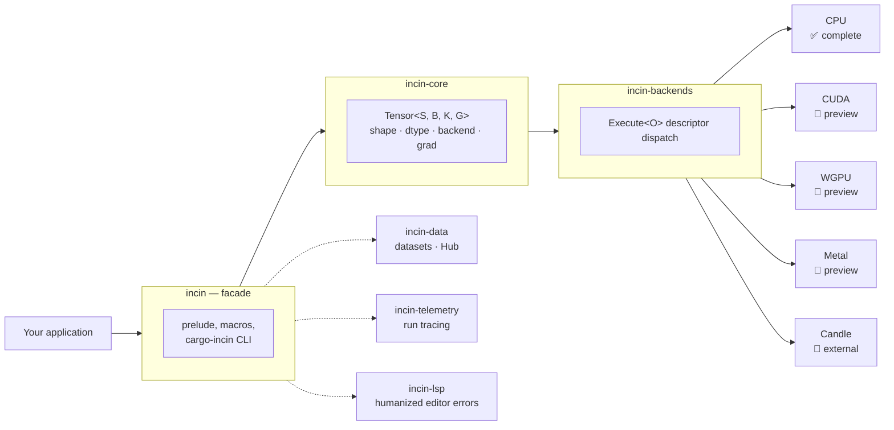

<div align="center">

# incin

**A Rust deep learning framework that catches shape and dtype mistakes at `cargo check`, not at 3am on epoch 40.**

[](https://github.com/xupremix/incin/actions/workflows/ci.yml)
[](https://crates.io/crates/incin)
[](https://docs.rs/incin)
[](#license)
[](Cargo.toml)

[Quick Start](#quick-start) ·
[Features](#features) ·
[Architecture](#architecture) ·
[The Book](docs/book/src/SUMMARY.md) ·
[CLI](#cli--cargo-incin) ·
[Editors](#editor--ide-support)

</div>

<br>

Incin encodes tensor shapes, dtypes, devices, and gradient capability directly
in Rust's type system. A `matmul` whose dimensions don't line up, a gradient
step taken on a frozen parameter, or a dtype that a backend can't execute —
these are compile errors, not `panic!`s discovered after your training loop
has been running for an hour.

```rust,ignore
use incin::prelude::*;

// The types ARE the shapes. [4, 8] · [8, 2] is a legal matmul —
// the compiler proved it before this ever ran.
let x: Tensor<s![4, 8], DefaultBackend> = Tensor::zeros(())?;
let w: Tensor<s![8, 2], DefaultBackend> = Tensor::zeros(())?;
let y = x.matmul(&w)?;                    // Tensor<s![4, 2], ...>

// This one doesn't compile — not "doesn't run," doesn't compile:
let bad: Tensor<s![3, 8], DefaultBackend> = Tensor::zeros(())?;
let _ = x.matmul(&bad)?;
```

That last line is a real build error, not a made-up one. Plain `cargo check`
shows Rust's raw typenum encoding:

```text
error[E0277]: Cannot contract dimension `UInt<UInt<UInt<UInt<UTerm, B1>, B0>, B0>, B0>` with `UInt<UInt<UTerm, B1>, B1>`
  --> src/main.rs:9:22
   |
 9 |     let _ = x.matmul(&bad)?;
   |               ------ ^^^^ inner dimensions do not match
```

[`cargo incin check`](#cli--cargo-incin) rewrites that same error live,
collapsing the `UInt<UInt<...>>` walls and the shape's own `DimCons<H,
DimCons<...>>` cons-list encoding down to a plain `[4, 8]`, and appending a
translation key:

```text
error[E0277]: Cannot contract dimension `[4, 8]` with `MatMulShape<[3, 8]>`
  --> src/main.rs:9:22
   |
 9 |     let _ = x.matmul(&bad)?;
   |               ------ ^^^^ inner dimensions do not match

  └── 💡 [Typenum Translation Hints]:
      • 4  <= UInt<UInt<UInt<UTerm, B1>, B0>, B0>
      • 8  <= UInt<UInt<UInt<UInt<UTerm, B1>, B0>, B0>, B0>
      • 3  <= UInt<UInt<UTerm, B1>, B1>
```

When rustc elides a type this deeply nested to a `long-type-*.txt` file
instead of printing it (its own `--verbose` note says so), `cargo incin`
reads that file too and humanizes it the same way, appending it as an
`[Expanded Full Type]` section rather than leaving you to go find and
decode the file yourself.

> **CPU is the complete, verified backend.** Every operation in the canonical
> catalog that a backend can execute has a CPU executor, and training runs
> there today. CUDA, WGPU, and Metal are **previews** — each covers a
> documented subset (arithmetic, reductions, `matmul`, convolution/pooling,
> plus unary activations on WGPU) and none yet covers normalization, loss, or
> embedding. [`docs/capabilities.md`](docs/capabilities.md) is generated
> straight from the backend registrations and is the authoritative answer for
> any given operation — see also [what isn't finished
> yet](docs/book/src/whats_not_finished.md).

---

## Features

| | |
|---|---|
| **Compile-time shape verification** | Static `s![]` shapes catch incompatible tensor operations at build time — no `RuntimeError: shapes (4,8) and (3,2) not aligned` three hours into training. |
| **Named dimensions** | `dim!` makes semantic axis names (`Batch`, `Channels`, ...) part of the tensor's *type*, not a comment you forgot to update. |
| **Python-style slicing** | `i![]` gives checked runtime range and index expressions — the ergonomics of NumPy indexing, the guarantees of Rust. |
| **Typed autograd** | `Grad`/`NoGrad` are type parameters. A frozen layer can't accidentally receive a gradient update; the compiler enforces it. |
| **ONNX import** | `import_model!` expands a supported `.onnx` graph into typed Rust code at compile time — fail-closed on anything it can't faithfully represent. |
| **Real backends, honestly scoped** | CPU is complete. CUDA, WGPU, and Metal are opt-in previews covering exactly what [`docs/capabilities.md`](docs/capabilities.md) says they cover — nothing is claimed that isn't registered and tested. |
| **Hugging Face Hub** | Download and load real-world model weights and dataset files directly, behind the opt-in `data-hub` feature. |
| **Zero-cost by construction** | Static shape information lives entirely in `typenum`'s type system and evaporates at compile time — the backend never sees it. |

---

## Architecture



Every operation flows through one path: a typed frontend call lowers to a
validated descriptor, a capability table decides whether the target backend
can run it, and a backend that can't runs *nothing* — a missing kernel is a
compile-time trait-bound failure, not a silent fallback. `S`, `B`, `K`, and
`G` on `Tensor<S, B, K, G>` are the shape, backend, element dtype, and
gradient-capability type parameters that make this checkable at all.

---

## Quick Start

A normal `incin = "0.1.0"` dependency enables only the standard library and
the native CPU backend. CUDA, WGPU, telemetry, autotuning, nightly
experiments, and third-party backends are opt-in. Enabling an accelerator
does not change `DefaultBackend`, which remains CPU whenever the `cpu`
feature is enabled.

```toml
[dependencies]
incin = "0.1.0"
```

### Concrete CPU quick start

```rust,ignore
use incin::prelude::*;

fn main() -> Result<()> {
    let a = Cpu.randn(shape![2, 3])?;
    let b = Cpu.randn(shape![3])?;
    let sum = &a + &b;
    let reshaped = sum.reshape(shape![3, 2])?;
    let reduced = reshaped.sum_keepdim(axis!(-1))?;
    let _ = reduced;
    Ok(())
}
```

The concrete form is the shortest path for an application using the default
CPU backend. For generic code, make the backend and shape parameters
explicit:

```rust,ignore
use incin::prelude::*;

type B = DefaultBackend;

fn generic_example() -> Result<()> {
    let static_tensor: Tensor<s![2, 3], B> = Tensor::zeros(())?;
    let dynamic_tensor: Tensor<Dyn, B> = Tensor::zeros(shape![2, 3])?;
    let _sum = &static_tensor + &static_tensor;
    Ok(())
}
```

`shape!` constructs runtime shape values and `s![]` describes compile-time
shape facts. Axis selectors accept signed values, so `axis!(-1)` selects the
last axis without constructing cursor types.

`i![]` expands to an unbounded index list, so indexing does not stop at a
fixed tuple arity. Static transpose and flatten selectors also support
arbitrary positive and negative axis positions; known static shapes retain
their exact output proof.

<details>
<summary><strong>Module definition & forward pass</strong></summary>

```rust,ignore
use incin::prelude::*;

#[module]
pub struct MLP<B: Backend> {
    pub fc1: Linear<s![784, 128], B>,
    pub fc2: Linear<s![128, 10], B>,
}

impl<B: Backend> MLP<B> {
    pub fn forward(&self, x: Tensor<s![dyn, 784], B>) -> Result<Tensor<s![dyn, 10], B>> {
        let x = self.fc1.forward(x)?.relu()?;
        self.fc2.forward(x)
    }
}
```

</details>

<details>
<summary><strong>Slicing with <code>i!</code></strong></summary>

```rust,ignore
use incin::prelude::*;

let t = Tensor::<Dyn>::zeros([2, 3, 4])?;
let sliced = t.get(i![.., 1..3, 0])?;
```

</details>

<details>
<summary><strong>ONNX model import</strong></summary>

```rust,ignore
use incin::prelude::*;

import_model!("resnet18.onnx", ResNet18);

fn main() -> Result<()> {
    let mut model = ResNet18::<CpuBackendImpl>::new();
    println!("Parsed ONNX graph into Rust AST!");
    Ok(())
}
```

Runtime ONNX *weight* loading is not implemented; use safetensors for
runtime loading, or download real-world weights straight from the
[Hugging Face Hub](#environment-variables) with the `data-hub` feature.

</details>

---

## Facade feature matrix

<!-- BEGIN GENERATED: facade-features -->
| Feature | Default | Purpose |
|---|:--:|---|
| `std` | yes | Enables standard-library functionality, serialization, and filesystem APIs. |
| `nightly` | no | Enables nightly-only APIs in the core and macro crates. |
| `cpu` | yes | Enables the built-in CPU backend. This is the only default backend. |
| `cpu-blas` | no | Hands large f32 CPU matmuls to a blocked GEMM. The CPU backend is complete without it; see incin-backends for what it does and does not change. |
| `cuda` | no | Preview: the native CUDA backend, covering the subset in docs/capabilities.md. Never enabled implicitly. |
| `wgpu` | no | Preview: the cross-platform WGPU backend, covering the subset in docs/capabilities.md. Never enabled implicitly. |
| `metal` | no | Preview: the native Metal backend for Apple Silicon. Its executors are stubs pending MTL-002/003; see docs/capabilities.md. Never enabled implicitly. |
| `metal-mps` | no | Enables MPS and MPSGraph structured primitives for Apple Silicon. |
| `external-candle` | no | Enables the external Candle backend at `incin::external::candle`. |
| `autotune` | no | Enables CUDA launch autotuning. |
| `train` | no | Enables the preview trainer at `incin::experimental::training`. The interface may change without a migration path. |
| `distributed` | no | Preview: typed meshes, static/runtime tensor placements, and distributed lowering proofs. This is a planning and validation layer; there is no distributed execution path. Transports remain separate opt-in backend features. |
| `distributed-reference` | no | Enables the deterministic in-process collective transport used by conformance tests and local distributed-plan development. |
| `distributed-nccl` | no | Two-host process-per-rank CUDA transport and its TCP bootstrap. |
| `telemetry` | no | Enables backend telemetry hooks. `cargo incin doctor` also reports the run directory under this feature, which is why the dependency is direct here and not only through incin-backends. |
| `test-utils` | no | Deterministic fault-injection hooks for tests. No stand-in backend: a test that needs a backend uses a real one. |
| `backend-authoring` | no | Extension contracts for backend authors. |
| `data-hub` | no | The Hugging Face Hub client at `incin::hub`. Off by default because it brings an async runtime and a second TLS stack into the dependency graph for an API most training code never calls; dataset downloading does not need it. |
| `compiled` | no | Preview: curated types for compiled execution. The interface may change without a migration path. |
| `hardware-tests` | no | Opt-in only: ignored multi-host CUDA runtime fixtures require actual hardware and are not part of compile-only feature coverage. |
<!-- END GENERATED: facade-features -->

<details>
<summary>Common feature combinations</summary>

```toml
# Bare/default CPU installation
incin = "0.1.0"

# WGPU in addition to the default CPU backend
incin = { version = "0.1.0", features = ["wgpu"] }

# CUDA-only application (use explicit CUDA backend/device types)
incin = { version = "0.1.0", default-features = false, features = ["std", "cuda"] }

# Third-party Candle interoperability
incin = { version = "0.1.0", features = ["external-candle"] }
```

</details>

<details>
<summary><strong>Lower-level crate features</strong></summary>

<!-- BEGIN GENERATED: crate-features -->
- `incin-backends`: defaults to `std,cpu`; optional `compiled`, `cpu-blas`, `cuda`, `cuda-vendor`, `wgpu`, `metal`, `metal-mps`, `autotune`, `external-candle`, `telemetry`, `distributed`, `distributed-reference`, `distributed-nccl`, and `test-utils`.
- `incin-core`: defaults to `std`; optional `nightly`, `paranoid-validation`, `distributed`, `cuda`, `wgpu`, `metal`, and `compiled`.
- `incin-macros`: defaults to `std`; optional `nightly` and `distributed`.
- `incin-diagnostics`: defaults to `std`.
- `incin-data`: defaults to `download`; optional `hub`.
- `incin-telemetry`, `incin-viz`, `incin-viz-plugin-api`, and `incin-lsp` expose no Cargo features.
<!-- END GENERATED: crate-features -->

The two-host launcher uses one process per rank. `DistributedContext::from_env`
checks `INCIN_RANK`, `INCIN_WORLD_SIZE`, `INCIN_RUN_ID`,
`INCIN_LOCAL_CUDA_DEVICE`, `INCIN_RENDEZVOUS_ADDR`, and
`INCIN_RENDEZVOUS_TIMEOUT_MS` before communicator creation. Both hosts may use
local CUDA ordinal zero; the address on rank zero is a bind address and the
address on rank one must reach rank zero over the network.

With `autotune`, `incin_backends::tuning` exposes stable UUID/compiler/topology
identities, an atomic bounded persistent cache, and statically typed or `Dyn`
disabled, heuristic, coordinated-warmup, and profile-guided services. Cached
winners are treated as untrusted hints and are reused only after the current
legal candidate set matches. Distributed warmup uses one bounded epoch permit
and requires every topology rank to accept the same result before commit.

`incin-core`'s `cuda` and `wgpu` flags expose the device metadata backend crates
need; they do not execute kernels themselves. Disabling `incin-diagnostics`'
defaults gives the allocation-only diagnostic core.

The per-backend support tables — which operations each backend registers, for
which element types, layouts, and ranks — are generated from those
registrations into [docs/capabilities.md](docs/capabilities.md). `cargo incin
doctor` reports which of them this machine can actually reach.

`incin-backends` can also be used without default features when implementing a
backend-specific binary. At least one of `cpu`, `cuda`, or `wgpu` is needed for
`IncinBackend` execution; `external-candle` exposes its separate external
adapter.

</details>

---

## Setup & Requirements

Incin serializes ONNX protocol graphs natively using Protocol Buffers.
Building the workspace requires the Protocol Buffers compiler (`protoc`).

| Platform | Command |
|---|---|
| Ubuntu / Debian | `sudo apt-get install -y protobuf-compiler` |
| macOS (Homebrew) | `brew install protobuf` |

### Environment Variables

| Variable | Purpose |
|---|---|
| `INCIN_HUB_CACHE_DIR` | Custom cache directory for Hub downloads (defaults to `~/.cache/huggingface/hub`). |
| `INCIN_HUB_TOKEN` | Authorization token for private Hugging Face Hub repositories. |
| `INCIN_NO_META` | Set to `1` to bypass the `.incin_meta` cache and force full ONNX graph re-parsing during macro compilation. |

---

## Workspace Crates

| Crate | Role |
|---|---|
| [`incin`](crates/incin) | Primary facade — unified imports, prelude, and the `cargo-incin` CLI binary. |
| [`incin-core`](crates/incin-core) | Statically-typed `Tensor` implementation, traits, and graph definitions. |
| [`incin-backends`](crates/incin-backends) | Native CPU (complete), opt-in CUDA/WGPU/Metal (preview) execution engines, plus an external Candle adapter. |
| [`incin-macros`](crates/incin-macros) | Procedural macros: `s!`, `shape!`, `axis!`, `i!`, `module`, `import_model!`. |
| [`incin-data`](crates/incin-data) | Data loading utilities, dataset traits, and Hugging Face Hub support. |
| [`incin-telemetry`](crates/incin-telemetry) | Event emission, transport streams, and graph snapshot recording. |
| [`incin-viz`](crates/incin-viz) | Terminal UI (TUI) model graph visualizer. |
| [`incin-diagnostics`](crates/incin-diagnostics) | Typenum-to-decimal shape diagnostic humanization, shared by the CLI and the editor LSP proxy. |
| [`incin-lsp`](crates/incin-lsp) | Transparent LSP proxy that routes rust-analyzer through `incin-diagnostics` so shape errors and inlay hints are humanized live in your editor. |

---

## CLI — `cargo incin`

`cargo-incin` wraps `cargo check`/`build`/`test`/`run`, rewriting the
compiler's typenum shape errors (`UInt<UInt<...>>` walls) into plain decimals
live in your terminal — the same translation the editor extensions use. It
also inspects exported model files and translates pasted error text ad hoc.

```bash
# Install
cargo install --path crates/incin

# Use
cargo incin check                # cargo check, with humanized shape errors
cargo incin build --release      # any cargo subcommand + its normal args work
cargo incin test
cargo incin run
cargo incin inspect model.gguf   # metadata for .safetensors / .gguf / .onnx files
cargo incin translate "..."      # translate pasted error text (arg or stdin)
```

Flags: `--raw` (skip translation, show the compiler's raw output), `--explain`
(append a plain-English shape-rule explanation for common errors), `--help`.

---

## Editor / IDE Support

The same humanization is available live inside your editor via `incin-lsp`,
a thin proxy that sits between your editor and rust-analyzer and rewrites
diagnostics and shape inlay hints through `incin-diagnostics` before they
reach you — no forked rust-analyzer, no per-editor parsing logic. See
[`docs/growth/02-ide-extensions.md`](docs/growth/02-ide-extensions.md) for
the full architecture and verification status of each client below.

| Editor | Status | Install guide |
|---|---|---|
| VS Code | Ships; activation + rust-analyzer config-rewriting verified by an automated test against a real VS Code (`npm test`). Full humanized-diagnostic pipeline (real `incin-lsp` + rust-analyzer) not yet exercised end-to-end | [`editors/vscode/README.md`](editors/vscode/README.md) |
| Neovim (0.11+, or nvim-lspconfig on older versions) | Verified against a real Neovim install | [`editors/nvim/README.md`](editors/nvim/README.md) |
| RustRover / IntelliJ | External-tool fallback verified; native LSP-mode integration unverified | [`editors/rustrover/README.md`](editors/rustrover/README.md) |

VS Code and Neovim both need the proxy on `PATH` first (RustRover's shipped
fallback only needs the CLI above):

```bash
cargo install --path crates/incin-lsp --bin incin-lsp
```

---

## Documentation

- **[The Book ("Incinnomicon")](docs/book/src/SUMMARY.md)** — the current
  user guide. Build it locally with `mdbook build docs/book`. Validate its
  Rust examples with `cargo test -p incin --features 'backend-authoring'
  --doc`; `mdbook test` is not the validation command because standalone
  mdBook rustdoc does not receive Cargo's dependency metadata.
- **[What's not finished yet](docs/book/src/whats_not_finished.md)** — an
  honest, source-verified list of what still blocks real usage, kept
  separate so nothing above has to hedge every sentence.
- **[docs/capabilities.md](docs/capabilities.md)** — generated per-backend,
  per-dtype operation support, straight from the registrations.
- **[Growth & architecture plans](docs/growth/)** — task-by-task execution
  plans for adoption-facing features (named dimensions, CLI/IDE tooling,
  deployment, and more), each with its own dated status ledger. The older
  roadmap in `docs/growth/07-the-book.md` is historical and is not the
  source of current documentation status.

---

## License

<div align="center">

Dual-licensed under either

[**MIT**](LICENSE_MIT) or [**Apache 2.0**](LICENSE_APACHE)

at your option.

</div>
