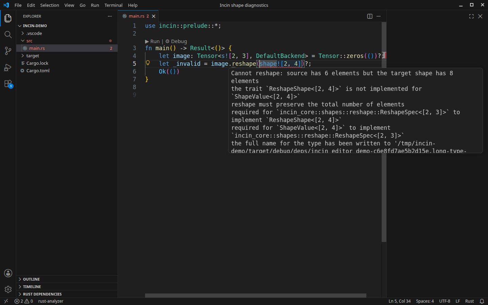

# Editor integrations

Incin provides `incin-lsp`, a small proxy in front of rust-analyzer. It
rewrites Incin's type-level shape diagnostics and tensor inlay hints into
readable labels. It does not replace rust-analyzer or implement a separate
Rust language server.

`incin-lsp` is prepared for crates.io publication but is not available there
yet. During this pre-release period, build it from a checkout:

```sh
cargo install --path crates/incin-lsp --bin incin-lsp --locked
```

After a published release, the equivalent registry install is:

```sh
cargo install incin-lsp
```

The proxy starts `rust-analyzer` from `PATH` by default. The VS Code extension
uses the rust-analyzer binary bundled with the official extension when it is
available. Other clients can set `INCIN_LSP_RA_PATH` to an absolute binary
path.

For Incin workspaces, the VS Code extension sets rust-analyzer's
`inlayHints.maxLength` to `null`. This gives the proxy the full type to
translate; rust-analyzer's default truncated `DimCons<UInt<…>>` labels cannot
be reconstructed safely after truncation.

Tagged GitHub releases package prebuilt `incin-lsp` binaries for Linux x86_64,
macOS Apple Silicon, and Windows x86_64. They also package the VS Code and
Neovim integrations described below. Those assets exist only after the
corresponding release is published; there is no editor-marketplace or Open VSX
publication pipeline yet.

## VS Code

The VS Code extension is a local VSIX package. It needs the official
`rust-lang.rust-analyzer` extension because it configures that extension to
launch `incin-lsp`.

For a checkout build:

```sh
cd editors/vscode
npm ci
npm run compile
npx @vscode/vsce package
code --install-extension incin-lsp-vscode-0.1.0.vsix
```

Or use **Extensions: Install from VSIX...** and choose the generated file.
Reload the window after installation. The extension activates in a workspace
whose `Cargo.toml` uses `incin`; set `incin.lspPath` to an absolute binary path
if `incin-lsp` is not on `PATH`.

The extension's **Incin: Toggle Shape Hints** command turns hint rewriting on
or off and restarts rust-analyzer. `incin.shortenBackend` removes the trailing
backend, dtype, and gradient detail from rewritten hints when that shorter view
is preferable.

The exact VSIX for a published version is attached to that version's GitHub
release. It is not currently uploaded to the Visual Studio Marketplace or Open
VSX.



## Neovim

The Neovim integration is a Lua module, not a remote plugin registry package.
It supports Neovim's native LSP configuration on 0.11 and later, and it can
also merge into an existing nvim-lspconfig or mason-lspconfig setup.

To use it directly from a checkout, put `editors/nvim` on `runtimepath` and
configure it before opening Rust buffers:

```lua
vim.opt.rtp:append("/path/to/incin/editors/nvim")
require("incin-lsp").setup({
  lsp_path = "incin-lsp",
})
```

For an existing `nvim-lspconfig` configuration, merge its command override
instead of calling `setup()`:

```lua
require("lspconfig").rust_analyzer.setup(require("incin-lsp").merge_into({}))
```

See the [Neovim integration README](https://github.com/xupremix/incin/tree/master/editors/nvim)
for lazy.nvim and mason-lspconfig examples. A published tag also contains an
`incin-lsp-nvim-<version>.tar.gz` archive. There is no automated Neovim plugin
registry release at present.


## `cargo incin`

`cargo-incin` is a Cargo subcommand that presents Incin diagnostics in a
terminal. It is distributed by the `incin` package rather than as a separate
crate.

Until crates.io has `0.1.0`, install it from a checkout:

```sh
cargo install --path crates/incin --bin cargo-incin --locked
cargo incin doctor
```

After the registry publication, use:

```sh
cargo install incin --bin cargo-incin
cargo incin doctor
```

Published GitHub releases also include platform binary archives containing
both `cargo-incin` and `incin-lsp`. The executable archive is useful when a
Rust toolchain is unavailable; the crates.io packages remain the normal update
path for Cargo users.

## RustRover

RustRover does not use rust-analyzer, so `incin-lsp` cannot be inserted into
its language-server path. The supported integration is an External Tool and
optional File Watcher that runs `cargo incin check`. A tagged release includes
that configuration as `incin-rustrover-external-tool-<version>.tar.gz`.

Native RustRover LSP support is not verified or shipped. Follow the
[RustRover integration README](https://github.com/xupremix/incin/tree/master/editors/rustrover)
for the supported setup.
