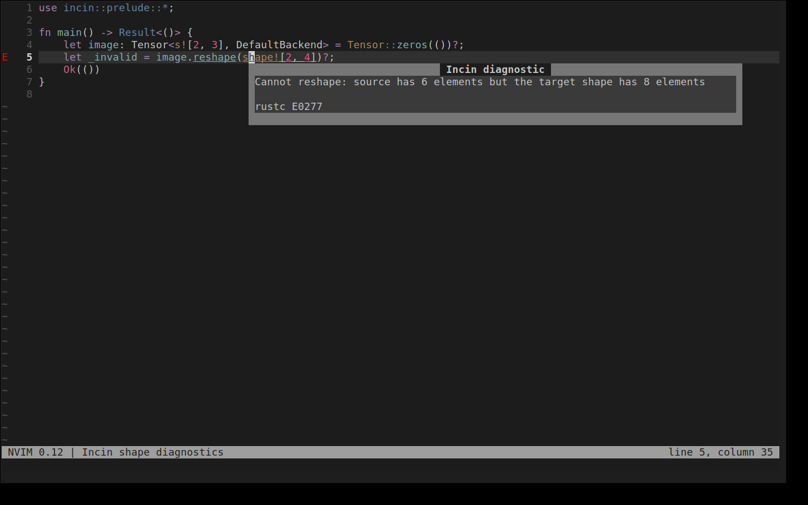

# incin-lsp for Neovim

Routes Neovim's `rust_analyzer` LSP client through the `incin-lsp` proxy, so
shape errors and inlay hints show up humanized (decimal shapes instead of
`UInt<...>` walls); see `docs/growth/02-ide-extensions.md` for the
architecture. This is a ~40-line Lua module with **no typenum-parsing logic
of its own**; all humanization happens in the `incin-diagnostics` Rust crate
behind `incin-lsp`.

Targets Neovim's native `vim.lsp.config`/`vim.lsp.enable` (0.11+) by default.
**If your config drives `nvim-lspconfig`'s own `.setup()` directly, or
indirectly through `mason-lspconfig`'s `handlers` (the common
kickstart.nvim-derived pattern), `setup()` below is a no-op for you**;
confirmed against a real nvim-lspconfig v2.11 install that its `.setup()`
path doesn't go through `vim.lsp.enable` at all, it's a separate, older
mechanism. Skip to "mason-lspconfig / mason-lspconfig `handlers`" below
instead. `M.server_opts()`/`M.merge_into()` return a plain table that
works with any of the three integration styles this file documents.



The capture uses Neovim 0.12, the module in this directory, the locally
installed `incin-lsp`, and rust-analyzer. The popup text comes from the live
LSP diagnostic.

The module also asks rust-analyzer for unlimited inlay-label length. This is
necessary because the server otherwise truncates a `DimCons<UInt<…>>` type
before `incin-lsp` can turn it into a readable tensor shape.

## Requirements

- Neovim 0.11+ (for `vim.lsp.config`/`vim.lsp.enable`), **or**
  nvim-lspconfig on any supported Neovim version.
- `incin-lsp` on your `$PATH` (`cargo install incin-lsp` after the first
  crates.io publication, or `cargo install --path crates/incin-lsp --bin
  incin-lsp --locked` from a checkout before then), or pass `lsp_path` to
  `setup()`/`server_opts()`. A normal `cargo install incin-lsp` installs only
  the proxy executable.

## lazy.nvim (native `vim.lsp.enable`, no nvim-lspconfig)

```lua
{
  dir = "/path/to/incin/editors/nvim", -- or your own fork's URL
  name = "incin-lsp",
  -- No `ft`/`event` lazy-load trigger: `setup()` just registers config and
  -- an autocmd via `vim.lsp.enable`; negligible cost, and gating a plugin
  -- whose whole job is registering a FileType-triggered autostart *behind
  -- its own* FileType trigger risks the first matching buffer's own event
  -- having already fired before this plugin loads. Load it unconditionally.
  config = function()
    require("incin-lsp").setup()
  end,
},
```

## mason-lspconfig / a direct `require("lspconfig").rust_analyzer.setup(...)`

**This is the one to use if you have a `servers = { rust_analyzer = {...} }`
table feeding a `mason-lspconfig.setup({ handlers = {...} })` call** (as in
kickstart.nvim and most configs derived from it), or if you call
`require("lspconfig").rust_analyzer.setup(...)` directly yourself. Add
`incin-lsp` as a plain dependency (it has no `config`/lazy-load trigger of
its own to invoke here; `merge_into` is called explicitly instead) and
merge its override into the `rust_analyzer` server table before it reaches
`lspconfig`:

```lua
-- e.g. inside your nvim-lspconfig plugin spec:
dependencies = {
  "williamboman/mason.nvim",
  "williamboman/mason-lspconfig.nvim",
  { dir = "/path/to/incin/editors/nvim", name = "incin-lsp" },
},
config = function()
  local servers = {
    rust_analyzer = require("incin-lsp").merge_into({
      settings = { ["rust-analyzer"] = { --[[ your existing settings ]] } },
    }),
    -- ...your other servers, untouched...
  }

  require("mason-lspconfig").setup({
    handlers = {
      function(server_name)
        require("lspconfig")[server_name].setup(servers[server_name] or {})
      end,
    },
  })
end,
```

`merge_into(server, opts)` returns a **new** table (`server` itself isn't
mutated) with `cmd`/`cmd_env` merged in on top; your `settings` and
anything else you put in `server` are preserved untouched.

No mason, just a direct call?

```lua
require("lspconfig").rust_analyzer.setup(require("incin-lsp").merge_into({
  settings = { ["rust-analyzer"] = { --[[ your existing settings, if any ]] } },
}))
```

## Manual install

Copy `lua/incin-lsp.lua` onto your `runtimepath` (e.g.
`~/.config/nvim/lua/incin-lsp.lua`), then in `init.lua`:

```lua
require("incin-lsp").setup()
```

## Options

`setup()`, `server_opts()`, and `merge_into()` all take the same optional
table (as their last argument, for `merge_into`):

```lua
require("incin-lsp").setup({
  lsp_path = "incin-lsp",   -- default: resolved via $PATH
  hints_enabled = true,      -- default: true; set false to disable hint rewriting
  shorten_backend = false,   -- default: false; true drops the backend/dtype/grad tail
})
```

To toggle at runtime, call `setup()` again with new options and restart the
client (`:LspRestart`). `incin-lsp` reads its config from the environment
once at startup.
